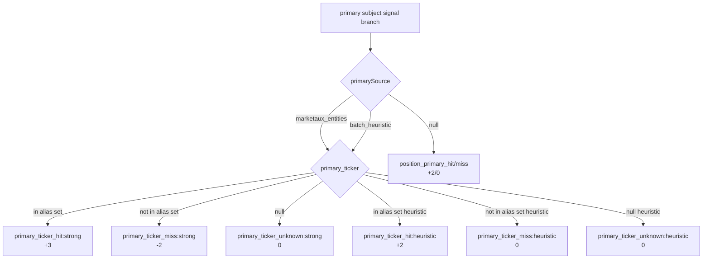

# Slice 4 — Trust-Aware Primary-Ticker Affinity Tuning

## 1. Current state (verified, not assumed)

Source: [`services/ai/gateway-2.0/src/core/analysis/digest-symbol-affinity.ts`](services/ai/gateway-2.0/src/core/analysis/digest-symbol-affinity.ts).

| Signal                                      | Current weight                               | Reason code emitted today                             |
| ------------------------------------------- | -------------------------------------------- | ----------------------------------------------------- |
| Text token hit (theme/news_one_liner)       | `+2`                                         | `text_token_hit:<ALIAS>`                              |
| Strong primary hit (`marketaux_entities`)   | `+3`                                         | `primary_ticker_hit:strong:<T>`                       |
| Heuristic primary hit (`batch_heuristic`)   | `+2`                                         | `primary_ticker_hit:heuristic:<T>`                    |
| Strong primary miss                         | `0`                                          | `primary_ticker_miss:strong:<T or null>`              |
| Heuristic primary miss                      | `0`                                          | `primary_ticker_miss:heuristic:<T or null>`           |
| Position-primary fallback (NULL source) hit | `+2`                                         | `position_primary_hit:<ALIAS>`                        |
| Position-primary fallback miss              | `0`                                          | `position_primary_miss:position=N` / `not_in_tickers` |
| Narrow tag (`n<=3`)                         | `+1`                                         | `narrow_tag_bonus:n=<N>`                              |
| Broad tag (`n>=8`)                          | `-1`                                         | `broad_tag_penalty:n=<N>`                             |
| Default threshold                           | `2` (env `SMART_DIGEST_MEMORY_AFFINITY_MIN`) | n/a                                                   |

The primary-ticker branch is a **mutex** with the position-primary fallback (lines 222-254 of the file): exactly one of `primary_ticker_*` or `position_primary_*` appears in `reasons` per row. That mutex is preserved.

**Live evidence reviewed** (`tmp/validation/2026-05-11/slice3-postdeploy/sym_*.json`, 6 symbols):

- 1 `batch_heuristic` row observed: NVDA's KOSPI theme had `primary_ticker = "^FCHI"` and was correctly rejected at affinity score 0 (`text_token_miss + primary_ticker_miss:heuristic:^FCHI + normal_tag = 0`). The 0-penalty was sufficient because there was no other on-symbol signal to overcome.
- 0 `marketaux_entities` rows in the captured snapshots; the user reports rows now exist live, so future captures will exercise the new path.
- All other rows: `primarySource = null`, executing legacy position-primary fallback unchanged.
- No regressions, no contamination cases recovered yet.

## 2. The contamination scenario this slice closes

Documented contamination case from the existing test suite ([`__tests__/digest-symbol-affinity.test.ts`](services/ai/gateway-2.0/src/core/analysis/__tests__/digest-symbol-affinity.test.ts) lines 56-93): an ETH-primary "ETH/BTC Ratio" theme that text-mentions `BTC` as part of the metric name. With Slice 3 weights, if upstream emits `primary_ticker = "ETH"` with `source = "marketaux_entities"`:

| Component                        | Score                                         |
| -------------------------------- | --------------------------------------------- |
| `text_token_hit:BTC`             | +2                                            |
| `primary_ticker_miss:strong:ETH` | 0                                             |
| `normal_tag:n=4`                 | 0                                             |
| **Total**                        | **2 -> passes** the BTC digest at threshold 2 |

That is the contamination Slice 4 must close. The principled fix: a strong-tier mismatch is upstream's deterministic positive identification of a _different_ subject. Penalize it enough to neutralize the text token, no more.

## 3. Proposed scoring change (evidence-based)

Single new constant in [`digest-symbol-affinity.ts`](services/ai/gateway-2.0/src/core/analysis/digest-symbol-affinity.ts) and a small refactor of the miss branch:

| Case                                                       | New weight                      | New / changed reason code                         |
| ---------------------------------------------------------- | ------------------------------- | ------------------------------------------------- |
| Strong primary hit                                         | `+3` (unchanged)                | `primary_ticker_hit:strong:<T>`                   |
| Strong primary mismatch (`pt != null && pt notIn aliases`) | **`-2` (NEW)**                  | `primary_ticker_miss:strong:<T>` (now carries -2) |
| Strong source but `pt == null` (data-integrity edge case)  | `0`                             | **`primary_ticker_unknown:strong` (NEW)**         |
| Heuristic primary hit                                      | `+2` (unchanged)                | `primary_ticker_hit:heuristic:<T>`                |
| Heuristic primary mismatch                                 | `0` (unchanged, evidence-based) | `primary_ticker_miss:heuristic:<T>`               |
| Heuristic source but `pt == null`                          | `0`                             | **`primary_ticker_unknown:heuristic` (NEW)**      |
| NULL source -> position-primary fallback                   | unchanged                       | unchanged                                         |

Why these exact magnitudes:

- **`-2` for strong miss**: exactly cancels `WEIGHT_TEXT_TOKEN`. Maximum bounded damage. The "ETH-primary mentions BTC" row goes 2 -> 0 and is rejected. A row that has both text + narrow + strong-miss still scores `2 + 1 - 2 = 1` -> rejected. A row that has only strong-miss scores `-2` (well below threshold). Reversible via single-line constant.
- **`0` for heuristic miss**: only one heuristic-miss case observed in production data, and it was _already_ correctly rejected at 0. Heuristic primary is reproducible-but-not-source-grounded (the KOSPI row's `^FCHI` anchor is itself questionable). Penalizing it would risk regressing clearly on-symbol rows where the curator's batch heuristic was wrong. Defer revisit until more data.
- **Splitting `_miss` vs `_unknown`**: today's code emits `primary_ticker_miss:strong:null` when source is non-null but primary is null. That conflates "upstream said something different" (mismatch -> penalize) with "upstream said nothing despite tagging itself" (data integrity -> don't penalize). The new `_unknown` reason makes the distinction explicit in debug output and ensures the penalty fires _only_ on positive mismatch.

## 4. Decision tree (mermaid)



(Two `pt` decision groups in the diagram represent the same node logically; the renderer will inline based on `src`.)

## 5. Implementation

### 5.1 Files modified

- [`services/ai/gateway-2.0/src/core/analysis/digest-symbol-affinity.ts`](services/ai/gateway-2.0/src/core/analysis/digest-symbol-affinity.ts) — add `WEIGHT_PRIMARY_TICKER_STRONG_MISS = -2` constant; refactor the primary-ticker branch (lines ~225-237) to distinguish hit/miss/unknown; emit new reason codes; update JSDoc.
- [`services/ai/gateway-2.0/src/core/analysis/__tests__/digest-symbol-affinity.test.ts`](services/ai/gateway-2.0/src/core/analysis/__tests__/digest-symbol-affinity.test.ts) — update one existing test that asserts `primary_ticker_miss:strong:null`; add ~5 new failing-first tests for the new behavior.
- [`docs/upstream-trust-map.md`](docs/upstream-trust-map.md) — append a "Slice 4: trust-aware primary-ticker mismatch penalty" section.

### 5.2 Files NOT modified (explicit non-scope)

- [`services/ai/gateway-2.0/src/core/analysis/recommendation-engine.ts`](services/ai/gateway-2.0/src/core/analysis/recommendation-engine.ts) — already passes `primaryTicker` / `primarySource` through; no plumbing change needed.
- [`services/ai/gateway-2.0/src/core/analysis/digest-debug.ts`](services/ai/gateway-2.0/src/core/analysis/digest-debug.ts) — already serializes `affinity.reasons[]` verbatim; new reason codes auto-surface with no debug-layer change.
- `news-processor.ts`, `memory-curator.ts`, `primary-ticker.ts` — upstream writer layers stay invariant, per the user's "do not redesign upstream" constraint.
- No env knob for the new weight (kept narrow). Rollback = single-line revert of one constant.

### 5.3 Code shape (proposed snippet, before/after)

Current (`digest-symbol-affinity.ts` lines 225-237):

```225:237:services/ai/gateway-2.0/src/core/analysis/digest-symbol-affinity.ts
  if (primarySource === "marketaux_entities" || primarySource === "batch_heuristic") {
    const tier = primarySource === "marketaux_entities" ? "strong" : "heuristic";
    const weight =
      primarySource === "marketaux_entities"
        ? WEIGHT_PRIMARY_TICKER_STRONG
        : WEIGHT_PRIMARY_TICKER_HEURISTIC;
    const pt = (args.primaryTicker ?? "").toUpperCase() || null;
    if (pt && aliasSet.has(pt)) {
      score += weight;
      reasons.push(`primary_ticker_hit:${tier}:${pt}`);
    } else {
      reasons.push(`primary_ticker_miss:${tier}:${pt ?? "null"}`);
    }
  } else {
```

Proposed (illustrative — not yet committed):

```ts
if (primarySource === "marketaux_entities" || primarySource === "batch_heuristic") {
  const tier = primarySource === "marketaux_entities" ? "strong" : "heuristic";
  const hitWeight = primarySource === "marketaux_entities"
    ? WEIGHT_PRIMARY_TICKER_STRONG
    : WEIGHT_PRIMARY_TICKER_HEURISTIC;
  const missWeight = primarySource === "marketaux_entities"
    ? WEIGHT_PRIMARY_TICKER_STRONG_MISS  // -2
    : 0;                                  // heuristic miss: no penalty (evidence-based)
  const pt = (args.primaryTicker ?? "").toUpperCase() || null;
  if (pt === null) {
    reasons.push(`primary_ticker_unknown:${tier}`);
  } else if (aliasSet.has(pt)) {
    score += hitWeight;
    reasons.push(`primary_ticker_hit:${tier}:${pt}`);
  } else {
    score += missWeight;
    reasons.push(`primary_ticker_miss:${tier}:${pt}`);
  }
} else {
```

## 6. Tests (failing-first, TDD)

Update one existing test:

- "strong source with null primaryTicker records `miss:strong:null`" -> assert `primary_ticker_unknown:strong` instead, and assert score is unchanged from baseline (no penalty).

Add new tests under `describe("computeSymbolAffinity — slice 4 trust-aware penalty")`:

1. **Strong-mismatch neutralizes text-token contamination**: ETH-primary row with `BTC` text mention scored against BTC/USD digest -> reasons include `text_token_hit:BTC` and `primary_ticker_miss:strong:ETH`; final score = 0; `passed = false`.
2. **Strong-mismatch alone is negative**: row with strong primary `ETH`, no text hit, no narrow tag -> score = -2; `passed = false`.
3. **Strong-mismatch + narrow + text still rejects**: text(+2) + strong-miss(-2) + narrow(+1) = 1; `passed = false`.
4. **Heuristic-mismatch is unchanged at 0**: regression-protect the empirical decision; same input as the existing heuristic-miss test should still score 0 with the same reason `primary_ticker_miss:heuristic:NVDA`.
5. **`primary_ticker_unknown:heuristic` is emitted when source is heuristic but primary is null** (new code path symmetry).
6. **Determinism is preserved with the new penalty branch** — same args, same reasons array order.
7. **Position-primary fallback remains untouched when source is NULL** — regression-protect Slice 3 mutex.

Existing tests that must continue to pass without modification (regression set): strong hit recovers at +3, heuristic hit at +2, NULL source falls back to position-primary, all token regex tests, all threshold/env tests.

## 7. Validation

### 7.1 Test suite

Run the full gateway-2.0 vitest suite after code change. Expectation: 477 + ~6 new tests, 0 regressions.

```bash
cd services/ai/gateway-2.0 && npm test
```

### 7.2 Live debug capture

Capture digest-debug snapshots for the user's suggested validation symbols **before and after** the deploy on the VM. Same script the team has been using:

- AAPL, NVDA, MSFT, GOOGL, META, TSLA, BTC-USD, ETH-USD, SPX500, GOLD

Save as `tmp/validation/<DATE>/slice4-debug-before/<SYMBOL>.json` and `tmp/validation/<DATE>/slice4-debug-after/<SYMBOL>.json`.

### 7.3 What to look for in the diffs

For each symbol:

1. Count of `primary_ticker_miss:strong:*` reasons across all candidates. Each occurrence is now a -2 score change vs Slice 3.
2. Any candidate whose `chosen` flag flipped because a strong-miss penalty pushed it below threshold (or because a competing row no longer dominates).
3. Any new `primary_ticker_unknown:*` reasons (data integrity flag — investigate upstream if non-zero).
4. Heuristic-miss rows: score should be **identical** to Slice 3 (regression-protected).
5. NULL-source rows: reasons should still contain `position_primary_hit/miss` exactly as before.

### 7.4 Acceptance criteria

- 0 regressions on rows whose `primarySource` is null or heuristic.
- Strong-mismatch rows that previously passed only via text_token_hit + narrow now visibly fail with reasons that explain why.
- No symbol's `chosen` row changes to a _worse_ candidate (i.e., one that is clearly off-symbol). If it does, investigate whether the new penalty over-rejected and consider raising the magnitude threshold or moving to env-tunable in Slice 5.
- DECISION.md written at `tmp/validation/<DATE>/slice4-debug-after/DECISION.md` summarizing observed strong-miss / strong-hit counts and any chosen-row flips.

## 8. Why this slice is justified, narrow, and reversible

- **Justified**: the contamination scenario is documented in the existing test suite and was the explicit reason `WEIGHT_POSITION_PRIMARY` was capped at +2; Slice 4 simply finishes that defense by penalizing the case where a stronger upstream signal explicitly disagrees.
- **Narrow**: one new constant, one branch refactor, one new reason code prefix (`_unknown`), three files touched (one source, one test, one doc).
- **Reversible**: `git revert` of a single commit restores Slice 3 behavior exactly. No migration, no schema change, no upstream layer touched.
- **Inspectable**: every score change carries a stable reason code visible in the digest-debug surface.
- **Deterministic**: pure-function refactor; same inputs yield same outputs.

## 9. What this slice explicitly does NOT do

- No env knob for the new `-2` weight (kept narrow; revert is the rollback).
- No change to the heuristic-tier weight or behavior (evidence does not yet justify it).
- No change to upstream writers (`news-processor.ts`, `memory-curator.ts`, `primary-ticker.ts`).
- No removal of the position-primary fallback (NULL-source rows still use it).
- No prompt edits, no canonical digest architecture work, no NER expansion, no backfill.
- No threshold change — `SMART_DIGEST_MEMORY_AFFINITY_MIN` default 2 stays.

## 10. Decisions confirmed by the user

- Strong-mismatch penalty: `-2` (neutralizes a text token; recommended option).
- Heuristic-mismatch penalty: `0` (evidence-based; no change).

---

## Standard deployment workflow

1. **Baseline check (SSH into VM)**
   - `ssh -i "$HOME\.ssh\nx-linux-server-azure_key (1).pem" azureuser@20.17.176.1`
   - `docker ps` -> note current image version

2. **Stage and push changes**
   - `git status` -> `git add <file1> <file2> ...` -> `git commit -m "msg" && git push origin main`
   - Never use `git add .` — other agents may have uncommitted changes

3. **Verify build**
   - GitHub Actions: `gh run watch`
   - If frontend modified: `vercel ls --scope=stocktracker`
   - **Only proceed when all builds pass**
   - Build fails -> `gh run view <run-id> --log` or `vercel logs <url>` -> Fix -> Step 2

4. **Verify VM deployment**
   - SSH -> `docker ps` -> Compare version
   - Version incremented -> Done
   - Version unchanged / container down -> Fix -> Step 2

5. **Done**
