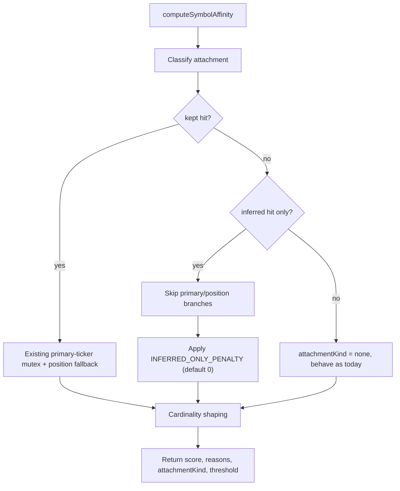

# Slice 6 — Consumer adoption of `tickers_inferred`

## Decision target

Make Smart Digest's per-(row, symbol) affinity scorer **aware of** the new `tickers_inferred` column (written by Slice 5's INSERT-time sanitizer) so:

1. Every memory-row candidate carries an explicit _attachment kind_ (`kept` vs `inferred_only`) that downstream debug + future scoring slices can read.
2. A controllable, zero-default scoring penalty exists for inferred-only attachment.
3. Reviewers can see exactly which boilerplate the writer dropped, per row, in the debug envelope.

The slice **does not change the SQL filter (`affected_tickers && $1::text[]`)**, does not change the default behavior of the chosen row, and does not touch the writer.

## Exact problem this solves

Today, `analysis_market_memory.tickers_inferred` is written but never read. The consumer can therefore neither:

- Distinguish a row where the digest symbol is a kept ticker (e.g. `JEPI`-themed row tagged `affected_tickers=[JEPI, MO]`, `tickers_inferred=[]`) from a row where it would only be inferred (`affected_tickers=[JEPI]`, `tickers_inferred=[SPX500]`), nor
- Surface that distinction in debug output, nor
- Apply a deterministic discount when a future slice opens the SQL filter to inferred-only matches.

Slice 6 lays exactly the wiring those follow-ups need, with no behavior change at default settings.

## Why this comes next after Slice 5

- Slice 5 produces the column but **no consumer reads it**. Without consumer plumbing, the column is dead weight (kept rows look identical to inferred-only rows from the scorer's POV).
- DB verification confirms `cardinality(tickers_inferred) > 0` is currently `0` rows (next curator run will produce the first data). Wiring must land first so the next curator run produces inspectable reason codes from the moment data exists.
- The 15 fresh `SPX500`-tagged rows from before Slice 5 will continue to age out; Slice 6 does not retro-fix them (intentional — that would require a sanitizer rerun, not a consumer change).

## What changes

### 1. `services/ai/gateway-2.0/src/core/analysis/digest-symbol-affinity.ts`

Additive — no existing test should regress.

- Extend `ComputeSymbolAffinityArgs`:

```ts
tickersInferred?: string[];
```

- Extend `AffinityResult`:

```ts
attachmentKind: "kept" | "inferred_only" | "both" | "none";
```

- New constants (env-tunable, additive):

```ts
const WEIGHT_INFERRED_ONLY_ATTACHMENT_DEFAULT = 0;
const INFERRED_ONLY_PENALTY_FLOOR = -5;
const INFERRED_ONLY_PENALTY_CEILING = 0;
```

- New helper mirroring `getAffinityMin`:

```ts
export function getInferredOnlyPenalty(): number; // reads SMART_DIGEST_INFERRED_ONLY_PENALTY, clamped
```

- Inside `computeSymbolAffinity`, classify before the existing primary-ticker mutex:
  - `keptHit = affected_tickers ∩ aliasSet`
  - `inferredHit = tickers_inferred ∩ aliasSet`
  - `attachmentKind` derived from the two booleans
  - Reason codes (always emitted for inspectability, never gated):
    - `attachment_kept:<ALIAS>` when present in `affected_tickers`
    - `attachment_inferred_only:<ALIAS>` when only in `tickers_inferred`
    - `inferred_ticker_present:<TICKER>` for every entry in `tickers_inferred` (so reviewers see the full inferred set — bounded by the broad-index allowlist)
- When `attachmentKind === "inferred_only"`:
  - **Skip** `WEIGHT_POSITION_PRIMARY` and `WEIGHT_PRIMARY_TICKER_*` entirely (they are meaningless when the symbol is not in `affected_tickers`).
  - Apply `getInferredOnlyPenalty()` once (default `0`, so no behavior change unless env override).
  - `position_primary_*` / `primary_ticker_*` codes are replaced by a single `attachment_inferred_only:<ALIAS>` code to keep `reasons` deterministic.
- All other branches (`kept`, `both`, `none`) keep the existing scorer behavior byte-for-byte.

Mermaid of the new decision branch inside the scorer:



### 2. `services/ai/gateway-2.0/src/core/analysis/recommendation-engine.ts`

- Add `tickers_inferred: string[] | null` to both `MemoryTextRow` and `NewsHeadlineRow`.
- Add `tickers_inferred` to the SELECT in `fetchTickerMemoryText` and `fetchNewsHeadlines` (snippet shown below):

```43:32:services/ai/gateway-2.0/src/core/analysis/recommendation-engine.ts
SELECT theme, affected_tickers, news_one_liner, summary, key_facts,
       market_implications, impact_level,
       relevance_score::text, sentiment_score::text,
       last_updated::text,
       primary_ticker, primary_ticker_source, tickers_inferred
```

- Pass `tickersInferred: row.tickers_inferred ?? []` to every `computeSymbolAffinity` call (both fetchers).
- SQL filter `affected_tickers && $1::text[]` is **not** touched in Slice 6 (kept for a future slice).

### 3. `services/ai/gateway-2.0/src/core/analysis/digest-debug.ts`

- Add `tickers_inferred: string[] | null` to `MemoryDebugRow`; include in the SELECT.
- Extend `DebugMemoryCandidate`:

```ts
tickersInferred: string[];
attachmentKind: "kept" | "inferred_only" | "both" | "none";
```

- Plumb both fields from the affinity result through `fetchMemoryCandidatesForDebug`.
- `buildAliasResolutionTrace` is unchanged (it already reports `chosenHitVia` against `affected_tickers`).

### 4. `docs/upstream-trust-map.md`

Append a short "Slice 6 — Consumer adoption" section documenting:

- The two new reason code families (`attachment_*`, `inferred_ticker_present:*`)
- The new env knob `SMART_DIGEST_INFERRED_ONLY_PENALTY` (default `0`, clamp `[-5, 0]`)
- The `attachmentKind` enum on debug + scorer

## Tests

### `digest-symbol-affinity.test.ts` (additive)

1. `attachmentKind = "kept"` when alias is only in `affected_tickers` (default behavior preserved, byte-identical score to today's tests where applicable).
2. `attachmentKind = "inferred_only"` when alias is only in `tickers_inferred`; primary-ticker / position-primary branches are skipped; reason codes are exactly `["text_token_*", "attachment_inferred_only:<ALIAS>", "inferred_ticker_present:<T>", "narrow_tag_bonus|normal_tag|broad_tag_penalty"]`.
3. `attachmentKind = "both"` keeps `kept` semantics (defensive — should not happen post-Slice-5 but must not break).
4. `attachmentKind = "none"` when alias is neither — scorer falls through, no penalty.
5. Env override clamping: `SMART_DIGEST_INFERRED_ONLY_PENALTY="-99"` → clamped to `-5`; `"5"` → clamped to `0`; non-numeric → default `0`.
6. Determinism: identical inputs yield identical `reasons` array order across 100 invocations.
7. Validation symbols smoke pass: each of `SPX500, NSDQ100, DJ30, AAPL, NVDA, META, BTC/USD, ETH/USD` evaluated with a synthetic `inferred_only` row produces `attachmentKind === "inferred_only"` and the expected reason codes.

### `recommendation-engine.test.ts` (existing — preserve)

- SQL string snapshot includes `tickers_inferred`.
- Chosen-row decision is unchanged on a fixture that has empty `tickers_inferred` (regression guard for default behavior).

### `digest-debug.test.ts` (additive)

- A debug candidate with `tickers_inferred=[SPX500]` and `affected_tickers=[JEPI]` and symbol `JEPI` reports `attachmentKind="kept"`, `tickersInferred=["SPX500"]`, and includes `inferred_ticker_present:SPX500` in `affinity.reasons`.
- A debug candidate with `tickers_inferred=[SPX500]`, `affected_tickers=[JEPI]`, and symbol `SPX500` would in principle be `inferred_only`, but Slice 6 keeps the SQL filter — assert `fetchMemoryCandidatesForDebug` does not return it for `SPX500` (filter behavior unchanged).

## DB / debug validation

Capture artifacts under `tmp/validation/<date>/slice6-debug-before` and `slice6-debug-after` for the 8 validation symbols (`SPX500, NSDQ100, DJ30, AAPL, NVDA, META, BTC-USD, ETH-USD`).

Live state observed today on prod (via VM `docker exec`):

- `tickers_inferred` column exists, default `'{}'::text[]`.
- 0 rows currently have `cardinality(tickers_inferred) > 0` (curator next run pending).
- 15 active/fading rows still carry `SPX500` in `affected_tickers` (legacy contamination — out of scope).

Validation steps:

1. **Pre-deploy snapshot** — run `validate-affinity.ts` against current prod JSON for the 8 symbols. Expected: all candidates show `attachment_kept:*` (column-aware code path), no `inferred_ticker_present:*` reasons (data is still all empty). Confirms zero behavior change at default settings.
2. **Post-deploy snapshot** — same script, same data. Diff against pre-deploy should be **empty** (default penalty = 0).
3. **Post-curator snapshot** — capture again after the next curator run produces non-empty `tickers_inferred`. Verify `inferred_ticker_present:*` reason codes appear on rows whose `tickers_inferred` is non-empty, and that `attachmentKind` populates correctly in the debug envelope.
4. Write `DECISION.md` under `tmp/validation/<date>/slice6-debug-after/` summarizing: test count, reason-code distribution by attachmentKind, chosen-row flips (expected: zero at default penalty), and any anomalies.

## What this slice intentionally does NOT do

- It does **not** expand the SQL filter to `(affected_tickers || tickers_inferred) && $1` — that is a deliberate Slice-7 candidate once data exists.
- It does **not** flip the `SMART_DIGEST_INFERRED_ONLY_PENALTY` default from `0` — that is also Slice-7 once chosen-row evidence justifies a non-zero value.
- It does **not** retroactively re-sanitize legacy rows (`tickers_inferred=[]` on pre-Slice-5 rows is treated as the writer's silence, not a positive "evidenced" assertion).
- It does **not** add LLM-side prompt changes.

## What should come after this slice

- **Slice 7 (scoring tuning):** Once `tickers_inferred` has accumulated data over a few curator runs, decide whether to set a non-zero `SMART_DIGEST_INFERRED_ONLY_PENALTY` and/or open the SQL filter to inferred-only matches with the penalty active. Evidence-driven, one env var + one SQL line change.
- **Slice 8 (BROAD_INDEX_BOILERPLATE expansion):** Consider extending the sanitizer's broad-index set if validation shows recurring weak ticker attachments for other indices (e.g. `^FTSE`, `^FCHI`).
- **Slice 9 (filtered-news parity):** Decide whether `analysis_filtered_news` warrants its own `tickers_inferred` column (currently only memory has it). Likely not — the news-processor's `tickers_unknown` already provides similar observability.

---

## Workflow (always appended)

1. **Baseline check (SSH into VM)**
   - `ssh -i "$HOME\.ssh\nx-linux-server-azure_key (1).pem" azureuser@20.17.176.1`
   - `docker ps` → Note current image versions (today: `stocktracker-gateway-2.0:v1.2`, `stocktracker-data-fetcher-2.0:v1.53`)

2. **Stage and push changes**
   - `git status` → `git add <file1> <file2> ...` → `git commit -m "slice6(consumer): tickers_inferred plumbing + attachmentKind"` → `git push origin main`
   - Never `git add .` — other agents may have uncommitted changes

3. **Verify build**
   - GitHub Actions: `gh run watch`
   - Frontend not modified — no `vercel ls` needed
   - Only proceed when all builds pass
   - Build fails → `gh run view <run-id> --log` → Fix → Step 2

4. **Verify VM deployment**
   - SSH → `docker ps` → Compare gateway version
   - Version incremented → Done
   - Version unchanged / container down → Fix → Step 2

5. **Done**
