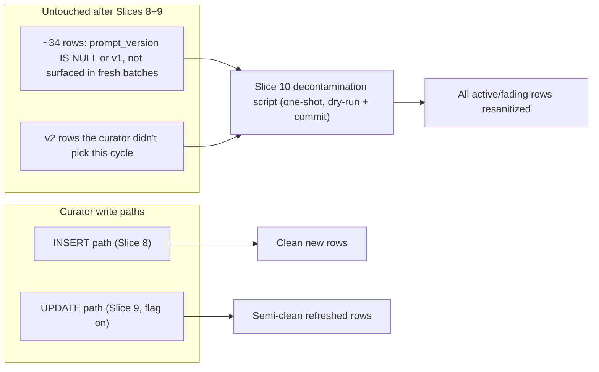
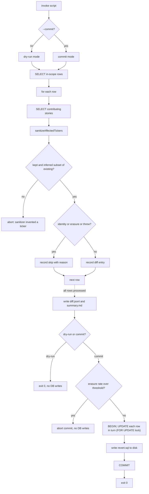

# Phase 2 / Step 13 / Slice 10 — Legacy decontamination of `analysis_market_memory`

## 1. Problem statement

Slice 8 fixed the INSERT path. Slice 9 fixed the UPDATE path (deployed + flag-flipped at 06:22 UTC 2026-05-12). But the live system is still dragging Smart Digest down:

- Iter-1 capture ([tmp/validation/2026-05-12/step13-iter-1/DECISION.md](tmp/validation/2026-05-12/step13-iter-1/DECISION.md)) measured 30 `prompt_version IS NULL` + 4 `memory-curator.v1` + 13 `memory-curator.v2` rows = 47 active/fading. Of those, **`m2_inferred_nonempty = 0`** and 7/11 validation symbols stayed contaminated.
- Iter-2 capture ([tmp/validation/2026-05-12/step13-iter-2/DECISION.md](tmp/validation/2026-05-12/step13-iter-2/DECISION.md)) ran after the Slice 9 flag flip, but the curator produced **0 updates** (2/3 LLM batches hit `spawn E2BIG`; the third batch produced no update entries). All metrics unchanged. Slice 9 code is correct and live — it simply never fires on rows the curator does not select that cycle.
- Slice 9 only re-sanitizes rows that **the LLM picks for update in the current batch**. Rows whose themes no longer surface in fresh story batches are immortal: they will never be selected for an UPDATE, so Slice 9 will never touch them. The 30 null-prompt-version rows fall mostly in this bucket — pre-Slice-5 themes that the curator has not refreshed.

This is why Slice 8 + Slice 9 are architecturally insufficient. The remaining contamination lives in rows the live curator can no longer reach. The deterministic fix is a one-shot operational script that walks all `active`/`fading` rows, reuses the same sanitizer + coherence rules already shipped, and rewrites only the four affected columns. No LLM dependency. No prompt redesign. No Slice 11 / Slice 12 / Step 14 changes.



## 2. Code areas involved

**One new file (the script) + one new test file. No production-path TS edits.** Slice 10 is operational tooling, not curator code.

- New script: [services/ai/gateway-2.0/scripts/decontaminate-memory.ts](services/ai/gateway-2.0/scripts/decontaminate-memory.ts).
  - CLI shape mirrors [services/ai/gateway-2.0/scripts/preview-digest.ts](services/ai/gateway-2.0/scripts/preview-digest.ts) (pg `Pool`, env via `infisical run --env=…`, args via manual parse).
  - Runs inside the gateway container OR locally with `infisical run --env=prod`. Same imports either way.
- New test: [services/ai/gateway-2.0/src/core/analysis/**tests**/decontaminate-memory.test.ts](services/ai/gateway-2.0/src/core/analysis/__tests__/decontaminate-memory.test.ts).
  - Mirrors the mock-pool pattern in [memory-curator.test.ts L943–999](services/ai/gateway-2.0/src/core/analysis/__tests__/memory-curator.test.ts) and the Slice 9 existing-row mock at L1303–1330. Pure function tests on the diff producer; mocked pool tests on the writer.
- Reused (read-only) helpers:
  - `sanitizeAffectedTickers`, `getActiveBroadSet`, `getSanitizeBroadTickersEnabled` from [ticker-sanitizer.ts](services/ai/gateway-2.0/src/core/analysis/ticker-sanitizer.ts).
  - The Slice 8C/9 primary coherence rule (open-coded inline; trivially 3 lines — no shared helper extracted to keep blast radius minimal).
- Docs: append a Slice 10 section to [docs/upstream-trust-map.md](docs/upstream-trust-map.md) (mirrors the Slice 8 / Slice 9 sections at L320 / L368).
- DB tables read: `analysis_market_memory` (SELECT), `analysis_filtered_news` (SELECT — evidence). DB tables written: `analysis_market_memory` only, four columns: `affected_tickers`, `tickers_inferred`, `primary_ticker`, `primary_ticker_source`. No other tables, columns, or extensions touched.
- No env-flag wiring. No compose changes. No Infisical changes. Slice 10 is a one-shot, not a permanent feature flag.

## 3. Proposed cleanup behavior

### 3.1 In-scope rows

```sql
SELECT amm.*
FROM analysis_market_memory amm
WHERE amm.status IN ('active', 'fading')
  AND cardinality(amm.affected_tickers) > 0
ORDER BY amm.last_updated ASC; -- stable, deterministic order; oldest first
```

Rationale: only `active`/`fading` rows feed Smart Digest selection ([digest-debug.ts](services/ai/gateway-2.0/src/core/analysis/digest-debug.ts), [recommendation-engine.ts](services/ai/gateway-2.0/src/core/analysis/recommendation-engine.ts) both filter on this). `archived` rows are excluded. Rows with empty `affected_tickers` have nothing to clean. No filter on `prompt_version` — the sanitizer's identity guard handles already-clean rows as no-ops, so re-running across the full set is safe and idempotent.

Optional CLI narrowing (for staged rollout): `--theme-id <uuid>` for single-row dry-runs; `--limit N` to cap the in-scope set during early testing.

### 3.2 Evidence retrieval per row

For each in-scope row:

```sql
SELECT fn.affected_tickers
FROM analysis_filtered_news fn
WHERE fn.batch_id = ANY($1::uuid[]); -- $1 = amm.source_batch_ids
```

`analysis_filtered_news` has a 7-day retention ([news-processor.ts L90 `RETENTION_DAYS = 7`](services/ai/gateway-2.0/src/core/analysis/news-processor.ts)). For pre-Slice-5 legacy rows (30 `prompt_version IS NULL`), most `source_batch_ids` will have aged out → zero contributing stories. **This is handled correctly by the existing `sanitizeAffectedTickers` Slice 8 zero-evidence fallback** ([ticker-sanitizer.ts L139–156](services/ai/gateway-2.0/src/core/analysis/ticker-sanitizer.ts)):

- All-broad theme → all tickers move to `inferred`, `kept = []`.
- Mixed theme → broad → `inferred`, non-broad → `kept`.

This is the same semantic Slice 8 applies at INSERT and Slice 9 at UPDATE. No new sanitizer logic — Slice 10 just exercises it on the legacy population.

### 3.3 Resanitization per row

```ts
const storyProj = stories.map((s) => ({
  affected_tickers: s.affected_tickers,
}));
const san = sanitizeAffectedTickers(row.affected_tickers, storyProj);
```

Inputs: `row.affected_tickers` (existing column value) + `stories` (filtered-news rows from §3.2). Output: `{ kept, inferred }`.

### 3.4 Column rewrite rules

- `affected_tickers` ← `san.kept`. Replaces existing list. No union with anything else.
- `tickers_inferred` ← `san.inferred`. **Replaces** (matches Slice 9 UPDATE semantics; not UNION). Existing inferred entries are discarded — they were either correctly there (and will be re-derived) or stale.
- `primary_ticker` ← unchanged unless `existing.primary_ticker IS NOT NULL AND NOT san.kept.includes(existing.primary_ticker)` → set to `NULL`. Guard-only, mirrors Slice 8C INSERT semantics and Slice 9 UPDATE semantics. Never recomputed via `computeMemoryPrimary` (primary coverage improvement is explicitly deferred to Slice 11 per the [hardening plan L271–276](.cursor/plans/step_13_curator_hardening_4ce7674e.plan.md)).
- `primary_ticker_source` ← nulled iff `primary_ticker` was nulled. Stays in lockstep.

Everything else untouched: `theme`, `summary`, `key_facts`, `relevance_score`, `status`, `first_observed`, `last_updated`, `update_count`, `source_batch_ids`, `prompt_version`, `validator_version`, `generated_at`, `model_name`, `tickers_unknown`. Provenance is preserved deliberately — `prompt_version` keeps recording the _original_ curator author so the A/B boundary remains queryable.

### 3.5 Skip rules (per-row, in addition to the identity guard inside the sanitizer)

A row is **skipped** (no SET clauses applied, logged with reason) when:

1. **Identity result**: `san.kept` (sorted, uppercased) is set-equal to `existing.affected_tickers` (sorted, uppercased) AND `san.inferred` is empty.
2. **Erasure guard**: `san.kept.length === 0` AND `existing.affected_tickers` contained at least one non-broad ticker. Mirrors Slice 9 §3.4 guard ([memory-curator.ts L877–892](services/ai/gateway-2.0/src/core/analysis/memory-curator.ts)).
3. **Sanitizer threw**: try/catch around the call; logged with `{ themeId, err }`.

### 3.6 Safety guards beyond the per-row checks

- `--dry-run` is the default. `--commit` must be passed explicitly. Default refuses to mutate.
- `MEMORY_CURATOR_SANITIZE_BROAD_TICKERS=false` master kill switch is honored: script aborts immediately if the sanitizer is globally disabled (no logical sense to decontaminate using a disabled sanitizer).
- **Sanitizer-invent assertion**: after each call, assert `san.kept ⊆ existing.affected_tickers (uppercase)` and `san.inferred ⊆ existing.affected_tickers (uppercase)`. The sanitizer should never produce a ticker that wasn't in the original list. Any violation → throw → abort the entire commit before any write.
- **Global erasure-rate abort**: in `--commit` mode, after the dry-run pass but before issuing any UPDATE, refuse to commit if more than **10%** of in-scope rows would have `san.kept.length === 0` (or `max(2, 10%)` whichever is higher, to allow small fixtures). Surfaces sanitizer regressions before they hit prod. Threshold is configurable via `--max-erasure-rate <float>` for staged exceptions.
- **Single transaction**: `BEGIN` → all UPDATEs → write `revert.sql` to disk → `COMMIT`. Any error → `ROLLBACK`. ~50 rows is small enough that one transaction is safe. Lock contention with the live curator is bounded by the script's runtime (seconds).
- **Row-level lock**: each UPDATE uses `SELECT … FOR UPDATE` inside the same transaction to coexist with a concurrent curator run (defensive; the script is intended to run when no curator cycle is in flight, but this prevents lost-update races).
- **No batched commits**: ROLLBACK semantics across batches are confusing. One transaction or none.
- **No retries**: failure is loud, not silent. Operator inspects logs, investigates, re-runs after fix.

### 3.7 Flow



## 4. Operational safety / rollback

### 4.1 Three-stage rollout

**Stage A — Build + dry-run on a single row.** Pass `--theme-id <known-contaminated-uuid>` (e.g. one of the iter-1 AAPL/NVDA/MSFT theme IDs). Verify the diff entry by hand. No commit. Output goes to `tmp/validation/<date>/slice10-dry-run-single/`.

**Stage B — Full dry-run.** Run without `--theme-id` against all in-scope rows. Output: `tmp/validation/<date>/slice10-dry-run-all/{diff.jsonl, summary.md, DECISION.md}`. Human reviewer fills DECISION.md and explicitly signs off. **Block stage C** if any of:

- Any row's `kept` set has tickers not in its original `affected_tickers` (assertion violation).
- Erasure rate exceeds 10%.
- Any of the 11 validation symbols would lose its sole non-broad anchor ticker (e.g. AAPL's chosen-row losing the `AAPL` literal). Per-symbol spot-check in the DECISION.md.
- Coherence guard would null a primary that the operator believes is still correct (case-by-case review).

**Stage C — Commit.** Pass `--commit`. Same script run produces `diff.jsonl`, `summary.md`, **and `revert.sql`** into `tmp/validation/<date>/slice10-commit/`. The `revert.sql` is written before `COMMIT` so a downstream failure still leaves the revert script intact on disk.

### 4.2 `revert.sql` shape (one row per mutation)

```sql
-- Slice 10 revert generated at 2026-05-13T…Z, run_id <uuid>
BEGIN;
UPDATE analysis_market_memory
SET affected_tickers       = ARRAY['AAPL','MSFT','GOOGL','META','NSDQ100']::text[],
    tickers_inferred       = ARRAY[]::text[],
    primary_ticker         = NULL,
    primary_ticker_source  = NULL
WHERE theme_id = '…' AND id = 123;
-- … one statement per row …
COMMIT;
```

Includes `id = 123` (the bigint PK) as an extra safety check — a manual `UPDATE` would refuse to apply if the row had since been replaced. `revert.sql` is idempotent: running it twice yields the same final state.

### 4.3 Rollback paths

| Scenario                                                                      | Action                                                                                                                                                                                                                     |
| ----------------------------------------------------------------------------- | -------------------------------------------------------------------------------------------------------------------------------------------------------------------------------------------------------------------------- |
| `--dry-run` ran and looked wrong                                              | No state changed. Discard the artefacts.                                                                                                                                                                                   |
| `--commit` succeeded but post-commit metrics regress                          | `infisical run --env=prod -- psql $DATABASE_URL -f tmp/validation/<date>/slice10-commit/revert.sql`. Single command. Restores all four columns per row.                                                                    |
| `--commit` succeeded but only a subset of rows are wrong                      | Open `revert.sql`, keep only the offending `UPDATE` statements, run that subset through psql.                                                                                                                              |
| `--commit` partial failure (some rows updated, then crash before COMMIT)      | The `ROLLBACK` in the script's catch block undoes everything. `revert.sql` may have been written for some rows — discard it; the transaction rolled back so nothing was actually applied.                                  |
| Slice 10 script logic is itself wrong and the revert restores corrupted state | Take the iter-1 baseline snapshot at [tmp/validation/2026-05-12/step13-iter-1/](tmp/validation/2026-05-12/step13-iter-1/) (Q2 captured pre-Slice-10 `affected_tickers` per `theme_id`) and write a manual recovery script. |

### 4.4 Blast-radius limits

- Script touches **only `analysis_market_memory`**, only four columns.
- Single transaction. No partial state visible to consumers mid-run.
- Smart Digest read fetchers (`fetchTickerMemoryText`, `fetchNewsHeadlines`, `fetchMemoryCandidatesForDebug`) acquire only row locks via their normal SELECTs; the script's `FOR UPDATE` locks are released on COMMIT/ROLLBACK in seconds.
- No async jobs depend on `tickers_inferred` semantics being unchanged across the run (Slice 6 + 7 consumer behavior is gated on `SMART_DIGEST_INCLUDE_INFERRED_ONLY`, default `false`).
- The script does NOT touch `analysis_filtered_news`, `analysis_ticker_price_targets`, `user_recommendation_log`, or any user-facing table.

## 5. Tests

All tests live in `services/ai/gateway-2.0/src/core/analysis/__tests__/decontaminate-memory.test.ts` and run under the existing `npm test` (vitest).

### 5.1 Pure-function tests (no DB, no mock pool)

The script exports a `computeRowDecontamination(row, stories)` helper that returns `{ action: 'apply' | 'skip', reason?: string, diff?: {...} }`. Test cases:

1. **Identity result → skip with reason `identity`.** Existing `[AAPL]`, stories `[{affected_tickers:[AAPL]}]`. Returns `{action:'skip', reason:'identity'}`.
2. **Erasure guard → skip with reason `erasure`.** Existing `[NVDA, SPX500]`, stories `[]`, BUT force a sanitizer return of `{kept:[], inferred:[…]}` (stub or use a fixture that triggers the path). Returns `{action:'skip', reason:'erasure'}`.
3. **Zero-evidence all-broad → apply.** Existing `[SPX500, NSDQ100]`, stories `[]`. Returns `{action:'apply', diff:{kept:[], inferred:[SPX500,NSDQ100]}}`.
4. **Zero-evidence mixed → apply.** Existing `[NVDA, SPX500]`, stories `[]`. Returns `{action:'apply', diff:{kept:[NVDA], inferred:[SPX500]}}`.
5. **Evidenced standard split → apply.** Existing `[AAPL, MSFT, NSDQ100]`, stories `[{affected_tickers:[AAPL,MSFT]}]`. Returns `{action:'apply', diff:{kept:[AAPL,MSFT], inferred:[NSDQ100]}}`.
6. **Primary coherence fires → diff includes `primary_ticker: null, primary_ticker_source: null`.** Existing primary `SPX500`, post-sanitization kept `[NVDA]`.
7. **Primary stays coherent → diff does NOT include primary fields.** Existing primary `NVDA`, post-sanitization kept `[NVDA, AAPL]`.
8. **Sanitizer-invent assertion** (defensive): stub the sanitizer to return `{kept:['ZZZZ'], inferred:[]}` against existing `[AAPL]`. Function throws.

### 5.2 Mock-pool tests for the writer (dry-run vs commit)

Reuse the mock-pool helper pattern from [memory-curator.test.ts L1303–1330](services/ai/gateway-2.0/src/core/analysis/__tests__/memory-curator.test.ts). The mock must serve:

- `SELECT … FROM analysis_market_memory WHERE status IN …` → returns N fixture rows.
- `SELECT fn.affected_tickers FROM analysis_filtered_news WHERE batch_id = ANY($1)` → returns N story rows.
- `BEGIN` / `COMMIT` / `ROLLBACK` → recorded.
- `UPDATE analysis_market_memory … WHERE theme_id = $1 AND id = $2` → recorded.

Test cases:

1. **Dry-run emits no `BEGIN`/`UPDATE`/`COMMIT`.** Captures all queries; asserts only `SELECT` statements appear in `queries`. Asserts `diff.jsonl` content via injected writer mock.
2. **Dry-run emits `summary.md` with correct counts** (apply / skip-identity / skip-erasure breakdown).
3. **Commit mode emits `BEGIN`, N UPDATEs, then COMMIT.** Asserts SQL shape per row and the FOR UPDATE row-lock SELECT.
4. **Commit writes `revert.sql` BEFORE the final COMMIT.** Reorder check on the captured query timeline + filesystem write timeline.
5. **Sanitizer-invent assertion → script throws, ROLLBACK fires, no UPDATEs.** Stub `sanitizeAffectedTickers` to return a ticker not in the original list. Assert mock pool sees `BEGIN`, possibly some early-row `UPDATE`s if the violation isn't on the first row, then `ROLLBACK`. (Cleanest: do the assertion **before** any UPDATE — verify implementation does the dry pass first, then writes only if all pass.)
6. **Erasure-rate threshold abort.** Fixture: 10 rows where 5 would have `kept = []`. Assert commit aborts with a clear error message; no UPDATE issued.
7. **Identity rows are not UPDATEd.** Fixture: 3 rows where 2 are identity, 1 needs change. Assert exactly 1 UPDATE issued.
8. **Master kill switch honored.** With `MEMORY_CURATOR_SANITIZE_BROAD_TICKERS=false`, script aborts immediately with a clear message.
9. **`--theme-id` narrows scope.** Fixture with 3 rows; pass `--theme-id` matching 1. Assert SELECT WHERE clause filters to that single uuid.
10. **`--limit N` narrows scope.** Fixture with 100 rows; `--limit 10`. Assert at most 10 rows processed.

### 5.3 Roundtrip / revertability test

11. **Apply diff → apply revert.sql → original state.** Synthetic 3-row fixture: simulate the full commit cycle on the mock pool, capture the generated revert.sql, parse it back into UPDATE statements, apply against a fresh mock pool that holds the post-commit state, assert the final state equals the pre-commit state on the four columns. This is the single most important test for operational confidence.

### 5.4 No accidental erasure of good narrow rows

12. **Narrow row stays narrow.** Existing `[AAPL]`, stories `[{affected_tickers:[AAPL]}]`. Identity guard fires; row untouched. Already covered by 5.1 case 1, but assert through the full writer path here.
13. **Narrow row with stale story evidence.** Existing `[AAPL]`, no stories at all (filtered_news aged out). Sanitizer zero-evidence mixed-theme rule: `AAPL` is non-broad → stays in kept. Returns identity. Row untouched. Critical: this is the most common "legacy null-prompt-version" case.

### 5.5 Read-side regression parity

`recommendation-engine.test.ts`, `digest-debug.test.ts`, `digest-symbol-affinity.test.ts` MUST stay green with no changes. Slice 10 does not touch any consumer code path — this is a pre-flight check, not a Slice 10 test.

## 6. Validation / evidence

Captures live under `tmp/validation/<date>/slice10-commit/`. Companion folder `tmp/validation/<date>/slice10-dry-run-all/` holds the pre-commit dry-run.

### 6.1 DB queries (BEFORE / AFTER)

Same Q1 + Q2 from the hardening plan ([step_13_curator_hardening_4ce7674e.plan.md L191–214](.cursor/plans/step_13_curator_hardening_4ce7674e.plan.md)). Capture once BEFORE the commit, once AFTER, into:

- `tmp/validation/<date>/slice10-commit/Q1-before.txt` / `Q1-after.txt`
- `tmp/validation/<date>/slice10-commit/Q2-before.csv` / `Q2-after.csv`

Q2 BEFORE serves as a backup recovery snapshot in case `revert.sql` is corrupted.

### 6.2 Step 13 metrics that should improve

| Metric                                                                                        | Iter-1 | Expected post-Slice-10                                                                                                   |
| --------------------------------------------------------------------------------------------- | ------ | ------------------------------------------------------------------------------------------------------------------------ |
| `m2_inferred_nonempty` (count of active/fading rows with `cardinality(tickers_inferred) > 0`) | 0      | **≥ 20** (most contaminated legacy rows have at least one broad ticker that should move to inferred)                     |
| `m6_broad_bearing` (count containing any broad set ticker in `affected_tickers`)              | 38     | **drop substantially**, expected `≤ 15`                                                                                  |
| `m7_broad_share`                                                                              | 0.8085 | **drop substantially**, expected `≤ 0.35`                                                                                |
| `m3_inferred_share`                                                                           | 0.0000 | **non-zero**, expected `≥ 0.40`                                                                                          |
| `m4_primary_nonnull`                                                                          | 4      | **may drop modestly** if the coherence guard nulls e.g. the Trump-Xi `^AXJO` primary; acceptable per Slice 8C / 9 design |
| `m5b_primary_coherent_pop`                                                                    | 0.0000 | **≥ 1.0** (any remaining non-null primary must be coherent — coherence guard guarantees this)                            |
| `m8_overlap` (disjoint invariant)                                                             | 0      | **0** (must stay zero)                                                                                                   |

### 6.3 `validate-affinity.ts` BEFORE / AFTER

Re-run [scripts/verify/validate-affinity.ts](scripts/verify/validate-affinity.ts) against the prod JSON dump BEFORE the commit and AFTER. Write to `tmp/validation/<date>/slice10-commit/validate-affinity-before/` and `…/validate-affinity-after/`. Diff the 11 spec validation symbols. Expectations:

- AAPL/NVDA/MSFT chosen rows narrow from `[…, MSFT, GOOGL, META, NSDQ100]`-shaped lists toward symbol-specific lists.
- No symbol's chosen-row `cardinality(affected_tickers)` strictly increases AFTER vs BEFORE.
- BTC/USD, ETH/USD, GOLD, GOOGL remain Improved or Unchanged-acceptable.
- No newly-introduced P1/P2/P3/P4 failures.

### 6.4 Per-row inspection (`diff.jsonl`)

One JSON object per in-scope row:

```json
{
  "theme_id": "…",
  "theme": "…",
  "status": "active",
  "prompt_version": null,
  "before": {
    "affected_tickers": ["AAPL", "MSFT", "GOOGL", "META", "NSDQ100"],
    "tickers_inferred": [],
    "primary_ticker": null,
    "primary_ticker_source": null
  },
  "after": {
    "affected_tickers": ["AAPL", "MSFT", "GOOGL", "META"],
    "tickers_inferred": ["NSDQ100"],
    "primary_ticker": null,
    "primary_ticker_source": null
  },
  "action": "apply",
  "reason": null,
  "evidence_story_count": 0,
  "evidence_mode": "zero_evidence_mixed"
}
```

`evidence_mode` is one of `evidenced`, `zero_evidence_all_broad`, `zero_evidence_mixed`. Lets a reviewer see at-a-glance which sanitizer code path produced each diff.

### 6.5 What good vs failure looks like

- **Good:** `m2_inferred_nonempty` jumps from 0 to ≥ 20; AAPL/NVDA/MSFT chosen rows narrow; no read-side test failure; iter-3 capture after one full curator cycle shows iter-1's 7 unchanged-contaminated symbols ≤ 2; H4 PASSes; H2 PASSes.
- **Failure (Slice 10 caused regression):** any chosen-row's `cardinality(affected_tickers)` strictly increases AFTER vs BEFORE; OR a previously-passing P1/P2/P3/P4 invariant flips to FAIL; OR Smart Digest output (sampled via [services/ai/gateway-2.0/scripts/preview-digest.ts](services/ai/gateway-2.0/scripts/preview-digest.ts)) regresses on the 11 spec symbols. → run `revert.sql`, open a Slice 10 follow-up plan, do not advance.
- **Insufficient:** all gates pass numerically but `validate-affinity.ts` still shows 4+ unchanged-contaminated equity symbols (i.e. the chosen rows are now narrower but other broad rows still rank above them). → Step 13 still incomplete; plan Slice 11 (theme-merge + primary coverage) per the hardening sketch.

## 7. Decision / exit for Slice 10

This section drives the iter-3 DECISION.md template (`tmp/validation/<date>/step13-iter-3/DECISION.md`), captured ≥ 24 h after the commit so at least one curator cycle has run since.

- **Slice 10 worked → Step 13 can close.** All these hold:
  1. `m2_inferred_nonempty ≥ 20` AND `m3_inferred_share ≥ 0.40` (H2 PASS by a wide margin).
  2. `m8_overlap == 0` (H1 disjoint invariant preserved).
  3. `m5b_primary_coherent_pop == 1.0` (H3: every non-null primary is in its row's `affected_tickers`).
  4. `validate-affinity.ts` AFTER: 0 regressed symbols; ≤ 2 unchanged-contaminated (H4 PASS).
  5. Read-side test suites green (H5 PASS).
  6. 7-day post-commit observation: no Smart Digest output regressions in `preview-digest.ts` spot-checks; no curator-side crashes or anomalies.

  → Step 13 closes. Slice 11 (theme-merge / primary coverage) and Step 14 (canonical digest) decisions can proceed independently.

- **Slice 10 helped but Step 13 still incomplete → plan Slice 11.** Mixed outcome:
  - H2 PASSes (inferred_nonempty improves), H1 / H5 PASS, **but** H4 still FAILs (chosen rows are narrower individually, but the wrong broad-shaped rows still rank above narrower siblings for some symbols).
  - OR `m4_primary_nonnull` is still low (< 10) — primary coverage was never fixed by Slice 8/9/10; Slice 11B (text-token primary fallback) becomes the next lever per the hardening sketch.

  → Open Slice 11 plan. Slice 10 has done its job (legacy contamination cleared); the remaining residual is structural (theme overlap and primary coverage) and not addressable by deterministic resanitization.

- **Slice 10 caused regression → revert and Slice 10 follow-up plan.** Any of:
  - A previously-passing P1–P4 invariant in `validate-affinity.ts` flips to FAIL.
  - A chosen-row `cardinality(affected_tickers)` strictly increases AFTER vs BEFORE for any spec symbol.
  - Smart Digest preview shows a degraded card for any spec symbol.
  - Read-side test suite breaks.

  → Run `revert.sql` via `psql -f`. Capture iter-3-revert evidence. Write Slice 10 follow-up plan investigating root cause (sanitizer edge case, primary-guard misfire, etc.). Do NOT proceed to Slice 11 until the regression is understood.

## 8. What this plan intentionally does NOT do

- Does not redesign Step 12 ([memory-curator.ts](services/ai/gateway-2.0/src/core/analysis/memory-curator.ts)) — no curator-path TS edits.
- Does not redesign Step 14 / canonical digest — no digest-layer changes.
- Does not bundle Slice 11 (theme-merge + primary coverage). Those are a separate plan and separate approval surface.
- Does not change the curator prompt, `themeUpdateEntrySchema`, or `ThemeUpdateEntry`.
- Does not change `MEMORY_CURATOR_PROMPT_VERSION`. Existing rows keep their original `prompt_version` so the A/B boundary remains queryable.
- Does not recompute `primary_ticker` via `computeMemoryPrimary`. Guard-only nulling, mirroring Slice 8C/9.
- Does not add new env flags. One-shot script, not a permanent feature.
- Does not rely on "LLM will be smarter". All decisions are deterministic.
- Does not modify `analysis_filtered_news`, `analysis_ticker_price_targets`, user-facing tables, or any other table.
- Does not change consumer flags (`SMART_DIGEST_INCLUDE_INFERRED_ONLY` stays at compose default `false`).

---

## Workflow (always appended) — Slice 10 only

### Stage A — Build + single-row dry-run

1. **Baseline check (SSH into VM).**
   - `ssh -i "$HOME\.ssh\nx-linux-server-azure_key (1).pem" azureuser@20.17.176.1`
   - `docker ps` → note current `stocktracker-gateway-2.0` image version.
   - Capture Q1 + Q2 into `tmp/validation/<date>/slice10-deploy-before/baseline.txt` and `Q2-before.csv`.

2. **Stage and push the script + tests + docs.**
   - `git status` → `git add` only the listed files (never `git add .`):
     - `services/ai/gateway-2.0/scripts/decontaminate-memory.ts`
     - `services/ai/gateway-2.0/src/core/analysis/__tests__/decontaminate-memory.test.ts`
     - `docs/upstream-trust-map.md`
   - `git commit -m "slice10(curator): legacy decontamination one-shot script (dry-run default)"`
   - `git push origin main`

3. **Verify build.**
   - `gh run watch`
   - Frontend not modified — no `vercel ls` needed.
   - Build fails → `gh run view <run-id> --log` → fix → step 2.

4. **Verify VM deployment.**
   - SSH → `docker ps` → confirm `gateway-2.0` image version increment (script ships inside the image so `docker exec` can find it).
   - `docker exec stocktracker-gateway-2.0 ls services/ai/gateway-2.0/scripts/decontaminate-memory.ts` → confirms the file is in the image.

5. **Single-row dry-run.**
   - `docker exec stocktracker-gateway-2.0 npx tsx services/ai/gateway-2.0/scripts/decontaminate-memory.ts --dry-run --theme-id <known-contaminated-uuid> --out tmp/validation/<date>/slice10-dry-run-single/`
   - Inspect `diff.jsonl` by hand. Confirm the sanitizer output matches expectations for that single row.

### Stage B — Full dry-run + sign-off

6. **Full dry-run.**
   - `docker exec stocktracker-gateway-2.0 npx tsx services/ai/gateway-2.0/scripts/decontaminate-memory.ts --dry-run --out tmp/validation/<date>/slice10-dry-run-all/`
   - Inspect `diff.jsonl` and `summary.md`. Spot-check at least the 11 validation symbols' chosen rows.
   - Fill `tmp/validation/<date>/slice10-dry-run-all/DECISION.md` explicitly signing off (or rejecting) the proposed diff. **Block stage C** if any assertion-violation, erasure-rate > 10%, or anchor-ticker-loss is observed.

### Stage C — Commit

7. **Commit.**
   - `docker exec stocktracker-gateway-2.0 npx tsx services/ai/gateway-2.0/scripts/decontaminate-memory.ts --commit --out tmp/validation/<date>/slice10-commit/`
   - On success, verify `revert.sql` exists in the output directory and contains one statement per UPDATEd row.
   - Capture Q1 AFTER into `tmp/validation/<date>/slice10-commit/Q1-after.txt`.
   - Run `validate-affinity.ts` AFTER → `tmp/validation/<date>/slice10-commit/validate-affinity-after/`.

8. **Iter-3 DECISION + observation.**
   - Wait for at least one full curator cycle (≥ 6 h) so Slice 9 has a chance to confirm idempotence on rows the curator re-picks.
   - Capture Q1 + `validate-affinity.ts` for iter-3 → `tmp/validation/<date>/step13-iter-3/`.
   - Fill `tmp/validation/<date>/step13-iter-3/DECISION.md` against the section 7 exit criteria.
   - **Done (for Slice 10).** Decide: close Step 13, plan Slice 11, or revert and plan Slice 10 follow-up.
