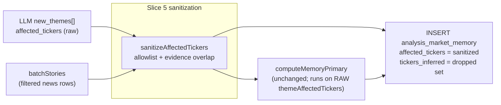

# Phase 2 / Step 13 / Slice 5: Anchor-sanitize `affected_tickers` at memory INSERT

## 1. The exact problem this slice solves

The dominant contamination pattern in current `analysis_market_memory` rows is **broad-index boilerplate**: the LLM curator routinely adds `SPX500` (and to a lesser extent `NSDQ100`, `DJ30`, `RTY`, `SPY`, `QQQ`, `DIA`, `IWM`, `VTI`, `VOO`) to themes that are **not actually about** those indices. The curator prompt at [`memory-curator.ts:446`](services/ai/gateway-2.0/src/core/analysis/memory-curator.ts) explicitly instructs:

> "For broad macro or risk-off themes that move 'the market,' include at least one major index symbol (e.g. SPX500) alongside any ETFs (SPY, QQQ)."

The LLM over-applies this rule. Direct evidence from [`tmp/validation/2026-05-11/slice4-debug-after/SPX500.json`](tmp/validation/2026-05-11/slice4-debug-after/SPX500.json) (24 memory candidates pulled for the SPX500 digest):

- "JEPI Covered-Call ETF Structural Flaw" — `affected_tickers: ["JEPI","SPX500"]`. About JEPI specifically.
- "GameStop $56B eBay Acquisition" — `affected_tickers: ["GME","EBAY","SPX500"]`. About GME.
- "California Insurance Market Regulatory Crisis" — `affected_tickers: ["PGR","ALL","TRV","SPX500"]`. About P&C insurers.
- "Healthcare Sector Defensive Outperformance" — `affected_tickers: ["AZN","JNJ","ROIV","WELL","GH","BLLN","ARGX","RDNT","SPX500"]`. About AZN/JNJ; `SPX500` tacked on plus already 8 tickers → `broad_tag_penalty:n=9`.
- "Sports Finance Institutionalization" — `affected_tickers: ["SPX500"]`. About a William Blair / Inner Circle Sports acquisition. SPX500 is the ONLY ticker → `position_primary_hit:SPX500` → `narrow_tag_bonus:n=1` → affinity passes at 3 with `oneLinerOnSymbol:false`.

This bloat:

1. Inflates `affected_tickers` so genuine narrow rows fail `n<=NARROW_TAG_MAX` and unrelated narrow rows wrongly trip `position_primary_hit:SPX500`.
2. Surfaces non-SPX500 stories as SPX500 candidates in [`fetchTickerMemoryText`](services/ai/gateway-2.0/src/core/analysis/recommendation-engine.ts) (overlap filter `affected_tickers && $1::text[]`).
3. Sometimes wins the ranking and produces an off-symbol one-liner that Step-5 surfacing then has to suppress downstream.
4. Pollutes `fetchNewsHeadlines` per-ticker iteration for index symbols.

Slice 4 already neutralizes one variant of this (strong-tier mismatch). But the memory layer itself still ships the bloated rows; consumer-side mitigations work around upstream noise instead of removing it.

## 2. Why this should come next instead of more scorer tuning

- Slice 4 validation ([`slice4-debug-after/DECISION.md`](tmp/validation/2026-05-11/slice4-debug-after/DECISION.md)): zero chosen-row flips because no memory rows currently carry `marketaux_entities` primaries. Further affinity-side tuning is gated on upstream data we already control.
- The contamination root cause is **what we write to the table**, not how we score it. Once the curator stops persisting unjustified broad-index tags, every downstream consumer (affinity scoring, news-headline fan-out, news-sentiment aggregation, debug surface) benefits without re-tuning thresholds.
- It is the narrowest fix that touches the curator at the only stage where the bloat originates (theme INSERT). UPDATE path is untouched (Slice 2 anchor invariance preserved).

## 3. Where the fix lands

**Theme creation only (INSERT in `applyChanges`).** This matches the location of the primary_ticker derivation already shipped in Slice 2 and means existing rows are left untouched. UPDATE / decay / daily-maintenance paths are explicitly out of scope so live rows don't churn.



## 4. Design

### Sanitization rule (deterministic)

For each new theme at INSERT time:

1. Compute the union of contributing-story `affected_tickers` using the **same overlap criterion as `computeMemoryPrimary`** (story is "contributing" iff `story.affected_tickers ∩ theme.affected_tickers ≠ ∅`, case-insensitive). Call this set `evidencedUnion`.
2. Define a hardcoded `BROAD_INDEX_BOILERPLATE_TICKERS` allowlist:
   ```
   SPX500, NSDQ100, DJ30, RTY, SPY, QQQ, DIA, IWM, VTI, VOO
   ```
   This matches the exact symbols the prompt encourages the LLM to "tack on."
3. For each ticker `t` in the theme's `affected_tickers`:
   - **Drop** `t` iff `t` is in `BROAD_INDEX_BOILERPLATE_TICKERS` AND `t` is NOT in `evidencedUnion`.
   - Otherwise keep.
4. Edge case: if `evidencedUnion` is empty (no contributing stories — extremely rare; e.g. all batchStory tickers disjoint from this theme), **fall back to the original `affected_tickers` unchanged** so we never strip everything from a row.
5. Edge case: if sanitization would leave `affected_tickers` empty (theme tagged with ONLY boilerplate broad indices, none evidenced — like the "Sports Finance" example above), **fall back to the original `affected_tickers` unchanged**. Better to keep one row visible than write a tickerless row.
6. Persist the dropped tickers in a new additive column `tickers_inferred TEXT[]` for inspectability and so future slices can choose to discount them in scoring.

`primary_ticker` is computed **before** sanitization on the **raw** `affected_tickers` so Slice 2 anchor logic is byte-identical. By construction the heuristic primary is in `evidencedUnion` already (it came from a contributing story's `primary_ticker`), so primary will never be dropped.

### Kill switch

Env flag `MEMORY_CURATOR_SANITIZE_BROAD_TICKERS` (default `"true"`). When `"false"`, sanitization is a no-op and `tickers_inferred` is written empty. Pattern mirrors `getMemoryFreshnessHours` / `getAffinityMin` env reads.

### Why allowlist instead of "drop all unevidenced"

The allowlist version is the **narrowest** fix targeting only the proven failure mode (broad-index boilerplate). A "drop every unevidenced ticker" version would also silently kill legitimate curator-added second-order effects (e.g. `LMT` on an oil shock theme, `GOLD` on a US-Iran theme). Evidence to justify that broader cut does not exist yet; deferring it to a future slice is correct.

## 5. Code changes

### 5.1 New module — [`services/ai/gateway-2.0/src/core/analysis/ticker-sanitizer.ts`](services/ai/gateway-2.0/src/core/analysis/ticker-sanitizer.ts)

```ts
export const BROAD_INDEX_BOILERPLATE_TICKERS: ReadonlySet<string> = new Set([
  "SPX500",
  "NSDQ100",
  "DJ30",
  "RTY",
  "SPY",
  "QQQ",
  "DIA",
  "IWM",
  "VTI",
  "VOO",
]);

export interface TickerSanitizationResult {
  kept: string[]; // new affected_tickers value (uppercased, deduped, order preserved)
  inferred: string[]; // dropped tickers (for tickers_inferred column)
}

export function getSanitizeBroadTickersEnabled(): boolean {
  const raw = process.env["MEMORY_CURATOR_SANITIZE_BROAD_TICKERS"];
  if (raw === undefined || raw === "") return true;
  return raw.toLowerCase() !== "false";
}

export function sanitizeAffectedTickers(
  themeAffectedTickers: ReadonlyArray<string>,
  contributingStories: ReadonlyArray<{
    affected_tickers: ReadonlyArray<string>;
  }>,
): TickerSanitizationResult {
  /* deterministic logic per §4 */
}
```

Pure / deterministic / no I/O. Wrapped in `try/catch` per project policy: on any internal failure return `{ kept: [...originalUpper], inferred: [] }` (safe no-op).

### 5.2 [`memory-curator.ts`](services/ai/gateway-2.0/src/core/analysis/memory-curator.ts) `applyChanges` INSERT path

Inside the `for (const nt of output.new_themes)` loop, after `computeMemoryPrimary(...)` and before the `INSERT`:

```ts
const sanitization = getSanitizeBroadTickersEnabled()
  ? sanitizeAffectedTickers(
      nt.affected_tickers,
      batchStories.map((s) => ({ affected_tickers: s.affected_tickers })),
    )
  : { kept: [...nt.affected_tickers], inferred: [] };
```

Then write `sanitization.kept` in place of `nt.affected_tickers` to the columns `affected_tickers`, recompute `tickerPrices` and `tickersUnknown` against `sanitization.kept`, and add `sanitization.inferred` as `$23` to the INSERT (new column `tickers_inferred`).

`computeMemoryPrimary` stays called on `nt.affected_tickers` (raw) — unchanged.

### 5.3 No changes to UPDATE / decay / maintenance / Smart Digest consumer

Step 11/12/13 Slice 2/3/4 invariants preserved. Consumer-side adoption of `tickers_inferred` (e.g. discounting inferred tickers in affinity) is explicitly a future slice (§9).

## 6. Schema / migration

New file [`services/workers/data-fetcher-2.0/migrations/030_market_memory_tickers_inferred.sql`](services/workers/data-fetcher-2.0/migrations/030_market_memory_tickers_inferred.sql):

```sql
BEGIN;

ALTER TABLE analysis_market_memory
    ADD COLUMN IF NOT EXISTS tickers_inferred TEXT[] DEFAULT '{}';

COMMENT ON COLUMN analysis_market_memory.tickers_inferred IS
'Slice 5: tickers the LLM proposed in affected_tickers but that had no support in the contributing-stories ticker union AND were on the broad-index boilerplate allowlist; dropped from affected_tickers at INSERT for inspectability and to enable downstream discounting.';

COMMIT;
```

Additive. `DEFAULT '{}'` keeps live rows readable without a backfill. No new index needed (column not used in filters yet). Verify after deploy by running `\d+ analysis_market_memory` on the VM.

## 7. Tests

New file [`services/ai/gateway-2.0/src/core/analysis/__tests__/ticker-sanitizer.test.ts`](services/ai/gateway-2.0/src/core/analysis/__tests__/ticker-sanitizer.test.ts):

- Drops unevidenced `SPX500` from a narrow `["JEPI","SPX500"]` theme when no contributing story has `SPX500`.
- Keeps evidenced `SPX500` from a `["JEPI","SPX500"]` theme when a contributing story has `["SPX500","SPY"]` (overlaps via SPY → SPX500 in evidencedUnion check needs to be evaluated correctly: story contributes iff overlap with theme, and SPX500 is the ticker we are evaluating; tests cover both "ticker in story's array" and "no contribution at all").
- Keeps non-allowlisted unevidenced tickers (e.g. `LMT` on an oil-shock theme).
- Empty-evidence fallback: `evidencedUnion` empty → no-op, `inferred` empty.
- Empty-after-sanitization fallback: theme `["SPX500"]` with no SPX500 evidence → keep `["SPX500"]`, `inferred` empty.
- Case-insensitive matching (input `["spx500"]` → kept as `"SPX500"`).
- Determinism: same input → same output across calls.
- Env flag `MEMORY_CURATOR_SANITIZE_BROAD_TICKERS=false` → no-op.

Extend [`memory-curator.test.ts`](services/ai/gateway-2.0/src/core/analysis/__tests__/memory-curator.test.ts) `applyChanges` block:

- New test: INSERT params show sanitized `affected_tickers` AND `tickers_inferred` populated with `["SPX500"]` when boilerplate is dropped.
- Anchor invariance: `primary_ticker` derived from raw is unaffected when sanitization drops boilerplate.
- Env-disabled path: with `MEMORY_CURATOR_SANITIZE_BROAD_TICKERS=false`, INSERT writes raw tickers and empty `tickers_inferred`.

## 8. DB / debug validation

After deploy (per workflow appendix):

1. **SQL spot-check** on new rows (post-deploy memory-curator run):

   ```sql
   SELECT theme,
          affected_tickers,
          tickers_inferred,
          primary_ticker,
          primary_ticker_source
   FROM analysis_market_memory
   WHERE created_at >= NOW() - INTERVAL '6 hours'
   ORDER BY created_at DESC
   LIMIT 30;
   ```

   Expect: rows with `tickers_inferred` containing one of the allowlist symbols are visible; their `affected_tickers` no longer contains those symbols. Older rows have empty `tickers_inferred` (default), unchanged.

2. **Debug-digest capture** for the SPX500 symbol (already known to be the worst contamination magnet) into `tmp/validation/2026-05-11/slice5-debug-after/SPX500.json` and compare to [`slice4-debug-after/SPX500.json`](tmp/validation/2026-05-11/slice4-debug-after/SPX500.json). Expected:
   - Fewer SPX500 memory candidates returned by the overlap query.
   - The "Sports Finance Institutionalization" row (only ticker = `SPX500`) either disappears (if sanitized) or stays unchanged (if fallback fires because it would otherwise be empty — desired outcome).
   - Narrow rows like JEPI / GameStop / California Insurance no longer appear in SPX500's candidate pool.

3. Write `tmp/validation/2026-05-11/slice5-debug-after/DECISION.md` documenting:
   - Counts of new rows with non-empty `tickers_inferred`.
   - Most frequently dropped symbol (expected: `SPX500`).
   - Chosen-row flips per symbol (expected: zero or one — the gain is fewer noise candidates, not different choices).
   - Any unexpected drops to investigate.

## 9. What comes after this slice

In strict scope order:

1. **Smart Digest consumer adoption of `tickers_inferred`** — optionally subtract inferred tickers from cardinality used for `narrow_tag_bonus` / `broad_tag_penalty`, or skip overlap matches on inferred-only tickers. Decide once Slice 5 has produced enough data to measure.
2. **Upstream extension to `analysis_filtered_news.affected_tickers`** — same boilerplate-allowlist sanitization at news-processor write time, since the contamination originates one layer earlier and Slice 5's "evidencedUnion" is only as clean as the filtered-news tickers it relies on.
3. **Curator prompt refinement** — remove the "include at least one major index symbol" sentence from the prompt once Slice 5 + the news-processor variant prove out, to attack the root cause too. Defer until we can measure the effect.
4. **Generalize beyond the allowlist** — once evidence supports it, broaden the drop rule to "all unevidenced tickers not in `primary_ticker`," after measuring false-drop rate against curator's legitimate second-order picks.

None of these are required for Slice 5 to be a complete, deployable improvement on its own.

---

## Workflow (appendix)

1. **Baseline check (SSH into VM)**
   - `ssh -i "$HOME\.ssh\nx-linux-server-azure_key (1).pem" azureuser@20.17.176.1`
   - `docker ps` → note current image version

2. **Stage and push changes**
   - `git status` → `git add <file1> <file2> ...` → `git commit -m "msg" && git push origin main`
   - Never `git add .` — other agents may have uncommitted changes

3. **Verify build**
   - GitHub Actions: `gh run watch`
   - If frontend modified: `vercel ls --scope=stocktracker` (N/A here — backend only)
   - Only proceed when all builds pass
   - Build fails → `gh run view <run-id> --log` → fix → Step 2

4. **Verify VM deployment**
   - SSH → `docker ps` → compare version
   - Version incremented → done
   - Version unchanged / container down → fix → Step 2

5. **Done**
