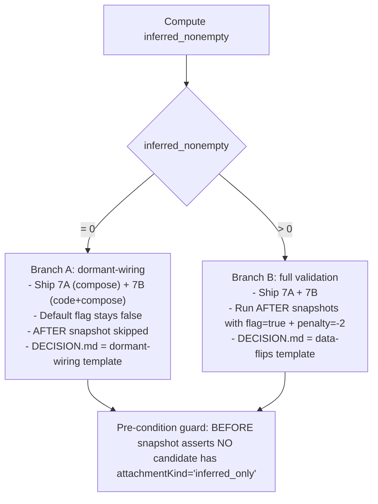

# Phase 2 / Step 13 / Slice 7 — Inferred-only scoring tuning + env-gated candidate inclusion (data-aware)

## Decision target

Slice 7 is intentionally split into **what ships** vs **what activates**. The two are not the same.

### What actually ships in this slice (in all cases)

- The `getIncludeInferredOnly()` env-reader helper in [digest-symbol-affinity.ts](services/ai/gateway-2.0/src/core/analysis/digest-symbol-affinity.ts) (Slice 7B wiring).
- The additive SQL predicate `OR ($I::bool AND tickers_inferred && $K::text[])` and the new bind parameter in three fetchers (Slice 7B wiring) — gated by the bind value.
- The TS-side iteration adjustments in `fetchTickerMemoryText` and `fetchNewsHeadlines` so the in-process intersection check follows the same flag.
- The `SMART_DIGEST_INFERRED_ONLY_PENALTY=${SMART_DIGEST_INFERRED_ONLY_PENALTY:--2}` default in [deployment/vm/docker-compose.yml](deployment/vm/docker-compose.yml) (Slice 7A).
- The `SMART_DIGEST_INCLUDE_INFERRED_ONLY=${SMART_DIGEST_INCLUDE_INFERRED_ONLY:-false}` default in the same compose file.
- The harness fix in [scripts/verify/validate-affinity.ts](scripts/verify/validate-affinity.ts) so `attachmentKind` is actually observable in snapshots.
- Tests, docs, and DECISION.md.

The source-level default `WEIGHT_INFERRED_ONLY_ATTACHMENT_DEFAULT = 0` is **not** changed. The penalty value lives in the deployment compose layer so revert is one line.

### What remains behaviorally dormant by default

- `SMART_DIGEST_INCLUDE_INFERRED_ONLY=false` (compose default). At this value the additive SQL OR-arm is gated by the `$I::bool` bind, and the in-process `inferred_only` iteration is skipped. The plan's behavioral claim is **observable**: with the flag false the candidate set returned by every fetcher matches the Slice 6 chosen-row / candidate-list outcome for the same DB state, asserted by deep-equal tests.
- The `-2` penalty default. Because `attachmentKind="inferred_only"` is only reachable through the include flag, the penalty has no observable effect on chosen rows while the flag is false. Tests still verify the penalty clamp and that the value is read; runtime behavior is unaffected at default.

### What only becomes behaviorally relevant if production data later contains non-empty `tickers_inferred`

Two conditions must both be met before any chosen-row flip can occur:

1. `analysis_market_memory` has rows with `cardinality(tickers_inferred) > 0` whose digest-symbol alias appears only in `tickers_inferred` (not in `affected_tickers`).
2. `SMART_DIGEST_INCLUDE_INFERRED_ONLY` is explicitly flipped to `true` (via Infisical or compose override).

Until both hold, this slice ships dormant wiring and a stored-but-unreached penalty value. The plan does **not** claim chosen-row flips will happen at deploy time. Validation in the no-data branch verifies the dormancy is real (no `inferred_only` candidates emitted), not that a behavior change has been measured.

### Current production evidence

Slice 6 DECISION.md (2026-05-11): `cardinality(tickers_inferred) > 0` = **0 rows** out of the active/fading set. The Hard-precondition step below re-queries this before any code change.

## Hard precondition (executed before any code change)

Compute three counts against prod via SSH. The result selects which execution branch runs.

```bash
ssh -i "$HOME/.ssh/nx-linux-server-azure_key (1).pem" azureuser@20.17.176.1 \
  'docker exec -i postgres psql -U postgres -d stocktracker -t -A -F "|" -c "
    SELECT
      COUNT(*) FILTER (WHERE cardinality(tickers_inferred) > 0)                            AS inferred_nonempty,
      COUNT(*) FILTER (WHERE cardinality(tickers_inferred) > 0
                       AND (affected_tickers && tickers_inferred))                          AS inferred_overlap_with_affected,
      COUNT(*) FILTER (WHERE cardinality(tickers_inferred) > 0
                       AND NOT (affected_tickers && tickers_inferred))                      AS inferred_disjoint_from_affected,
      COUNT(*)                                                                              AS total_active_fading
    FROM analysis_market_memory
    WHERE status IN (''active'',''fading'');"' \
  | tee tmp/validation/$(date -u +%F)/slice7-debug-before/db-baseline.txt
```

Inferred inventory (only meaningful if `inferred_nonempty > 0`):

```bash
docker exec -i postgres psql ... -c "
  SELECT theme, affected_tickers, tickers_inferred, last_updated
  FROM analysis_market_memory
  WHERE status IN ('active','fading') AND cardinality(tickers_inferred) > 0
  ORDER BY last_updated DESC LIMIT 100;" > tmp/validation/<date>/slice7-debug-before/inferred-rows.txt
```

### Execution branches



**Branch A (inferred_nonempty == 0):** Slice 7B inclusion remains dormant — it is not presented as an active behavioral change in this slice. The wiring is shipped so that when future curator runs populate `tickers_inferred`, an Infisical flip is the only step needed; no second deploy. Observable verification:

1. `getIncludeInferredOnly()` returns `false` at default (unit test).
2. Each fetcher's SQL contains the additive predicate and is bound with `$I::bool = false` at default (structural assertion).
3. No fetcher returns a candidate with `attachmentKind === "inferred_only"` against the production dataset (BEFORE snapshot guard).
4. Each fetcher's chosen row / candidate list at default flags is deep-equal to the Slice 6 baseline outcome on a controlled fixture (behavioral regression).
5. The penalty clamp `[-5, 0]` rejects out-of-range overrides (unit test).

**Branch B (inferred_nonempty > 0):** Run the AFTER snapshot with `SMART_DIGEST_INCLUDE_INFERRED_ONLY=true` and `SMART_DIGEST_INFERRED_ONLY_PENALTY=-2`, diff vs BEFORE, fill the data-flips DECISION.md template.

## Slice 7A — penalty default

Add to [deployment/vm/docker-compose.yml](deployment/vm/docker-compose.yml) under `gateway-2.0.environment:` (matches `CURATOR_*` pattern, line ~436):

```yaml
- SMART_DIGEST_INFERRED_ONLY_PENALTY=${SMART_DIGEST_INFERRED_ONLY_PENALTY:--2}
```

No source-file change. Reversal = single-line removal or override via `infisical secrets set SMART_DIGEST_INFERRED_ONLY_PENALTY=0 --env=prod`.

Penalty `-2` rationale (only relevant when 7B flag is on AND data exists):

- `-1`: a text-hit inferred_only row still passes (`+2 −1 +1 = 2`). Effectively no gate.
- `-2`: exactly cancels `WEIGHT_TEXT_TOKEN` (`+2 −2 +1 = 1` → below threshold). Matches the spec's "appropriately de-boosted".
- `-3`: even legitimate inferred mentions blocked. Too aggressive given low evidence base.

## Slice 7B — env-gated SQL expansion

### 1) New env reader in [digest-symbol-affinity.ts](services/ai/gateway-2.0/src/core/analysis/digest-symbol-affinity.ts)

Append after `getInferredOnlyPenalty` (around L242):

```ts
/**
 * Slice 7B: when true, fetchers also pull rows whose digest-symbol alias
 * appears only in `tickers_inferred` (i.e. tickers dropped by the Slice 5
 * sanitizer). Default false — no behavior change until explicitly enabled.
 * Truthy values: "true", "TRUE", "1". Everything else (including "yes",
 * "0", empty, non-string-coerced values) returns false.
 */
export function getIncludeInferredOnly(): boolean {
  const raw = process.env["SMART_DIGEST_INCLUDE_INFERRED_ONLY"];
  if (raw === undefined || raw === "") return false;
  const v = raw.toLowerCase();
  return v === "true" || v === "1";
}
```

### 2) Exact SQL predicate per fetcher (with bind ordering)

The plan commits to a single canonical predicate shape, applied with fetcher-specific parameter indices:

```sql
(affected_tickers && $K::text[]
 OR ($I::bool AND tickers_inferred && $K::text[]))
```

Where `$K` is the existing alias-array parameter slot, and `$I` is a newly-appended boolean parameter. The OR-arm's effective truth value is gated on `$I::bool`: when bound `false`, the conjunct `($I::bool AND tickers_inferred && $K::text[])` is `false` for every row, so the predicate as a whole reduces to the original `affected_tickers && $K::text[]` filter. The plan does not assume anything about query-planner internals (no claims about short-circuit evaluation, predicate folding, or index plan stability) — the safety contract is purely at the level of observable rows: at flag `false` the returned candidate set matches the Slice 6 default-path outcome, asserted by behavioral deep-equal tests on the chosen row / candidate list for every fetcher.

#### 2a) `fetchTickerMemoryText` ([recommendation-engine.ts L586-597](services/ai/gateway-2.0/src/core/analysis/recommendation-engine.ts))

Current params: `[Array.from(candidatesUnion), freshHours]` → `$1`, `$2`. Add `$3` = include flag.

```ts
const includeInferred = getIncludeInferredOnly();
const { rows } = await db.query<MemoryTextRow>(
  `SELECT theme, affected_tickers, news_one_liner, summary, key_facts,
          market_implications, impact_level,
          relevance_score::text, sentiment_score::text,
          last_updated::text,
          primary_ticker, primary_ticker_source, tickers_inferred
     FROM analysis_market_memory
    WHERE status IN ('active', 'fading')
      AND last_updated >= NOW() - ($2::int * INTERVAL '1 hour')
      AND (affected_tickers && $1::text[]
           OR ($3::bool AND tickers_inferred && $1::text[]))`,
  [Array.from(candidatesUnion), freshHours, includeInferred],
);
```

Inner per-digest hit-check (around L606-609) must also branch on the flag, otherwise inferred-only rows would be filtered out by the in-process intersection check:

```ts
const includeInferredForLoop = includeInferred; // closure-capture for clarity
for (const row of rows) {
  const tickers = row.affected_tickers ?? [];
  const inferred = row.tickers_inferred ?? [];
  const keptHit  = tickers.some((t) => candSet.has((t ?? "").toUpperCase()));
  const inferredHit =
    includeInferredForLoop &&
    inferred.some((t) => candSet.has((t ?? "").toUpperCase()));
  if (!keptHit && !inferredHit) continue;
  // ... existing affinity scoring (already wired for tickersInferred in Slice 6) ...
}
```

#### 2b) `fetchNewsHeadlines` ([recommendation-engine.ts L403-424](services/ai/gateway-2.0/src/core/analysis/recommendation-engine.ts))

This fetcher has a conditional `symbolClause` that re-indexes `$1`→`$2`. The Slice 7B param goes on the end either way.

When `symbolFilter` is undefined: only `$1=freshHours` is bound. The flag does nothing because there is no symbol intersection at all. We still bind it for shape consistency.

When `symbolFilter` is set:
```ts
const includeInferred = getIncludeInferredOnly();
const params: unknown[] = [];
let symbolClause = "";
if (symbolFilter) {
  // $1 stays freshHours; aliases moves to $2; include flag to $3.
  symbolClause = " AND (affected_tickers && $2::text[]"
               + " OR ($3::bool AND tickers_inferred && $2::text[]))";
  params.push(newsLookupCandidateSymbols(symbolFilter));
  params.push(includeInferred);
}

const { rows } = await db.query<NewsHeadlineRow>(
  `SELECT theme AS headline, affected_tickers, news_one_liner,
          primary_ticker, primary_ticker_source, tickers_inferred
     FROM analysis_market_memory
    WHERE status IN ('active', 'fading')
      AND last_updated >= NOW() - ($1::int * INTERVAL '1 hour')${symbolClause}
    ORDER BY relevance_score DESC, last_updated DESC
    LIMIT 50`,
  [freshHours, ...params],
);
```

Outer iteration (around L429-460): when `includeInferred` is true, also walk `row.tickers_inferred` so the headline map gets keyed for the inferred ticker. `computeSymbolAffinity` already tags such entries as `attachmentKind="inferred_only"` (Slice 6) and the penalty downranks them — so `affinity.passed` is the gate.

```ts
const includeInferredForLoop = getIncludeInferredOnly();
for (const row of rows) {
  const keptTickers = row.affected_tickers ?? [];
  const inferredTickers = includeInferredForLoop ? (row.tickers_inferred ?? []) : [];
  const allTickersForLoop = [...keptTickers, ...inferredTickers];
  for (const ticker of allTickersForLoop) {
    // ... existing per-ticker affinity scoring unchanged; computeSymbolAffinity
    // receives tickersInferred: row.tickers_inferred ?? [] (Slice 6 wiring) ...
  }
}
```

#### 2c) `fetchMemoryCandidatesForDebug` ([digest-debug.ts L647-662](services/ai/gateway-2.0/src/core/analysis/digest-debug.ts))

Current params: `[candidatesTried]` → `$1`. Add `$2` = include flag.

```ts
const includeInferred = getIncludeInferredOnly();
const res = await db.query<MemoryDebugRow>(
  `SELECT theme, category, affected_tickers, news_one_liner, summary,
          impact_level,
          relevance_score::text AS relevance_score,
          sentiment_score::text AS sentiment_score,
          last_updated::text AS last_updated,
          model_name, prompt_version, validator_version,
          generated_at::text AS generated_at,
          tickers_unknown,
          primary_ticker, primary_ticker_source, tickers_inferred
     FROM analysis_market_memory
    WHERE status IN ('active', 'fading')
      AND (affected_tickers && $1::text[]
           OR ($2::bool AND tickers_inferred && $1::text[]))`,
  [candidatesTried, includeInferred],
);
```

No TS iteration change — `fetchMemoryCandidatesForDebug` already scores every fetched row against the single debug symbol (Slice 6 passes `tickersInferred` through to `computeSymbolAffinity`).

### 3) docker-compose default

Append next to the penalty knob in [deployment/vm/docker-compose.yml](deployment/vm/docker-compose.yml):

```yaml
- SMART_DIGEST_INCLUDE_INFERRED_ONLY=${SMART_DIGEST_INCLUDE_INFERRED_ONLY:-false}
```

## Validation harness — required script update

The current [scripts/verify/validate-affinity.ts](scripts/verify/validate-affinity.ts) does NOT include `tickers_inferred` in `RawRow` and does NOT pass `tickersInferred` to `computeSymbolAffinity`. Without this fix, `attachmentKind` cannot be observed and BEFORE/AFTER snapshots would never produce `inferred_only` outcomes regardless of code state — i.e. the diff harness would be invalid for this slice.

Required edits to the script:

1. Extend `RawRow`:

```ts
interface RawRow {
  theme: string | null;
  category: string | null;
  affected_tickers: string[] | null;
  tickers_inferred: string[] | null;        // NEW
  primary_ticker: string | null;            // NEW (Slice 3/4 — was already missing; needed for parity)
  primary_ticker_source: string | null;     // NEW
  news_one_liner: string | null;
  summary: string | null;
  impact_level: string | null;
  relevance_score: string | null;
  sentiment_score: string | null;
  last_updated: string | null;
  status: string | null;
}
```

2. Honor the include flag for in-script iteration (mirrors `fetchTickerMemoryText`):

```ts
const includeInferred = (() => {
  const raw = process.env["SMART_DIGEST_INCLUDE_INFERRED_ONLY"] ?? "";
  const v = raw.toLowerCase();
  return v === "true" || v === "1";
})();

const intersects =
  tickers.some((t) => aliasSet.has(t)) ||
  (includeInferred && (r.tickers_inferred ?? [])
    .some((t) => aliasSet.has((t ?? "").toUpperCase())));
```

3. Pass `tickersInferred` to the scorer and `primaryTicker`/`primarySource` for parity:

```ts
const affinity = computeSymbolAffinity({
  theme: r.theme,
  newsOneLiner: r.news_one_liner,
  affectedTickers: tickers,
  symbolUpper,
  aliases,
  threshold,
  tickersInferred: r.tickers_inferred ?? [],
  primaryTicker: r.primary_ticker,
  primarySource: r.primary_ticker_source as PrimaryTickerSource,
});
```

4. Export `attachmentKind` and `tickersInferred` per candidate so the diff harness can group/count by attachment:

```ts
const candidates = scored.map((s) => ({
  theme: s.row.theme,
  affected_tickers: s.row.affected_tickers,
  tickers_inferred: s.row.tickers_inferred ?? [],   // NEW
  impact_level: s.row.impact_level,
  relevance_score: s.row.relevance_score,
  last_updated: s.row.last_updated,
  news_one_liner: s.row.news_one_liner,
  affinity: {
    score: s.affinity.score,
    threshold: s.affinity.threshold,
    reasons: s.affinity.reasons,
    passed: s.affinity.passed,
    attachmentKind: s.affinity.attachmentKind,      // NEW
  },
  chosen: s === chosen,
}));
```

5. Extend `VALIDATION_SYMBOLS` to cover the **11 required spec symbols** (index ETF proxies, named equities, crypto pairs, and metals):
   - **Indices (3):** `SPX500`, `NSDQ100`, `DJ30`
   - **Equities (5):** `AAPL`, `NVDA`, `MSFT`, `GOOGL`, `META`
   - **Crypto pairs (2):** `BTC/USD`, `ETH/USD`
   - **Metals (1):** `GOLD`

   The existing `NEAR/USD` and `SOL/USD` entries are retained as **2 optional continuity symbols** (not required by the spec) — useful for spot-checking crypto coverage without affecting the required pass/fail set. Total list length after the edit: 13 (11 required + 2 optional). The DECISION.md table rows are required only for the 11 spec symbols; the 2 continuity rows are informational.

6. Update the SQL `COPY` snippet in the script's header comment to reflect that the JSON must include `tickers_inferred, primary_ticker, primary_ticker_source` (it already does — `row_to_json(amm)` selects every column — but the doc should call it out so reviewers don't have to read pg internals to confirm).

## Tests (additive only — aligned with data reality)

### [digest-symbol-affinity.test.ts](services/ai/gateway-2.0/src/core/analysis/__tests__/digest-symbol-affinity.test.ts)

Add `describe("getIncludeInferredOnly — env reader")` mirroring the existing `getInferredOnlyPenalty` block:

| Input | Expected |
|---|---|
| unset | `false` |
| `""` | `false` |
| `"true"` / `"TRUE"` / `"True"` | `true` |
| `"1"` | `true` |
| `"false"` / `"0"` / `"yes"` / `"no"` / `"abc"` | `false` |

### [recommendation-engine.test.ts](services/ai/gateway-2.0/src/core/analysis/__tests__/recommendation-engine.test.ts)

Helper: capture the mock `pool.query` invocation arguments so SQL and params can be asserted structurally.

```ts
let lastCall: { sql: string; params: unknown[] } | undefined;
function makeMockPool(rows: MemoryRow[]): Pool {
  return {
    query: async (sql: string, params: unknown[]) => {
      lastCall = { sql, params };
      return { rows, rowCount: rows.length, command: "SELECT", oid: 0, fields: [] };
    },
  } as unknown as Pool;
}
```

For each of the three fetchers two describes land: one **structural** (SQL/params shape) and one **behavioral** (chosen-row / candidate-list deep-equal vs Slice 6 baseline at default flags).

#### `fetchTickerMemoryText`

New `describe("fetchTickerMemoryText — slice 7 structural")`:

1. SQL contains the predicate `(affected_tickers && $1::text[] OR ($3::bool AND tickers_inferred && $1::text[]))` (asserted via regex `/affected_tickers && \$1::text\[\][^)]*OR \(\$3::bool AND tickers_inferred && \$1::text\[\]\)/`).
2. `lastCall.params.length === 3`; `lastCall.params[0]` is `string[]`; `lastCall.params[1]` is a finite number (freshness hours); `lastCall.params[2] === false` when env is unset and `=== true` when `SMART_DIGEST_INCLUDE_INFERRED_ONLY=true`.

New `describe("fetchTickerMemoryText — slice 7 behavioral parity (default path)")`:

1. **Behavioral regression — chosen-row deep-equal.** Build the same multi-row fixture used by the Slice 6 baseline tests (mixed `impact_level`, `relevance_score`, `last_updated`, all rows with `tickers_inferred=[]`). With both envs unset (or explicitly `SMART_DIGEST_INCLUDE_INFERRED_ONLY=` empty and `SMART_DIGEST_INFERRED_ONLY_PENALTY=` empty), the returned `Map<string, TickerMemoryText>` is deep-equal to a snapshot literal expressing the Slice 6 expected outcome (one assertion per requested digest symbol). Same assertion with both envs explicitly set to `false` and `0`.
2. **No `inferred_only` leakage at default.** Across the entire candidate scan, no `computeSymbolAffinity` call returns `attachmentKind === "inferred_only"` when every fixture row has `tickers_inferred=[]`. (Asserted by spying on `computeSymbolAffinity` via dependency injection or by replicating the per-row affinity recompute in the test and inspecting `attachmentKind`.) This is the data-reality guard.
3. **Empty-inferred fixture + flag true still produces no `inferred_only`.** Same fixture, with `SMART_DIGEST_INCLUDE_INFERRED_ONLY=true` and `SMART_DIGEST_INFERRED_ONLY_PENALTY=-2`. Result is deep-equal to (1) and no candidate has `attachmentKind="inferred_only"`. This proves the flag is dormant when there is no data.
4. **Populated-inferred fixture + flag true yields `inferred_only` but does NOT win.** Fixture row: `affected_tickers=["JEPI"]`, `tickers_inferred=["SPX500"]`, theme contains `SPX500`. Querying symbol `SPX500` with flag true + penalty `-2`: an inferred_only candidate is scored, `affinity.passed === false` (`+2 −2 +1 = 1 < 2`), and the returned map does NOT have `SPX500` set (because the row was the only candidate and it failed the gate). Safety claim: even with inclusion-on, the penalty correctly gates.
5. **Penalty-zero override demonstrates the penalty is the gate.** Same fixture as (4) with `SMART_DIGEST_INFERRED_ONLY_PENALTY=0`: the inferred_only candidate now scores `+2 +0 +1 = 3 ≥ 2`, `passed=true`, and the returned map has `SPX500` set. Proves the SQL expansion is reachable when explicitly chosen and that the `-2` default is what holds the gate.

#### `fetchNewsHeadlines`

New `describe("fetchNewsHeadlines — slice 7 structural")`:

1. **With `symbolFilter` set:** SQL matches `/AND \(affected_tickers && \$2::text\[\] OR \(\$3::bool AND tickers_inferred && \$2::text\[\]\)\)/`; params shape `[freshHoursNumber, stringArray, booleanFlag]`.
2. **With `symbolFilter` undefined:** SQL contains no `affected_tickers && ` predicate (no `symbolClause`); params is `[freshHoursNumber]`. Backward compat preserved.

New `describe("fetchNewsHeadlines — slice 7 behavioral parity (default path)")`:

1. **Headline-map + one-liner-map deep-equal vs Slice 6.** Multi-row fixture mirroring the existing Slice 6 headline-map fixtures, all rows with `tickers_inferred=[]`. With both envs unset, `fetchNewsHeadlines` returns `{ headlineMap, oneLinerMap }` deep-equal to the Slice 6 expected outcome for both the `symbolFilter`-set and unfilterered code paths.
2. **No `inferred_only` keying in the maps at default.** No map key corresponds to an `inferred_only`-only ticker when fixture rows have `tickers_inferred=[]`. (Trivially true; explicit assertion guards against future iteration regressions.)
3. **Flag-on with populated `tickers_inferred` adds the inferred key only when affinity passes.** A row with `affected_tickers=["JEPI"]`, `tickers_inferred=["SPX500"]`. With flag true + penalty `-2`: per-(row, `SPX500`) affinity returns `passed=false`, so `headlineMap.get("SPX500")` stays `undefined`. With flag true + penalty `0`: the key is set. Behavioral gate proof.

#### `fetchMemoryCandidatesForDebug`

New `describe("fetchMemoryCandidatesForDebug — slice 7 structural")`:

1. SQL matches `/AND \(affected_tickers && \$1::text\[\] OR \(\$2::bool AND tickers_inferred && \$1::text\[\]\)\)/`. Params shape `[stringArray, booleanFlag]`. Flag value tracks the env exactly.

New `describe("fetchMemoryCandidatesForDebug — slice 7 behavioral parity (default path)")`:

1. **Candidate-list deep-equal vs Slice 6 baseline.** Multi-row fixture, all `tickers_inferred=[]`. With both envs unset, the returned `DebugMemoryCandidate[]` (including `chosen`, `whyLost`, `rankKey`, `affinity`, `attachmentKind="kept"`) is deep-equal to the Slice 6 expected outcome.
2. **Empty-inferred fixture + flag true is also deep-equal to (1).** With `SMART_DIGEST_INCLUDE_INFERRED_ONLY=true` + `SMART_DIGEST_INFERRED_ONLY_PENALTY=-2`, the candidate list is identical because no row has non-empty `tickers_inferred`. Dormancy is verified.
3. **Populated fixture, flag false.** A row whose alias is only in `tickers_inferred` is NOT returned (Slice 6 invariant preserved at default).
4. **Populated fixture, flag true.** Same row IS returned with `attachmentKind === "inferred_only"`, `affinity.reasons` contains `attachment_inferred_only:<SYMBOL>` and `inferred_ticker_present:<SYMBOL>`.

### Cross-fetcher behavioral regression matrix

The plan's safety contract requires explicit deep-equal proofs at the chosen-row / candidate-list level for every fetcher, not implied by structural tests. Summary of the required assertions:

| Fetcher | Default-flag deep-equal vs Slice 6 | Empty-inferred + flag-on dormant | Penalty-`-2` gates inferred_only |
|---|---|---|---|
| `fetchTickerMemoryText` | yes (test 1) | yes (test 3) | yes (test 4) |
| `fetchNewsHeadlines` | yes (test 1, both code paths) | covered via test 1 + test 2 | yes (test 3) |
| `fetchMemoryCandidatesForDebug` | yes (test 1) | yes (test 2) | covered via Slice 6 + structural |

This matrix is the regression guard: default-flag/default-penalty behavior is asserted behaviorally identical to Slice 6 by deep-equal, not by reasoning about query-planner internals.

## Validation flow

### Pre-condition step (after BEFORE snapshots)

The BEFORE snapshot script invocation runs with `SMART_DIGEST_INCLUDE_INFERRED_ONLY` unset → flag false. A small grep gate against the artefacts proves the data-reality guard:

```bash
# No BEFORE candidate may carry attachmentKind=inferred_only at default flag.
if grep -R '"attachmentKind": "inferred_only"' tmp/validation/<date>/slice7-debug-before/ ; then
  echo "FAIL: inferred_only attachment leaked into default-flag snapshot"
  exit 1
fi
```

### Branch A: inferred_nonempty == 0

Skip AFTER snapshots. Observable verification:

- DB baseline records `inferred_nonempty = 0`.
- BEFORE snapshot grep: no candidate with `attachmentKind="inferred_only"` (precondition guard above).
- Tests: `getIncludeInferredOnly` returns `false` at default; clamp on penalty rejects out-of-range overrides; structural SQL/params assertions pass; behavioral deep-equal vs Slice 6 baseline passes for all three fetchers.

`DECISION.md` template (dormant-wiring, no inferred data):

```markdown
# Slice 7 — DECISION (dormant wiring, no inferred data)

Date: <YYYY-MM-DD>
Branch: A (inferred_nonempty == 0)
Status: PASS (default behavior unchanged vs Slice 6; SQL/env wiring verified)

## DB baseline
- inferred_nonempty: 0
- inferred_overlap_with_affected: 0
- inferred_disjoint_from_affected: 0
- total_active_fading: <N>

## Wiring proofs (observable, not planner-assumptive)
- getIncludeInferredOnly() returns false at default: TEST OK
- SQL predicate present with $I::bool gate; params bound with false at default: STRUCTURAL TEST OK
- Default penalty (env unset) returns 0 from getInferredOnlyPenalty(): TEST OK
- Penalty clamp [-5, 0] rejects "5"/"-99": TEST OK
- fetchTickerMemoryText chosen-row deep-equal to Slice 6 baseline at default: BEHAVIORAL TEST OK
- fetchNewsHeadlines headline/one-liner maps deep-equal to Slice 6 baseline at default: BEHAVIORAL TEST OK
- fetchMemoryCandidatesForDebug candidate-list deep-equal to Slice 6 baseline at default: BEHAVIORAL TEST OK

## Observed runtime state (post-deploy, on VM)
- docker exec gateway-2.0 env shows:
  SMART_DIGEST_INFERRED_ONLY_PENALTY=-2
  SMART_DIGEST_INCLUDE_INFERRED_ONLY=false
- BEFORE snapshot: 0 candidates with attachmentKind="inferred_only" (precondition guard passed)

## Chosen-row flips
- Inclusion behaviorally relevant? No (flag false AND inferred_nonempty == 0)
- Observed: 0
- Verdict: default-path behavior matches Slice 6

## Next trigger
When a future curator run produces `cardinality(tickers_inferred) > 0` rows, re-run the AFTER snapshot with `SMART_DIGEST_INCLUDE_INFERRED_ONLY=true`. No deploy required — Infisical flip suffices.
```

### Branch B: inferred_nonempty > 0

Run AFTER snapshots with `SMART_DIGEST_INCLUDE_INFERRED_ONLY=true SMART_DIGEST_INFERRED_ONLY_PENALTY=-2` against the same JSON dump. Compare per-symbol.

Required regression guard: **no symbol whose BEFORE chosen-row was `attachmentKind="kept"` may have its AFTER chosen-row become `attachmentKind="inferred_only"`**. This is asserted by a second grep step on the AFTER artefacts joined against BEFORE.

`DECISION.md` template (data-flips):

```markdown
# Slice 7 — DECISION (data observed, flip analysis)

Date: <YYYY-MM-DD>
Branch: B (inferred_nonempty > 0)
Status: <PASS|FAIL>

## DB baseline
- inferred_nonempty: <N>
- inferred_overlap_with_affected: <N>
- inferred_disjoint_from_affected: <N>

## Configured knobs
- SMART_DIGEST_INFERRED_ONLY_PENALTY: -2 (docker-compose default)
- SMART_DIGEST_INCLUDE_INFERRED_ONLY: true (experiment override)

## Attachment-kind distribution (across all candidates, all symbols)
- kept: <N>
- inferred_only: <N>
- both: <N>
- none: <N>

## Per-symbol flip table
| Symbol | BEFORE chosen theme | BEFORE attachmentKind | AFTER chosen theme | AFTER attachmentKind | Flipped? | Verdict |
|---|---|---|---|---|---|---|
| SPX500 | ... | kept | ... | kept | no | unchanged |
| ... | | | | | | |

## Regression guard
- kept → inferred_only flips: 0 (expected 0; >0 = FAIL)

## Aggregate
- Total flips: <N>
- Improvements (away from inferred_only-bloated rows): <N>
- Unchanged: <N>
- Regressions: 0

## Verdict
PASS — flips occur only on rows that were demonstrably boilerplate-inferred and the penalty correctly downranks them below threshold.
```

## Docs

Append a "Slice 7 — Inferred-only tuning + candidate inclusion" section to [docs/upstream-trust-map.md](docs/upstream-trust-map.md) covering:

- The two env knobs with exact defaults and clamp behavior.
- The canonical SQL predicate shape and parameter-ordering rules per fetcher (table).
- The data-aware execution branches (Branch A dormant-wiring vs Branch B data-flips).
- Reversibility: `SMART_DIGEST_INFERRED_ONLY_PENALTY=0` + `SMART_DIGEST_INCLUDE_INFERRED_ONLY=false` (or unset) returns the system to Slice 6 behavior exactly.
- Explicit caveat that the include flag stays dormant by default and is only behaviorally relevant when production data contains non-empty `tickers_inferred` AND the flag is flipped on.

## What this slice intentionally does NOT do

- Does not relax the `getAffinityMin()` threshold.
- Does not touch the curator prompt or the Slice-5 sanitizer.
- Does not change the source default `WEIGHT_INFERRED_ONLY_ATTACHMENT_DEFAULT = 0`. Source default stays 0; the active value lives in the deployment compose layer (reversible at the env edge).
- Does not flip `SMART_DIGEST_INCLUDE_INFERRED_ONLY` to true by default — that decision waits on Branch B evidence.
- Does not change the canonical digest architecture.
- Does not retro-fix pre-Slice-5 rows.

---

## Workflow (always appended)

1. **Baseline check (SSH into VM)**
   - `ssh -i "$HOME\.ssh\nx-linux-server-azure_key (1).pem" azureuser@20.17.176.1`
   - `docker ps` → note current `stocktracker-gateway-2.0` image version
   - Run the DB baseline query in the Hard-precondition section; capture `tmp/validation/<date>/slice7-debug-before/db-baseline.txt`
   - **Select execution branch (A or B) from `inferred_nonempty`** and proceed accordingly

2. **Stage and push changes**
   - `git status` → `git add <listed files>` (never `git add .`) → `git commit -m "slice7(tuning): inferred-only penalty default + env-gated SQL expansion"` → `git push origin main`
   - Files expected:
     - `services/ai/gateway-2.0/src/core/analysis/digest-symbol-affinity.ts`
     - `services/ai/gateway-2.0/src/core/analysis/recommendation-engine.ts`
     - `services/ai/gateway-2.0/src/core/analysis/digest-debug.ts`
     - `services/ai/gateway-2.0/src/core/analysis/__tests__/digest-symbol-affinity.test.ts`
     - `services/ai/gateway-2.0/src/core/analysis/__tests__/recommendation-engine.test.ts`
     - `services/ai/gateway-2.0/src/core/analysis/__tests__/digest-debug.test.ts`
     - `deployment/vm/docker-compose.yml`
     - `docs/upstream-trust-map.md`
     - `scripts/verify/validate-affinity.ts`
     - `tmp/validation/<date>/slice7-debug-before/...` + `slice7-debug-after/DECISION.md`

3. **Verify build**
   - `gh run watch`
   - Frontend not modified — no `vercel ls` needed
   - Build fails → `gh run view <run-id> --log` → fix → step 2

4. **Verify VM deployment**
   - SSH → `docker ps` → compare `gateway-2.0` version (must increment)
   - Confirm env presence: `docker exec gateway-2.0 env | grep -E 'SMART_DIGEST_(INFERRED_ONLY_PENALTY|INCLUDE_INFERRED_ONLY)'`
     - Expected: `SMART_DIGEST_INFERRED_ONLY_PENALTY=-2`, `SMART_DIGEST_INCLUDE_INFERRED_ONLY=false`
   - Branch A: write wiring-only `DECISION.md` and stop. Branch B: capture AFTER snapshots with experiment env overrides and write the data-flips `DECISION.md`.

5. **Done**
