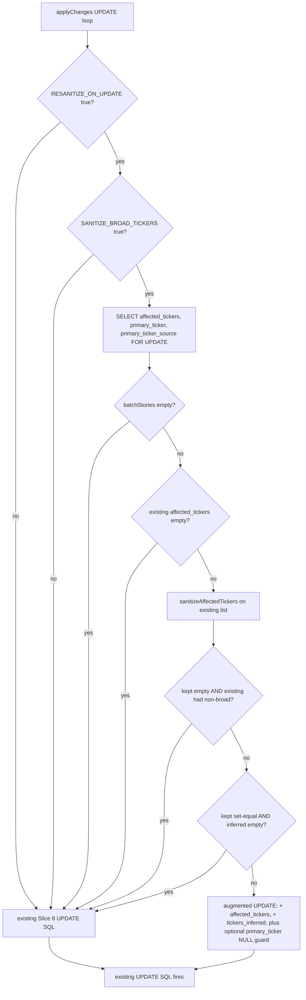

# Phase 2 / Step 13 / Slice 9 — UPDATE-path sanitization

## 1. Problem statement

Slice 8 landed and is live (commit `bc82064`, prompt_version `memory-curator.v2`), but the iter-1 capture at [tmp/validation/2026-05-12/step13-iter-1/DECISION.md](tmp/validation/2026-05-12/step13-iter-1/DECISION.md) shows the work is not done:

- **`tickers_inferred = 0 / 47` across active+fading rows** (H2 FAIL). The Slice 8A sanitizer is in the code path but only fires on INSERT.
- **14 UPDATEs vs 2 INSERTs** in the iter-1 curator run → UPDATE is the dominant write path. A run that touches no INSERTs cannot move H2 at all.
- **7/11 equity validation symbols stuck contaminated** (AAPL `[AAPL,MSFT,GOOGL,META,NSDQ100]`, NVDA `[NVDA,AMD,SOXX,NSDQ100,RTY,SPX500]`, MSFT `[MSFT,GOOGL,700.HK,NSDQ100,SPX500]`) — all UPDATEd rows whose pre-Slice-8 `affected_tickers` were preserved verbatim because the UPDATE branch never re-runs `sanitizeAffectedTickers()`.
- iter-1's own next-step recommendation explicitly names this gap (line 149 of the DECISION).

INSERT-only cleanup is therefore architecturally insufficient: contaminated rows that the curator merely refreshes are immortal. The next deterministic lever is to re-apply Slice 8's sanitizer + coherence guard to the existing row's `affected_tickers` on every UPDATE, using the current run's contributing stories as fresh evidence. Legacy null-prompt-version rows that never re-attach to a batch will still need Slice 10 — that is intentionally out of scope here.

## 2. Code areas involved

- [services/ai/gateway-2.0/src/core/analysis/memory-curator.ts](services/ai/gateway-2.0/src/core/analysis/memory-curator.ts) — `applyChanges` UPDATE branch L816–853 is the sole edit site. The function already receives `batchStories: ReadonlyArray<FilteredStory>` (L740) — no signature change needed.
- [services/ai/gateway-2.0/src/core/analysis/ticker-sanitizer.ts](services/ai/gateway-2.0/src/core/analysis/ticker-sanitizer.ts) — reuse `sanitizeAffectedTickers()` and `getSanitizeBroadTickersEnabled()` unchanged. Add **one** new env reader `getResanitizeOnUpdateEnabled()` next to the existing two.
- [services/ai/gateway-2.0/src/core/analysis/**tests**/memory-curator.test.ts](services/ai/gateway-2.0/src/core/analysis/__tests__/memory-curator.test.ts) — extend `describe("applyChanges Slice 8C primary-ticker coherence guard")` patterns and add a new `describe("applyChanges Slice 9 UPDATE-path sanitization")` block. The mock pool at L943–967 already captures both INSERT and UPDATE SQL, plus a new SELECT we'll need to read the existing row.
- [services/ai/gateway-2.0/src/core/analysis/**tests**/ticker-sanitizer.test.ts](services/ai/gateway-2.0/src/core/analysis/__tests__/ticker-sanitizer.test.ts) — add an env-reader block matching the existing `getSanitizeBroadTickersEnabled` / `getBroadTickerTier` patterns at L238 / L278.
- [deployment/vm/docker-compose.yml](deployment/vm/docker-compose.yml) L467 area — append `MEMORY_CURATOR_RESANITIZE_ON_UPDATE=${MEMORY_CURATOR_RESANITIZE_ON_UPDATE:-false}` directly after the existing `MEMORY_CURATOR_BROAD_TICKER_TIER` line. Compose default explicitly `false`.
- [docs/upstream-trust-map.md](docs/upstream-trust-map.md) — append a Slice 9 section with the env flag, behavior, and reversibility row.

Out of scope: `themeUpdateEntrySchema` ([llm-schemas.ts L201](services/ai/gateway-2.0/src/core/analysis/llm-schemas.ts)), `ThemeUpdateEntry` ([memory-curator.ts L80](services/ai/gateway-2.0/src/core/analysis/memory-curator.ts)), `buildBatchCuratorPrompt` ([memory-curator.ts L406](services/ai/gateway-2.0/src/core/analysis/memory-curator.ts)). Slice 9 derives evidence from contributing batch stories only — no curator-payload contract change.

## 3. Proposed UPDATE-path behavior

Decision (per pre-plan questions): **input = existing row's `affected_tickers`; evidence = this run's `batchStories` whose tickers overlap that existing list; primary reconciliation = guard-only (never recompute, only null when dropped).**

### 3.1 Inputs

For each `upd` in `output.updates`, before the existing UPDATE SQL fires:

1. **Skip cheaply when env is off.** If `getResanitizeOnUpdateEnabled()` is `false`, fall through to the current Slice 8 codepath unchanged. Byte-identical SQL, params, and rowcount.
2. **Skip cheaply when sanitizer master gate is off.** If `getSanitizeBroadTickersEnabled()` is `false`, also fall through. (Master kill switch supersedes Slice 9.)
3. **Read the existing row** _inside the transaction_ with `SELECT affected_tickers, primary_ticker, primary_ticker_source FROM analysis_market_memory WHERE theme_id = $1 FOR UPDATE`. Single extra round-trip per update; the `FOR UPDATE` lock matches the same transaction we already hold.
4. If the row is missing, behave exactly like today (the existing UPDATE returns `rowCount=0` and `log.warn` fires).

### 3.2 Sanitization step

Reuse the same call shape Slice 8 uses on INSERT ([memory-curator.ts L765–770](services/ai/gateway-2.0/src/core/analysis/memory-curator.ts)):

```ts
const storyProj = batchStories.map((s) => ({
  affected_tickers: s.affected_tickers,
}));
const san = sanitizeAffectedTickers(existingRow.affected_tickers, storyProj);
```

`sanitizeAffectedTickers` already implements the overlap-evidence rule (only stories whose tickers overlap the supplied list count) and the Slice 8 zero-evidence tiered fallback. **No sanitizer logic changes.** This means:

- If at least one contributing story overlaps → broad tickers without ticker-specific evidence move to `inferred`, the rest stay in `kept`.
- If zero overlap **and** existing list is entirely broad → `kept = []`, `inferred = [...all]`.
- If zero overlap **and** existing list has any non-broad ticker → broad → `inferred`, non-broad → `kept`.
- Internal sanitizer error → returns original unchanged (existing safe-fallback at [ticker-sanitizer.ts L160–165](services/ai/gateway-2.0/src/core/analysis/ticker-sanitizer.ts)).

### 3.3 Reconciliation rules

After `san` is computed:

| Column                  | Rule                                                                                                                            | Notes                                                                                                                     |
| ----------------------- | ------------------------------------------------------------------------------------------------------------------------------- | ------------------------------------------------------------------------------------------------------------------------- |
| `affected_tickers`      | `= san.kept`                                                                                                                    | Replaces existing list. Never unions/merges with a curator-payload list (none exists).                                    |
| `tickers_inferred`      | `= san.inferred`                                                                                                                | **Replaces** existing inferred. Not unioned, to avoid stale inferred entries persisting after a row legitimately narrows. |
| `primary_ticker`        | unchanged unless `existingRow.primary_ticker IS NOT NULL AND NOT san.kept.includes(existingRow.primary_ticker)` → set to `NULL` | Guard-only; mirrors Slice 8C INSERT semantics. Never recomputed via `computeMemoryPrimary`.                               |
| `primary_ticker_source` | nulled iff `primary_ticker` was nulled                                                                                          | Stays in lockstep.                                                                                                        |

### 3.4 Safety guards (must be in code, not just in plan)

These prevent the UPDATE path from corrupting good rows when the input is degenerate. All of them produce **the same SQL and params as the current Slice 8 code path** — i.e. they degrade to no-op gracefully.

1. **No contributing stories at all** (`batchStories.length === 0`): skip the sanitizer step entirely, do not touch `affected_tickers` / `tickers_inferred` / `primary_ticker`. The existing UPDATE proceeds as before.
2. **Existing list is empty** (`existingRow.affected_tickers.length === 0`): nothing to sanitize. No-op for the three new columns.
3. **Erasure guard**: if `san.kept.length === 0` AND `existingRow.affected_tickers` contained at least one non-broad ticker, treat the sanitizer result as untrusted and no-op. (Belt-and-braces — the sanitizer's own internal fallback at [ticker-sanitizer.ts L155–157](services/ai/gateway-2.0/src/core/analysis/ticker-sanitizer.ts) should already prevent this in the non-zero-evidence path; this guard catches a hypothetical regression in the sanitizer.)
4. **Identity guard**: if `san.kept` (sorted) is set-equal to `existingRow.affected_tickers` (sorted) AND `san.inferred.length === 0`, do not append the new SET clauses (avoids no-op writes to `tickers_inferred`).
5. **Per-update try/catch**: wrap the four-column reconciliation block. On any error, log `warn` with `{themeId, err}`, fall through to the original UPDATE code path. Project policy at user_rule "use try-catch whenever a reasonable possibility of failure" applies here in particular because of the new SELECT round-trip.
6. **Transactional integrity**: the new `SELECT … FOR UPDATE` and the subsequent `UPDATE` both use the existing `client` opened at [memory-curator.ts L742](services/ai/gateway-2.0/src/core/analysis/memory-curator.ts), inside the same `BEGIN/COMMIT` envelope. Failure in any single update still rolls back the whole batch, identical to today.

### 3.5 Flow



## 4. Rollout / safety design

### 4.1 Env flag

New flag, default-off, single source of truth in `ticker-sanitizer.ts`:

```ts
export function getResanitizeOnUpdateEnabled(): boolean {
  const raw = process.env["MEMORY_CURATOR_RESANITIZE_ON_UPDATE"];
  if (raw === undefined || raw === "") return false; // dormant by default
  return raw.toLowerCase() === "true";
}
```

Note the inverted default polarity vs the Slice 8 sanitizer flag (which defaults `true`): UPDATE-path mutation is riskier than INSERT-path tagging, so we keep the code dormant on first deploy.

### 4.2 Two-stage rollout

**Stage A — ship dormant.** Deploy the code with `MEMORY_CURATOR_RESANITIZE_ON_UPDATE` absent / `false`. Verify via `docker exec gateway-2.0 env | grep MEMORY_CURATOR` that the flag is unset (the env reader treats unset as `false`). Run validate-affinity.ts: results MUST match Slice 8 iter-1 byte-for-byte. This proves the dormant code is truly inert.

**Stage B — fixture-replay validation before flipping the flag.** Before turning the flag on in prod, run a one-shot in-process replay against the prod JSON dump consumed by `validate-affinity.ts`:

- For each active/fading row, simulate one UPDATE with that row's most recent batch's stories from the same prod dump.
- Capture `(theme_id, kept_before, kept_after, inferred_before, inferred_after, primary_before, primary_after, would_apply)` to `tmp/validation/<date>/slice9-debug-before/update-replay.jsonl`.
- Read-only — no DB writes. Output reviewed by a human and signed off in `tmp/validation/<date>/slice9-debug-before/DECISION.md` before stage C.

**Stage C — flip.** Once the replay diff is approved, set `MEMORY_CURATOR_RESANITIZE_ON_UPDATE=true` via Infisical. No redeploy. Capture an iter-2 validation run on the next curator cycle.

### 4.3 Rollback

Single-action: `MEMORY_CURATOR_RESANITIZE_ON_UPDATE=false` via Infisical → next curator run reverts to Slice 8 behavior. No redeploy. No data restore needed because the changes are forward-only mutations of `affected_tickers` / `tickers_inferred` / `primary_ticker` only — values that the curator already mutates regularly.

If something worse happens (e.g., a row gets erased erroneously despite guards), the operator can restore individual rows using the iter-1 baseline snapshot at [tmp/validation/2026-05-12/step13-iter-1/](tmp/validation/2026-05-12/step13-iter-1/) which captured pre-Slice-9 `affected_tickers` per `theme_id` (via Q2). This is per-row revert, not a generated SQL script — Slice 10 owns the script-driven recovery model.

### 4.4 Reversibility table (to append to docs/upstream-trust-map.md)

- `MEMORY_CURATOR_RESANITIZE_ON_UPDATE=false` (default) → UPDATE path unchanged, Slice 8 behavior.
- `MEMORY_CURATOR_RESANITIZE_ON_UPDATE=true` → UPDATE path runs the sanitizer + INSERT-path coherence guard on the existing row.
- `MEMORY_CURATOR_SANITIZE_BROAD_TICKERS=false` → master kill switch; Slice 9 also disabled regardless of its own flag.

## 5. Tests

### 5.1 Env reader (ticker-sanitizer.test.ts)

Match the existing patterns at L238 / L278:

- Default: env unset → `false`.
- `"true"` → `true` (case-insensitive: `"True"`, `"TRUE"` also true).
- `"false"` → `false`.
- Empty string → `false`.
- Unknown value (`"yes"`, `"1"`) → `false` (strict — opposite polarity from `getSanitizeBroadTickersEnabled`).

### 5.2 UPDATE-path sanitization (memory-curator.test.ts)

New `describe("applyChanges Slice 9 UPDATE-path sanitization")` block. The mock pool needs one extension: when SQL starts with `SELECT affected_tickers, primary_ticker, primary_ticker_source FROM analysis_market_memory`, return a configurable existing-row payload. Helper similar to `findUpdateSql` at L993.

Required cases:

1. **Env off → byte-identical SQL parity.** With `RESANITIZE_ON_UPDATE` unset, the captured UPDATE SQL is exactly `setClauses` from L817–824 (no `affected_tickers =`, no `tickers_inferred =`, no `primary_ticker =` clauses). Regression guard for the dormant deploy.
2. **Env on, contaminated row + overlapping non-broad story → kept narrows, inferred fills.** Existing row `[NVDA,SPX500]`, batch stories `[{affected_tickers:[NVDA,AMD]}]`. Captured UPDATE SQL contains `affected_tickers = $X` set to `["NVDA"]` and `tickers_inferred = $Y` set to `["SPX500"]`.
3. **Env on, all-broad row + zero overlap → kept empties, inferred fills.** Existing `[SPX500,NSDQ100]`, batch stories `[{affected_tickers:[AAPL]}]`. Captured SQL writes `affected_tickers=[]`, `tickers_inferred=[SPX500,NSDQ100]`.
4. **Env on, mixed row + zero overlap → broad split.** Existing `[NVDA,SPX500]`, batch stories `[{affected_tickers:[AAPL]}]`. SQL writes `affected_tickers=[NVDA]`, `tickers_inferred=[SPX500]`.
5. **Env on, primary coherence guard fires.** Existing row has `primary_ticker=SPX500`, post-sanitization `kept=[NVDA]`. SQL writes `primary_ticker=NULL`, `primary_ticker_source=NULL`.
6. **Env on, primary stays.** Existing `primary_ticker=NVDA`, post-sanitization `kept=[NVDA, AAPL]`. SQL does NOT contain `primary_ticker =` clause (anchor invariance preserved when coherent).
7. **Env on, no contributing stories → no-op for new columns.** `batchStories=[]`. Captured UPDATE SQL is byte-identical to env-off case (existing-only SET clauses).
8. **Env on, existing list empty → no-op.** Existing `affected_tickers=[]`. Captured UPDATE SQL is byte-identical to env-off case.
9. **Env on, erasure guard fires.** Force a sanitizer result with `kept=[]` against an existing list `[NVDA,SPX500]` (e.g., simulate by stubbing the sanitizer in this single test). UPDATE SQL is byte-identical to env-off case; warn log emitted.
10. **Env on, identity result → no-op for new columns.** Existing `[AAPL]`, batch story `[{affected_tickers:[AAPL]}]`. Sanitizer returns `kept=[AAPL], inferred=[]`. SQL must NOT contain `affected_tickers =` or `tickers_inferred =` (avoid no-op write).
11. **Env on, sanitizer throws → caught, falls through to legacy path.** Stub the sanitizer to throw; assert the legacy SQL still fires and a warn log is emitted with `{themeId}`.
12. **Env on, master `SANITIZE_BROAD_TICKERS=false` → falls through to legacy path.** Assertion identical to case 1.
13. **Env on, row not found in DB.** Mock pool returns `rows:[]` from the SELECT-for-update. Assert the existing UPDATE still fires (so the existing `result.rowCount > 0` log.warn at L852 still works) and no new SET clauses are added.

### 5.3 Read-side regression parity

Existing `recommendation-engine.test.ts`, `digest-debug.test.ts`, `digest-symbol-affinity.test.ts` MUST stay green with no env changes. Rule: Slice 9 must not change consumer behavior at default env.

## 6. Validation and evidence

Captures live under `tmp/validation/<date>/slice9-debug-before/` (stage B) and `tmp/validation/<date>/slice9-debug-after/` (stage C, post-flip).

### 6.1 Stage-B replay artefacts (read-only, BEFORE flag flip)

- `update-replay.jsonl` — one JSON line per simulated UPDATE: `theme_id`, `existing_affected_tickers`, `kept_after`, `inferred_after`, `existing_primary`, `would_null_primary`, `would_apply` (true if any of the new SET clauses would fire), `safety_guard_triggered` (one of `none`/`empty_stories`/`empty_existing`/`erasure`/`identity`).
- `summary.md` — counts: rows touched, rows where primary would null, rows triggering each safety guard, distribution of `cardinality(kept_after)` vs `cardinality(existing)`.
- DECISION.md sign-off — human review of the would-be-applied diff. Cannot proceed to stage C without sign-off.

### 6.2 Stage-C iter-2 capture (after flag flip + one curator cycle)

Re-run the iter-1 SQL (Q1 + Q2 in [step_13_curator_hardening_4ce7674e.plan.md L191](.cursor/plans/step_13_curator_hardening_4ce7674e.plan.md)) and `validate-affinity.ts`. Compare against iter-1 baseline. Expectations to enter the DECISION.md:

- `m2_inferred_nonempty` should move from `0` to `≥ 1` (mandatory: this is the H2 gate that iter-1 failed).
- `m6_broad_bearing` (count of rows containing any broad ticker in `affected_tickers`) should drop on UPDATEd rows that had broad contamination.
- Per validation symbol, the iter-1 chosen rows for AAPL/NVDA/MSFT should either narrow their `affected_tickers` or fall out of the candidate set in favor of a narrower theme.
- `m4_primary_nonnull` may drop modestly (some existing primaries get nulled by the coherence guard); this is acceptable and expected on the carried-forward incoherent ones identified in iter-1 (e.g. the Trump-Xi `^AXJO` row noted in the H3 caveat at iter-1 line 33).

### 6.3 What failure looks like

- Any chosen row's `affected_tickers` becomes empty when the row originally had non-broad tickers → erasure guard regression. **Block.** Flip flag off.
- iter-2 `m2_inferred_nonempty` still `0` after a curator cycle that touched contaminated UPDATEs → Slice 9 logic isn't firing. Investigate (env wiring, transaction order, sanitizer fallback).
- `validate-affinity.ts` AFTER for any of the 11 spec symbols regresses (chosen-row `cardinality(affected_tickers)` strictly increases vs iter-1, OR a previously-passing P1/P2/P3/P4 invariant flips to FAIL) → **block, flip flag off.**
- Read-side test parity broken with default env → block before stage A even ships.

## 7. Decision / exit for Slice 9

- **Slice 9 worked.** All these must hold on the first iter-2 capture after the flag is on for ≥ 1 curator cycle:
  - H2 gate flips PASS (`m2_inferred_nonempty ≥ 1`).
  - No new H1 disjoint-invariant or H4 regressed-symbols failures (regressed = strictly worse than iter-1 on a per-symbol basis).
  - No symbol's chosen-row `cardinality(affected_tickers)` strictly increases vs iter-1.
  - Read-side test suites green.
  - At least one of the 7 unchanged-contaminated equity symbols at iter-1 (AAPL/NVDA/MSFT/META/SPX500-related) shows narrowed `affected_tickers` or a switch to a narrower chosen row.

  → Continue 7-day post-flip observation. Then decide whether Slice 10 (legacy null-prompt-version row decontamination) is still needed for the rows the curator never re-attaches.

- **Slice 9 insufficient.** Either:
  - H2 still FAIL after a full curator cycle on the flipped flag (sanitizer not firing) — investigate and patch within Slice 9 before exiting.
  - H2 PASSes but the persistent contamination is concentrated in `prompt_version IS NULL` rows that the curator never picks up as updates (matches the iter-1 footnote that 30 rows are pre-Slice-5 legacy never re-touched).

  → Plan **Slice 10** next (legacy decontamination script). That is a separate plan and a separate approval surface and must not be folded back into Slice 9.

- **Slice 9 caused regression.** Flip flag off, capture diff, write Slice 9 follow-up plan. Do not advance to Slice 10/11.

## What this plan intentionally does NOT do

- Does not change `themeUpdateEntrySchema`, `ThemeUpdateEntry`, or the curator prompt. The LLM update payload contract is unchanged.
- Does not run a backfill script (Slice 10).
- Does not recompute `primary_ticker` via `computeMemoryPrimary` on UPDATE — guard-only, never overwrite a value with a new one.
- Does not change INSERT-path behavior (already shipped in Slice 8).
- Does not change consumer flags (`SMART_DIGEST_INCLUDE_INFERRED_ONLY` stays at compose default `false`).
- Does not redesign canonical digest / Step 14 architecture.

---

## Workflow (always appended) — Slice 9 only

### Stage A — ship dormant code

1. **Baseline check (SSH into VM).**
   - `ssh -i "$HOME\.ssh\nx-linux-server-azure_key (1).pem" azureuser@20.17.176.1`
   - `docker ps` → note current `stocktracker-gateway-2.0` image version (post-Slice-8).
   - Run iter-1 Q1 + Q2 → write `tmp/validation/<date>/slice9-deploy-before/baseline.txt`.

2. **Stage and push changes.**
   - `git status` → `git add` only the listed files (never `git add .`):
     - `services/ai/gateway-2.0/src/core/analysis/memory-curator.ts`
     - `services/ai/gateway-2.0/src/core/analysis/ticker-sanitizer.ts`
     - `services/ai/gateway-2.0/src/core/analysis/__tests__/memory-curator.test.ts`
     - `services/ai/gateway-2.0/src/core/analysis/__tests__/ticker-sanitizer.test.ts`
     - `deployment/vm/docker-compose.yml`
     - `docs/upstream-trust-map.md`
   - `git commit -m "slice9(curator): UPDATE-path sanitization (dormant; flag default false)"`
   - `git push origin main`

3. **Verify build.**
   - `gh run watch`
   - Frontend not modified — no `vercel ls` needed.
   - Build fails → `gh run view <run-id> --log` → fix → step 2.

4. **Verify VM deployment (dormant).**
   - SSH → `docker ps` → confirm `gateway-2.0` version increment.
   - `docker exec stocktracker-gateway-2.0 env | grep -E 'MEMORY_CURATOR_(RESANITIZE_ON_UPDATE|SANITIZE_BROAD_TICKERS|BROAD_TICKER_TIER)'`
     - Expected: `MEMORY_CURATOR_SANITIZE_BROAD_TICKERS=true`, `MEMORY_CURATOR_BROAD_TICKER_TIER=v2`, `MEMORY_CURATOR_RESANITIZE_ON_UPDATE=false` (or absent — env reader treats unset as false).
   - Re-run `validate-affinity.ts` and Q1/Q2 → write `tmp/validation/<date>/slice9-deploy-after-dormant/`. Results MUST match iter-1 byte-for-byte (proves dormant code is inert).

### Stage B — fixture-replay sign-off (read-only, BEFORE flag flip)

5. **In-process update replay.**
   - Run a one-shot script (no DB writes) against the prod JSON dump → `tmp/validation/<date>/slice9-debug-before/update-replay.jsonl` + `summary.md`.
   - Fill `tmp/validation/<date>/slice9-debug-before/DECISION.md`. Human review required. Block stage C if the diff has any erasure-guard or coherence-guard surprises.

### Stage C — flip the flag

6. **Flip in Infisical.**
   - Set `MEMORY_CURATOR_RESANITIZE_ON_UPDATE=true` in the gateway-2.0 prod env.
   - Restart container (compose pulls env on start; equivalent to `docker compose up -d gateway-2.0`).
   - `docker exec stocktracker-gateway-2.0 env | grep MEMORY_CURATOR_RESANITIZE_ON_UPDATE` → confirm `true`.

7. **Trigger a curator cycle and capture iter-2.**
   - Wait for the next scheduled curator run, or trigger via `/internal/process-news`. Capture `curatorRunId` from logs.
   - Re-run Q1 + Q2 + `validate-affinity.ts` → `tmp/validation/<date>/step13-iter-2/`.
   - Fill `tmp/validation/<date>/step13-iter-2/DECISION.md` against the section 7 exit criteria.

8. **Done (for Slice 9).** Decide whether Slice 10 is still needed based on the iter-2 evidence, and open its own plan only if so.
