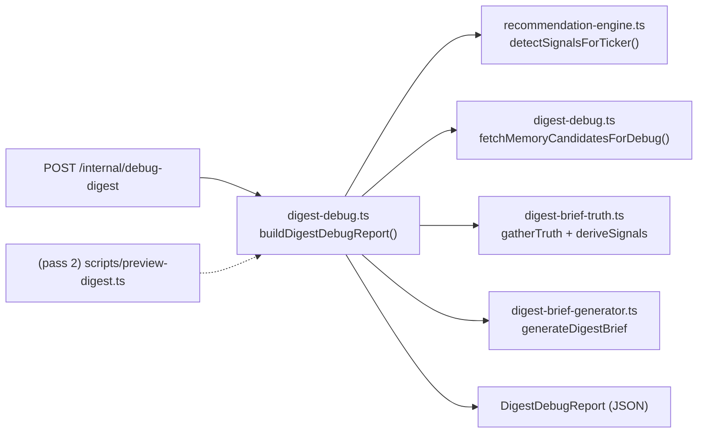

# Smart Digest debug inspection path

## Why

Smart Digest is hard to reason about because today's surfaces only show the final output:

- `[services/ai/gateway-2.0/scripts/preview-digest.ts](services/ai/gateway-2.0/scripts/preview-digest.ts)` writes `truth`/`derived`/`brief` for the **primary** signal only, not the full candidate set, not the ranking decision, not the losing memory rows.
- `/internal/force-send-digest` in `[services/ai/gateway-2.0/src/http/recommendations.ts](services/ai/gateway-2.0/src/http/recommendations.ts)` supports `dryRun: true` but requires a `clerkUserId` who already watches the symbol, and only returns the primary signal's view.

Neither exposes: full candidate signal list, the full priority sort with tie-break behavior, the **complete set of memory candidates** considered for context (not just the winner), source freshness timestamps, or the deterministic fallback decisions (which level filled `holdAbove`, whether crypto/index alias resolved memory, whether macro fired because per-ticker memory failed the gate). Those gaps are exactly what makes Smart Digest opaque.

This change closes those gaps via one shared builder + one new HTTP endpoint. No production behavior changes, no LLM dependence in the debug tool itself, no side effects.

## Verified active code path

Re-confirmed in the codebase before writing this plan (so the implementation does not target a stale layer):

- `[services/ai/gateway-2.0/src/core/pipeline-consumer.ts](services/ai/gateway-2.0/src/core/pipeline-consumer.ts)` (RabbitMQ) and `[services/ai/gateway-2.0/src/http/recommendations.ts](services/ai/gateway-2.0/src/http/recommendations.ts)` (`/internal/check-recommendations`) both call `processRecommendations` from `[services/ai/gateway-2.0/src/core/analysis/digest-pipeline.ts](services/ai/gateway-2.0/src/core/analysis/digest-pipeline.ts)`.
- `processRecommendations` calls `detectSignals` (`[recommendation-engine.ts](services/ai/gateway-2.0/src/core/analysis/recommendation-engine.ts)`) → fans out per symbol → `generateDigestBrief` (`[digest-brief-generator.ts](services/ai/gateway-2.0/src/core/analysis/digest-brief-generator.ts)`).
- `generateDigestBrief` delegates to the three-stage truth layer in `[digest-brief-truth.ts](services/ai/gateway-2.0/src/core/analysis/digest-brief-truth.ts)`: `gatherTruth → deriveSignals → composeBrief`. `digest-brief-generator.ts:31` documents this explicitly: "Replaces the old long-form `explanation-generator.ts` for the digest pipeline."
- `[explanation-generator.ts](services/ai/gateway-2.0/src/core/analysis/explanation-generator.ts)` and `[digest-formatter.ts](services/ai/gateway-2.0/src/core/analysis/digest-formatter.ts)` are **dead on the digest path**: the only consumers are their own test files (verified via grep). The debug builder must NOT touch them.
- No parallel digest implementation exists in `services/workers/` or anywhere outside `services/ai/gateway-2.0/`.

Conclusion: `digest-brief-truth.ts` is the correct active layer to source `BriefTruth` / `BriefDerived` from, and `recommendation-engine.ts::detectSignalsForTicker` is the correct entry to source the candidate signal list and macro/news inputs from.

## High-level architecture (pass 1)



No Telegram, no `user_recommendation_log` insert, no Redis dedup mutation, no LLM. The debug builder reads what the production pipeline already loads, plus one extra read of the un-filtered candidate set from `analysis_market_memory`.

## Files

### New (pass 1)

- `services/ai/gateway-2.0/src/core/analysis/digest-debug.ts` — single source of the envelope. Exports:
  - `interface DigestDebugReport` (the typed envelope)
  - `interface DebugMemoryCandidate` (raw row + ranking metadata + chosen flag + reason-it-lost)
  - `async function buildDigestDebugReport(deps, args): Promise<DigestDebugReport>`
  - `async function fetchMemoryCandidatesForDebug(db, symbol): Promise<DebugMemoryCandidate[]>` — returns ALL `analysis_market_memory` rows whose `affected_tickers && newsLookupCandidateSymbols(symbol)`, including their ranking-relevant columns (`theme`, `category`, `impact_level`, `relevance_score`, `sentiment_score`, `affected_tickers`, `last_updated`, `news_one_liner`, `summary`). Returns them sorted by the same key the production code uses (lowest `IMPACT_RANK`, then highest `relevance_score`) so the chosen row is at index 0 with `chosen: true`.
  - Pure helpers `rankCandidates(signals)`, `inferLevelFallback(truth)`, `inferContextFallback(truth, derived)`, `evaluateMemoryGates(memoryRow)`, `evaluateMacroGate(macro)`, `buildAliasResolutionTrace(symbol, candidates, hitRow)`, `buildNotes(report)`. These re-evaluate the same constants and predicates that already live in `digest-brief-truth.ts` (`MEMORY_IMPACT_GATE`, `MEMORY_RELEVANCE_GATE`, `MEMORY_BLEND_IMPACT_GATE`, `MACRO_SENTIMENT_GATE`) so the debug answer matches the production decision exactly. To keep them in lockstep without duplication, lift those constants from `digest-brief-truth.ts` to a small `digest-truth-gates.ts` companion (or re-export them) so both files share one definition. Either approach is fine; whichever the implementation chooses, document it in a one-line comment at the top of `digest-debug.ts`.
- `services/ai/gateway-2.0/src/core/analysis/__tests__/digest-debug.test.ts` — unit tests (see Tests section).

### Modified (pass 1)

- `[services/ai/gateway-2.0/src/http/recommendations.ts](services/ai/gateway-2.0/src/http/recommendations.ts)` — register `POST /internal/debug-digest`.

### Deferred to pass 2 (explicitly out of scope for first ship)

- Refactoring `[services/ai/gateway-2.0/scripts/preview-digest.ts](services/ai/gateway-2.0/scripts/preview-digest.ts)` to use the shared builder. The endpoint alone makes the debug path useful (`curl | jq`); the CLI is a quality-of-life upgrade we can land separately.

### Untouched (intentionally)

- `digest-pipeline.ts`, `digest-eligibility.ts`, `digest-delivery.ts`, `digest-brief-truth.ts`, `digest-brief-generator.ts`, `recommendation-engine.ts`. The debug builder consumes them; it does not modify them. `explanation-generator.ts` and `digest-formatter.ts` are dead and stay that way.

## DigestDebugReport envelope

Single JSON object. Every populated value is grounded in either an existing DB column or a deterministic helper over an existing field — nothing invented, no LLM:

- `input`: `{ symbol, assetType, mode, requestedAt }`
- `freshness`:
  - `priceTargetAnalysisDate` ← `truth.dataAsOf` (from `analysis_ticker_price_targets.analysis_date`)
  - `memoryChosenLastUpdated` ← chosen memory row's `last_updated` (or `null`)
  - `memoryNewestLastUpdated` ← max `last_updated` across all memory candidates (so reviewers can spot when a fresher row exists but lost on rank)
  - `requestedAt` ← wall-clock ISO of the debug call
- `candidateSignals`:
  - `original`: `Array<{ index, type, priority, headline, timeframeAlignment, rawDataKeys: string[] }>` — full candidate list in the order returned by `detectSignalsForTicker` (which is itself fixed by `detectForTicker`'s 6-rule loop, then `news_sentiment` appended). `rawDataKeys` shows which `rawData` fields are populated without dumping the full payload twice.
  - `sorted`: same shape, after applying `PRIORITY_ORDER` from `digest-brief-generator.ts`. Includes the original `index` so reviewers can trace.
  - `tieGroups`: `Array<{ priority, indices: number[] }>` — every priority bucket with ≥2 entries. Empty array when there were no ties.
  - `tieBreak`: `{ used: bool, mechanism: "stable-sort-original-order" | "n/a", note: string }` — set to `used: true` whenever the chosen primary was inside a non-singleton `tieGroup`. The mechanism string is fixed because V8's `Array.prototype.sort` is stable, so ties resolve by original detection order; the note explains that with the actual indices involved.
  - `primaryIndexInOriginal`: the index in `candidateSignals.original` that won.
  - `rationale`: human-readable single-line explanation, e.g. `"primary = candidates[0] (entry_zone, high). Beat momentum_shift (medium) on PRIORITY_ORDER (high<medium<low)."` or `"primary = candidates[2] (target_reached, high). Tied with entry_zone (high) at indices [0,2]; stable sort kept the earlier-detected entry but selectPrimary uses sort()[0] which returned the smaller original index — verify if this surprises you."`. The rationale is intentionally explicit about ties so reviewers don't assume there was one when there wasn't.
- `primary`: the chosen `TickerSignal` (full `rawData` included)
- `truth`: `BriefTruth` from `gatherTruth({ signal: primary, macroContext, memoryText, analysisDate })`
- `derived`: `BriefDerived` from `deriveSignals(truth)` (already exposes `contextSource`, `holdAbove`, `breakBelowTarget`, `stance`, `confidence`, `changePercent`, `hasMaterialContext`)
- `memory`:
  - `candidates`: `DebugMemoryCandidate[]` — **all** rows whose `affected_tickers` intersect `newsLookupCandidateSymbols(symbol)`, ranked by the production tie-breaker (`IMPACT_RANK` ascending, then `relevance_score` descending). Each candidate has:
    - raw fields: `theme`, `category`, `impact_level`, `relevance_score`, `sentiment_score`, `affected_tickers`, `last_updated`, `news_one_liner`, `summary`
    - `rankKey`: `{ impactRank: number, relevance: number }` so the sort is auditable
    - `chosen`: `boolean` (true on exactly one row, or zero rows when no candidates exist)
    - `whyLost`: `string | null` — populated for every non-chosen row, e.g. `"impact=high tied with chosen but relevance 0.42 < chosen 0.82"`, `"impact=low ranked behind chosen impact=high"`, or `"chosen tiebreak first-seen"` when neither key separates them.
    - `gates`: `{ contextGatePassed, blendGatePassed }` evaluated per-row, so reviewers can see candidates that *would* have qualified had they been chosen.
  - `aliasResolution`: `{ symbolUpper: string, candidatesTried: string[], chosenHitVia: string | null }` — `candidatesTried` is `newsLookupCandidateSymbols(symbol)`, `chosenHitVia` is the alias from `affected_tickers` that intersected for the chosen row (e.g. `"BTC"` when `symbol="BTC/USD"`, `"SPY"` when `symbol="SPX500"`).
  - `chosenIndex`: index into `candidates` of the chosen row, or `null`.
- `macro`: `{ headlines, dominantTheme, overallSentiment, gatePassed, gateThreshold }` — `gateThreshold` is the constant `MACRO_SENTIMENT_GATE` (currently 0.3) so reviewers can see why a 0.21 sentiment fails.
- `fallbacks`:
  - `holdAboveSource`: `"entryLow" | "periodLow" | "ema20" | "none"` — derived from the `truth.levels` cascade in `deriveLevelsFromTruth`.
  - `breakBelowSource`: `"stopLoss" | "none"`.
  - `contextSource`: forwarded from `derived.contextSource` (`"news_one_liner" | "macro" | "none"`).
  - `memoryAliasResolved`: `bool` — true iff `aliasResolution.chosenHitVia` differs from the symbol's primary uppercase form.
  - `memoryDroppedForNewsSentiment`: `bool` — true iff the primary signal is `news_sentiment` and per-ticker memory was deliberately suppressed (matches the "skip per-ticker memoryText to avoid double-stating" branch in `generateDigestBrief`).
  - `neutralFallbackUsed`: `bool` — true iff the brief came from `neutralFallbackBrief` (no candidates).
- `brief`: final `DigestBrief` from `generateDigestBrief({...})`.
- `notes`: `string[]` — human-readable annotations, populated from the deterministic state. Examples: `"primary tied at priority=high with [0,2]; selectPrimary returned index 0 by stable sort"`, `"memory matched on alias BTC (digest symbol BTC/USD)"`, `"context resolved from analysis_market_memory.news_one_liner (impact=high, relevance=0.82); 3 other candidates considered, see memory.candidates"`, `"macro sentiment 0.21 < gate 0.3 — macro context suppressed"`, `"holdAbove fell back to ema20 because entryLow and periodLow are null"`.

This envelope is the contract for both endpoint and (later) script.

## Memory candidates: why this matters

The current `fetchTickerMemoryText` already loads every memory row whose `affected_tickers` intersects the digest symbol's alias set, then in-process ranks them by `IMPACT_RANK` then `relevance_score` and returns only the winner. The losers are computed and discarded. `fetchMemoryCandidatesForDebug` runs the same query (status filter + alias array) and returns the full list with the same ranking applied, plus a per-row `whyLost` string. So when a reviewer sees `"why isn't this AAPL story in the digest context?"`, the answer is one HTTP call away:

```text
memory.candidates[0].theme: "iPhone 17 supercycle"   chosen=true  impact=high relevance=0.82
memory.candidates[1].theme: "Services revenue beat"  chosen=false impact=high relevance=0.51   whyLost: "impact=high tied with chosen but relevance 0.51 < chosen 0.82"
memory.candidates[2].theme: "Antitrust ruling"       chosen=false impact=low  relevance=0.95   whyLost: "impact=low ranked behind chosen impact=high"
```

That is the single biggest opacity gain in this change.

## Ranking section: full mechanics

Today's `selectPrimary` (`digest-brief-generator.ts:87-92`) is:

```81:92:services/ai/gateway-2.0/src/core/analysis/digest-brief-generator.ts
const PRIORITY_ORDER: Record<TickerSignal["priority"], number> = {
  high: 0,
  medium: 1,
  low: 2,
};

function selectPrimary(signals: TickerSignal[]): TickerSignal | undefined {
  if (signals.length === 0) return undefined;
  return [...signals].sort(
    (a, b) => PRIORITY_ORDER[a.priority] - PRIORITY_ORDER[b.priority],
  )[0];
}
```

It uses `Array.prototype.sort`, which V8 guarantees stable. Ties therefore resolve by **original detection order** from `detectForTicker`, which fires its 6 rules in fixed order (`entry_zone`, `target_reached`, `stop_loss_warning`, `signal_change`, `momentum_shift`, `notable_pattern`) followed by appended `news_sentiment` signals.

`rankCandidates` in `digest-debug.ts` will:

1. Snapshot the original list (no mutation).
2. Apply the same `PRIORITY_ORDER` sort to a copy.
3. Compute `tieGroups` by bucketing on `priority`.
4. Set `tieBreak.used = true` whenever the winning candidate sat in a non-singleton tie group.
5. Build `rationale` strings that explicitly mention ties when present and explicitly state "no ties" when absent. This is the difference reviewers need to actually trust the output.

If we ever add a richer ranking (e.g. confidence-weighted), the only thing this section needs is a new `rationale` branch — the envelope shape stays stable.

## HTTP endpoint

In `[services/ai/gateway-2.0/src/http/recommendations.ts](services/ai/gateway-2.0/src/http/recommendations.ts)`, alongside the existing routes:

```ts
app.post<{
  Body: { symbol: string; assetType?: "stock" | "crypto"; mode?: BriefMode };
}>("/internal/debug-digest", async (request, reply) => {
  const serviceKey = request.headers["x-service-key"] as string | undefined;
  if (
    !config.internalServiceKey ||
    !serviceKey ||
    serviceKey !== config.internalServiceKey
  ) {
    return reply.status(401).send({ error: "Unauthorized" });
  }
  const symbol = request.body?.symbol?.trim().toUpperCase() ?? "";
  if (!symbol) return reply.status(400).send({ error: "symbol required" });
  try {
    const report = await buildDigestDebugReport(
      { db, log: app.log },
      {
        symbol,
        assetType: request.body?.assetType ?? "stock",
        mode: request.body?.mode ?? (config.smartDigestBriefBlend ? "blended" : "strict"),
      },
    );
    return reply.send({ ok: true, ...report });
  } catch (err) {
    app.log.error({ err, symbol }, "debug-digest failed");
    return reply.status(500).send({ error: "Internal server error" });
  }
});
```

No `clerkUserId`, no eligibility check, no Redis dedup, no DB write, no Telegram. Pure read path. Auth via the same `x-service-key` the other `/internal/*` routes use.

## Tests

`services/ai/gateway-2.0/src/core/analysis/__tests__/digest-debug.test.ts` (vitest, mirroring the style of the existing `digest-brief-truth.test.ts`):

- `rankCandidates`:
  - empty list → `primaryIndexInOriginal: null`, no ties, `tieBreak.used: false`
  - single signal → no ties, rationale mentions "only candidate"
  - clear winner (`high` vs `medium`) → `tieBreak.used: false`, rationale states the priority gap
  - tied at `high` between `entry_zone` (idx 0) and `target_reached` (idx 1) → `tieBreak.used: true`, primary is index 0, rationale names the tie group
  - tied at `medium` between `momentum_shift` and `notable_pattern` with `news_sentiment` low → primary is the earlier `medium`, not the `low`
- `inferLevelFallback`:
  - `entryLow` set → `holdAboveSource: "entryLow"`
  - only `periodLow` set → `holdAboveSource: "periodLow"`
  - only `ema20` set → `holdAboveSource: "ema20"`
  - none of the three set → `holdAboveSource: "none"`
  - `stopLoss` set / unset → `breakBelowSource` follows
- `inferContextFallback`:
  - memory passes context gate → `contextSource: "news_one_liner"`
  - memory fails relevance gate but macro passes → `contextSource: "macro"`
  - both fail → `contextSource: "none"`
- `fetchMemoryCandidatesForDebug` (stubbed pg pool):
  - 3 candidates, mixed impact/relevance → returns 3 rows in chosen-first order, exactly one `chosen: true`, every other has a non-null `whyLost`
  - ranks identical to production: critical>high>medium>low on impact, then relevance desc
  - 0 candidates → returns `[]`, downstream `chosenIndex: null`
- alias resolution:
  - `symbol="BTC/USD"` and only an `affected_tickers=["BTC"]` row exists → `chosenHitVia: "BTC"`, `memoryAliasResolved: true`
  - `symbol="SPX500"` and only `["SPY"]` row exists → `chosenHitVia: "SPY"`, alias resolved
  - `symbol="AAPL"` matches `["AAPL"]` directly → `memoryAliasResolved: false`
- `news_sentiment` primary path: builder must surface `memoryDroppedForNewsSentiment: true` and the chosen memory candidate must NOT feed `truth.memoryText`
- neutral-fallback path: zero candidate signals → `brief` matches `neutralFallbackBrief` shape, `fallbacks.neutralFallbackUsed: true`

## How to run (after ship)

```bash
curl -sS -X POST http://localhost:8080/internal/debug-digest \
  -H "x-service-key: $INTERNAL_SERVICE_KEY" \
  -H "content-type: application/json" \
  -d '{"symbol":"AAPL","assetType":"stock","mode":"strict"}' | jq

curl -sS -X POST http://localhost:8080/internal/debug-digest \
  -H "x-service-key: $INTERNAL_SERVICE_KEY" \
  -H "content-type: application/json" \
  -d '{"symbol":"BTC/USD","assetType":"crypto","mode":"blended"}' | jq
```

Useful jq slices for common debugging questions:

```bash
# Why was this primary picked?
... | jq '.candidateSignals.rationale, .candidateSignals.tieGroups'

# Why isn't this memory row showing up in context?
... | jq '.memory.candidates[] | {theme, impact_level, relevance_score, chosen, whyLost, gates}'

# Did any fallback fire?
... | jq '.fallbacks, .notes'

# Is the data fresh?
... | jq '.freshness'
```

## Worked example output shape (abbreviated)

```json
{
  "ok": true,
  "input": { "symbol": "AAPL", "assetType": "stock", "mode": "strict", "requestedAt": "2026-05-10T04:50:00.000Z" },
  "freshness": {
    "priceTargetAnalysisDate": "2026-05-09",
    "memoryChosenLastUpdated": "2026-05-09T18:32:00Z",
    "memoryNewestLastUpdated": "2026-05-09T18:32:00Z",
    "requestedAt": "2026-05-10T04:50:00.000Z"
  },
  "candidateSignals": {
    "original": [
      { "index": 0, "type": "entry_zone",     "priority": "high",   "headline": "AAPL is near a key support level ($168.00–$178.00)", "timeframeAlignment": "full", "rawDataKeys": ["close","entryLow","entryHigh","stopLoss","ema20","..."] },
      { "index": 1, "type": "momentum_shift", "priority": "medium", "headline": "AAPL MACD momentum shifted bullish",                  "timeframeAlignment": "full", "rawDataKeys": ["close","macdHistogram","previousMacdHistogram","..."] }
    ],
    "sorted": [
      { "index": 0, "type": "entry_zone",     "priority": "high",   "rank": 0 },
      { "index": 1, "type": "momentum_shift", "priority": "medium", "rank": 1 }
    ],
    "tieGroups": [],
    "tieBreak": { "used": false, "mechanism": "n/a", "note": "no ties: priorities were [high, medium]" },
    "primaryIndexInOriginal": 0,
    "rationale": "primary = candidates[0] (entry_zone, high). Beat momentum_shift (medium) on PRIORITY_ORDER (high<medium<low). No ties."
  },
  "primary": { "type": "entry_zone", "priority": "high", "rawData": { "...": "..." } },
  "truth":   { "symbol": "AAPL", "price": 175, "levels": { "entryLow": 168, "ema20": 171 }, "...": "..." },
  "derived": { "stance": { "label": "Watch zone", "tone": "watch" }, "confidence": "High", "holdAbove": "168.00", "breakBelowTarget": "162.00", "contextSource": "news_one_liner" },
  "memory": {
    "candidates": [
      { "theme": "iPhone 17 supercycle",  "category": "earnings",  "impact_level": "high", "relevance_score": 0.82, "affected_tickers": ["AAPL"], "last_updated": "2026-05-09T18:32:00Z", "rankKey": { "impactRank": 1, "relevance": 0.82 }, "chosen": true,  "whyLost": null, "gates": { "contextGatePassed": true, "blendGatePassed": true } },
      { "theme": "Services revenue beat", "category": "earnings",  "impact_level": "high", "relevance_score": 0.51, "affected_tickers": ["AAPL"], "last_updated": "2026-05-09T16:10:00Z", "rankKey": { "impactRank": 1, "relevance": 0.51 }, "chosen": false, "whyLost": "impact=high tied with chosen but relevance 0.51 < chosen 0.82", "gates": { "contextGatePassed": true, "blendGatePassed": true } },
      { "theme": "Antitrust ruling",      "category": "policy",    "impact_level": "low",  "relevance_score": 0.95, "affected_tickers": ["AAPL"], "last_updated": "2026-05-08T20:15:00Z", "rankKey": { "impactRank": 3, "relevance": 0.95 }, "chosen": false, "whyLost": "impact=low ranked behind chosen impact=high", "gates": { "contextGatePassed": false, "blendGatePassed": false } }
    ],
    "aliasResolution": { "symbolUpper": "AAPL", "candidatesTried": ["AAPL"], "chosenHitVia": "AAPL" },
    "chosenIndex": 0
  },
  "macro":     { "dominantTheme": "macro", "overallSentiment": 0.21, "gatePassed": false, "gateThreshold": 0.3 },
  "fallbacks": { "holdAboveSource": "entryLow", "breakBelowSource": "stopLoss", "contextSource": "news_one_liner", "memoryAliasResolved": false, "memoryDroppedForNewsSentiment": false, "neutralFallbackUsed": false },
  "brief":     { "ticker": "AAPL", "status": { "label": "Watch zone", "tone": "watch" }, "price": 175, "...": "..." },
  "notes": [
    "primary chosen by PRIORITY_ORDER: high beats medium (no ties)",
    "context resolved from analysis_market_memory.news_one_liner (impact=high, relevance=0.82); 2 other candidates considered, see memory.candidates",
    "macro sentiment 0.21 < gate 0.3 — macro context suppressed"
  ]
}
```

## Caveats this debug path still cannot explain

- **Eligibility decisions** (per-watcher session/throttle/daily-cap) — those live in `digest-eligibility.ts` and only matter at fan-out time. Out of scope for symbol-only inspection. Use `/internal/force-send-digest` with `dryRun: true` when you specifically want to verify watcher gating for a real `clerkUserId`.
- **Redis dedup state** (`digest:signal:<symbol>:<type>`) — the debug builder deliberately does not read or mutate Redis. If you need to inspect dedup, query Redis directly.
- **Cross-day signal history** — only the current pipeline window is inspected. Replaying a digest from an earlier `analysis_date` would require parameterizing the underlying engine queries; not in scope here.
- **LLM commentary** — the digest pipeline is fully deterministic today, so there is nothing LLM-generated to inspect. If a future revision adds an LLM compressor inside `composeBrief`, the envelope's `brief.whatHappening` will reflect that, but the upstream `truth`/`derived`/`memory` will still be deterministic.
- **Multi-day freshness drift** — `freshness` exposes raw timestamps but does not flag staleness thresholds. Reviewers compare against `requestedAt`.

## Risks / follow-ups

- The new endpoint is auth-gated (same `x-service-key`) but is more powerful than `force-send` because it bypasses watcher gating. No rate-limiting is added; if abuse becomes a concern we add a per-IP limiter later.
- `fetchMemoryCandidatesForDebug` adds one extra SQL query per debug call (and returns more rows than the production fetcher). Acceptable because this is a manual/operator path off the hot pipeline.
- Pass 2 (CLI refactor) should be a small, mechanical change once the builder lands: replace the inline pipeline in `scripts/preview-digest.ts` with a single call to `buildDigestDebugReport`, default to stdout JSON, keep `--write-files` and `--render-png` for the legacy outputs. We can choose to land it the same day or in a follow-up.
