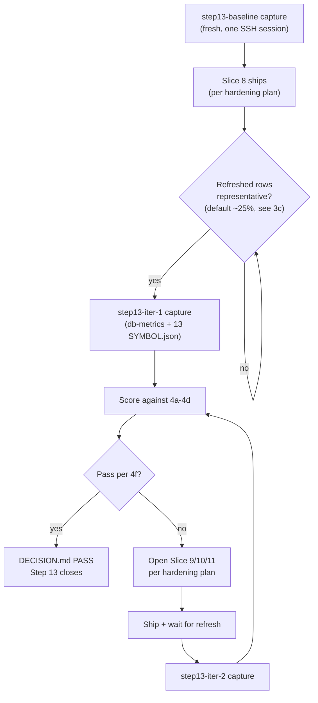

# Phase 2 / Step 13 — Memory curator hardening: validation & exit-criteria framework

## Decision target

Define the production-aware framework that answers, for each curator-side iteration after Slice 7 lands:

1. Did curator output in `analysis_market_memory` actually improve?
2. Are the hard correctness floors met AND the directional deltas moving in the right direction versus the fresh baseline?
3. Are the per-symbol spot-checks consistent with the quantitative verdict?
4. Is Step 13 complete enough to move to Step 14, or does it require another curator cycle / curator-logic revision?

This is a measurement plan. It does NOT redesign sanitizer / primary-ticker / curator-prompt logic (that lives in [.cursor/plans/step_13_curator_hardening_4ce7674e.plan.md](.cursor/plans/step_13_curator_hardening_4ce7674e.plan.md)). It does NOT flip `SMART_DIGEST_INCLUDE_INFERRED_ONLY` (kept at compose default `false` throughout). It does NOT move into Step 14.

## Scope

In scope:

- DB queries against `analysis_market_memory` for rows in `status IN ('active','fading')`.
- The 11 required validation symbols + 2 continuity symbols already enshrined in [scripts/verify/validate-affinity.ts](scripts/verify/validate-affinity.ts) L54–73.
- Existing debug surfaces: `validate-affinity.ts`, `/internal/debug-digest` ([recommendations.ts L335](services/ai/gateway-2.0/src/http/recommendations.ts)) backed by [fetchMemoryCandidatesForDebug](services/ai/gateway-2.0/src/core/analysis/digest-debug.ts) L637, BEFORE/AFTER artefact tree under `tmp/validation/<date>/...`, and DECISION.md write-up.

Out of scope:

- Curator-logic redesign (sanitizer, primary-ticker, prompt) — covered by the hardening plan.
- Flipping `SMART_DIGEST_INCLUDE_INFERRED_ONLY=true`.
- Step 14 canonical digest architecture.
- Retro-fixing pre-Slice-5 legacy rows (Slice 10's job).

## Baseline anchor — fresh capture (one SSH session)

Per the answered question, the BEFORE anchor is captured fresh, in one SSH session, so DB metrics and per-symbol artefacts come from the same instant. The 2026-05-12 Slice 7/Slice 8 snapshots are retained for forensic reference but are NOT the comparison anchor.

Action (read-only):

```bash
ssh -i "$HOME\.ssh\nx-linux-server-azure_key (1).pem" azureuser@20.17.176.1
docker ps  # note gateway-2.0 image version into baseline.txt
# 1. DB metrics + breadth + per-broad-ticker breakdown -> db-metrics.txt
# 2. row_to_json dump of active/fading -> prod-dump.jsonl
```

Local:

```bash
cat prod-dump.jsonl | npx tsx scripts/verify/validate-affinity.ts
# produces 13 <SYMBOL>.json in tmp/validation/<DATE>/
```

Capture lands at `tmp/validation/<DATE>/step13-baseline/`:

```
step13-baseline/
  baseline.txt              # gateway image version + capture timestamp + curator prompt_version distribution
  db-metrics.txt            # 9 metrics + breadth distribution + per-broad-ticker breakdown
  prod-dump.jsonl           # raw row_to_json dump (frozen for replay)
  <SYMBOL>.json             # 13 files, one per validation symbol
```

This baseline is locked the moment it is captured. Subsequent iterations compare against THIS snapshot, not 2026-05-12.

## 1. Baseline measurement set

All metrics computed on `WHERE status IN ('active','fading')` unless noted. Captured BEFORE any curator change and AFTER each curator iteration.

### 1a. Row counts and shares (single query, m1–m9 plus the m5b/m5c coherence-scope metrics)

- `m1_total` — `COUNT(*)`. Population size; every share normalizes against this.
- `m2_inferred_nonempty` — `COUNT(*) FILTER (WHERE cardinality(tickers_inferred) > 0)`. Direct evidence the Slice 5 sanitizer fired on real curator output.
- `m3_inferred_share` — `m2_inferred_nonempty / m1_total`. Headline coverage proxy.
- `m4_primary_nonnull` — `COUNT(*) FILTER (WHERE primary_ticker IS NOT NULL)`. Slice 2 batch-heuristic derivation success.
- `m5_primary_share` — `m4_primary_nonnull / m1_total`. Headline primary-ticker usefulness.
- `m5b_primary_coherent_share_population` — `COUNT(*) FILTER (WHERE primary_ticker IS NOT NULL AND primary_ticker = ANY(affected_tickers)) / m1_total`. Population-wide coherence share. Reported for forensic visibility only — legacy active/fading rows that pre-date the slice deploy are NOT in scope for H3 (the Slice 8C guard is INSERT-path only; UPDATE-path/legacy backfill belong to Slice 9/10).
- `m5c_new_path_primary_total` — `COUNT(*) FILTER (WHERE primary_ticker IS NOT NULL AND last_updated >= '<slice_deploy_ts>' AND prompt_version = '<bumped_version>')`. Count of new-code-path rows with a non-null primary. Denominator for H3.
- `m5c_new_path_primary_incoherent` — `COUNT(*) FILTER (WHERE primary_ticker IS NOT NULL AND NOT (primary_ticker = ANY(affected_tickers)) AND last_updated >= '<slice_deploy_ts>' AND prompt_version = '<bumped_version>')`. The H3 gate sentinel: how many new-code-path rows introduce a primary that points outside `affected_tickers`. Must be 0.
- `m6_broad_bearing` — `COUNT(*) FILTER (WHERE affected_tickers && ARRAY['SPX500','NSDQ100','DJ30','RTY','SPY','QQQ','DIA','IWM','VTI','VOO','GOLD','OIL','NATGAS','BTC','BTC/USD','ETH','ETH/USD']::text[])`. Direct contamination count using the [BROAD_INDEX_BOILERPLATE_TICKERS ∪ BROAD_MACRO_PROXY_TICKERS](services/ai/gateway-2.0/src/core/analysis/ticker-sanitizer.ts) v2 union.
- `m7_broad_share` — `m6_broad_bearing / m1_total`. Contamination headline.
- `m8_overlap_inferred_affected` — `COUNT(*) FILTER (WHERE cardinality(tickers_inferred) > 0 AND affected_tickers && tickers_inferred)`. Hard invariant from sanitizer contract — MUST be 0.
- `m9_overlap_affected_inferred` — `COUNT(*) FILTER (WHERE cardinality(tickers_inferred) > 0 AND NOT (affected_tickers && tickers_inferred))`. Healthy disjoint sanitization signal (every inferred ticker was actually dropped).

### 1b. Ticker-breadth distribution

```sql
SELECT
  CASE
    WHEN cardinality(affected_tickers) = 0 THEN 'b0_zero'
    WHEN cardinality(affected_tickers) = 1 THEN 'b1_single'
    WHEN cardinality(affected_tickers) BETWEEN 2 AND 3 THEN 'b2_narrow'
    WHEN cardinality(affected_tickers) BETWEEN 4 AND 6 THEN 'b3_wide'
    ELSE 'b4_very_wide'
  END AS bucket,
  COUNT(*) AS rows
FROM analysis_market_memory
WHERE status IN ('active','fading')
GROUP BY 1 ORDER BY 1;
```

Healthy distribution is concentrated in `b1_single + b2_narrow`. Wide and very-wide rows are the contamination tail.

### 1c. Per-broad-ticker contamination breakdown

```sql
SELECT t AS ticker, COUNT(*) AS rows
FROM analysis_market_memory, LATERAL unnest(affected_tickers) AS t
WHERE status IN ('active','fading')
  AND t = ANY(ARRAY['SPX500','NSDQ100','DJ30','RTY','SPY','QQQ','DIA','IWM','VTI','VOO',
                    'GOLD','OIL','NATGAS','BTC','BTC/USD','ETH','ETH/USD'])
GROUP BY t ORDER BY rows DESC;
```

Locked baseline records per-ticker counts; each iteration reports the diff. SPX500 dominated prior baselines (15/49 at Slice 7, 26/45 at Slice 8 — the difference is the v2 union expansion).

### 1d. Capture layout

```
tmp/validation/<DATE>/step13-baseline/
  db-metrics.txt          # m1-m9 + breadth + per-broad-ticker, pipe-separated, one row per metric
  prod-dump.jsonl
  <SYMBOL>.json × 13
  baseline.txt            # gateway version + timestamp + prompt_version distribution
tmp/validation/<DATE>/step13-iter-<N>/
  (same files; <N> increments per curator iteration)
```

## 2. Symbol-level validation set

The 11 required + 2 continuity symbols, reused verbatim from [validate-affinity.ts L54–73](scripts/verify/validate-affinity.ts). "Improvement" definition per class:

- **Indices** — SPX500, NSDQ100, DJ30. Chosen row's theme is materially ABOUT the index (not generic G7/macro filler). `affected_tickers` includes the matched index plus ≤ 2 index-correlated tickers. `tickers_inferred` empty (or contains only the alias used by `primary_ticker`). `attachmentKind = "kept"`.
- **Equities** — AAPL, NVDA, MSFT, GOOGL, META. `affected_tickers` narrow (1–3 tickers). Matched ticker is in `affected_tickers`, NOT inferred. `primary_ticker` non-null and ideally matches the symbol. Cannot be a row whose chosen theme is broad macro that happens to also list the equity (the Slice 7 AAPL chosen-row `[BTC,ETH,AAPL,BRK.B,SPX500]` is the contamination archetype that must improve).
- **Crypto** — BTC/USD, ETH/USD. `affected_tickers` crypto-specific (BTC/ETH/MSTR/COIN/MARA), not contaminated by broad equity indices. `affected_tickers` must NOT intersect `{SPX500, NSDQ100, DJ30, SPY, QQQ, DIA}`.
- **Metals** — GOLD. `affected_tickers` metals/commodities-coherent. Not a broad macro / G7-rate-cycle row that happens to list GOLD.
- **Continuity (informational only, not pass/fail)** — NEAR/USD, SOL/USD. Tracked for cross-cycle continuity.

Per-symbol verdict (set by manual review of the iter-<N> `<SYMBOL>.json` `chosen` block):

- **Improved** — chosen-row `cardinality(affected_tickers)` drops AND chosen theme topically aligns with symbol class.
- **Unchanged-acceptable** — chosen row identical to baseline AND baseline was already acceptable.
- **Unchanged-contaminated** — chosen row identical to baseline AND baseline was already contaminated.
- **Regressed** — chosen-row cardinality grows OR chosen theme drifts further from symbol class.

## 3. Debug and harness usage

### 3a. `validate-affinity.ts` snapshots — the primary harness

For each iteration:

1. SSH-dump prod `analysis_market_memory` active/fading rows to JSON (one row per line, `row_to_json(amm)`).
2. `cat dump.jsonl | npx tsx scripts/verify/validate-affinity.ts` (env unset → `includeInferred=false`, penalty unset → `0`).
3. Outputs land in `tmp/validation/<DATE>/` per the harness's [date-suffixed mkdir](scripts/verify/validate-affinity.ts) L119–121; immediately move them into `step13-iter-<N>/`.
4. For each artefact, the spot-check inputs are: `chosen.theme`, `chosen.affected_tickers`, `chosen.tickers_inferred`, `chosen.affinity.attachmentKind`, `chosen.affinity.reasons`.

The harness is NOT modified. It already reads `tickers_inferred`, `primary_ticker`, `primary_ticker_source` (Slice 7 update).

### 3b. `/internal/debug-digest` — secondary surface for borderline symbols

When the harness verdict is borderline (e.g. chosen row passes but only barely, or the runner-up is materially better), confirm against live state:

```bash
curl -s -H "x-service-key: $INTERNAL_KEY" -H "Content-Type: application/json" \
  -d '{"symbol":"AAPL","assetType":"stock"}' \
  https://<gateway-host>/internal/debug-digest \
  | jq '.memory.candidates[] | {theme, affectedTickers, tickersInferred, attachmentKind, chosen, rankKey, affinity}' \
  > tmp/validation/<DATE>/step13-iter-<N>/debug-digest-AAPL.json
```

Complements `validate-affinity.ts` by exposing the full ranked memory candidate list with rank-key components for one symbol. Use only when reviewers need to understand WHY row X beat row Y.

### 3c. BEFORE vs AFTER capture rule

- BEFORE = freshly captured `step13-baseline/` (the locked anchor).
- AFTER = `step13-iter-<N>/` captured once the refreshed rows under the new curator code path are **representative** of the active/fading population — i.e. they materially exercise the new sanitizer/prompt/coherence logic against a cross-section of theme types (indices, equities, crypto, metals/macro) similar to the baseline distribution.
- The decision artifact is written ONLY at the iter-final step (the iteration we believe closes Step 13).

**Representativeness — default heuristic.** As a rule of thumb, aim for roughly a quarter of the active/fading rows (by `last_updated` post-dating the slice deploy AND/OR by `prompt_version` matching the new bumped version) before declaring AFTER capture-ready. This is a default, not a hard threshold.

**When a smaller refreshed share is acceptable.** All of the following must hold:

- The refreshed subset spans multiple symbol classes (e.g. at least one equities row, one crypto row, one indices/macro row) so the per-symbol invariants (P1–P4) can be evaluated meaningfully.
- The refreshed subset already contains rows that exercise the specific code path the slice changed (e.g. for Slice 8A, at least one new INSERT whose pre-sanitizer affected_tickers were all-broad or mixed broad/non-broad; for Slice 8C, at least one new INSERT whose heuristic primary would have been a sanitizer-dropped ticker).
- No hard correctness gate (H1–H5, scoped per H3 below) is observably borderline — i.e. the refreshed subset is enough to fail a gate cleanly, not just to score it ambiguously.

In this case the iter-N capture proceeds and the DECISION.md explicitly records "refreshed share = X% (< default heuristic); rationale: …".

**When a larger refreshed share is warranted.** Wait longer if:

- The refreshed subset is concentrated in a single class (e.g. only crypto refreshed) and would leave half the validation symbols unevaluated.
- D4/D5 (wide-tail and per-symbol cardinality direction) are still inverted because too few new rows have entered the consumer-relevant chosen position.
- The curator iteration cadence is unusually low (e.g. a quiet news week) and the observed sample isn't reflective of normal contamination shapes.

In this case the iter is postponed; nothing is written yet.

## 4. Exit criteria for Step 13

Hybrid model per the answered question: a small set of baseline-defensible hard floors, plus directional deltas for everything where pre-committing a percentage isn't justified.

### 4a. Hard correctness gates (must pass — pass/fail, no leniency)

These are defensible from the baseline and from sanitizer/curator invariants. Failure on ANY blocks Step 13 closure.

- **H1 — sanitizer disjoint invariant.** `m8_overlap_inferred_affected == 0` on the iter-final snapshot. Hard invariant from [ticker-sanitizer.ts](services/ai/gateway-2.0/src/core/analysis/ticker-sanitizer.ts). Any non-zero count is a curator regression.
- **H2 — inferred bucket non-empty.** `m2_inferred_nonempty >= 1`. The user's primary symptom ("tickers_inferred on active/fading rows is still effectively zero") must be observably resolved. Non-zero is the right framing here; a pre-committed % would be invented.
- **H3 — primary-ticker coherence on new-code-path rows.** `m5c_new_path_primary_incoherent == 0`. Evaluated only on rows refreshed under the new curator code path since baseline (filter: `last_updated >= <slice_deploy_ts>` AND `prompt_version = <bumped_version>` — both observable in `analysis_market_memory`). The spirit of the gate is "no NEW incoherent primaries are introduced"; legacy rows whose `primary_ticker ∉ affected_tickers` are explicitly NOT in scope for H3 because the Slice 8C guard is INSERT-path only and the UPDATE-path / one-shot backfill remediations belong to Slice 9 / Slice 10 respectively. The Slice 8 baseline's 0/4 population-wide value is what motivates this gate, but applying it population-wide here would falsely fail Step 13 due to untouched legacy rows. Population-wide coherence (`m5b_primary_coherent_share_population`) is still recorded for forensic visibility in the DECISION.md observed-distribution section.
- **H4 — no per-symbol regressions on the validation set.** For each of the 11 spec symbols, the chosen row in iter-final is NOT "Regressed" per section 2's verdict rubric. At most 2 of the 11 may be "Unchanged-contaminated"; zero may be "Regressed".
- **H5 — read-side parity untouched.** [recommendation-engine.test.ts](services/ai/gateway-2.0/src/core/analysis/__tests__/recommendation-engine.test.ts), [digest-debug.test.ts](services/ai/gateway-2.0/src/core/analysis/__tests__/digest-debug.test.ts), [digest-symbol-affinity.test.ts](services/ai/gateway-2.0/src/core/analysis/__tests__/digest-symbol-affinity.test.ts) all green with default env. Slice 7's Branch A parity guarantee must hold through every Step 13 iteration.

### 4b. Per-symbol invariants (hard pass/fail on the validation set)

Defensible because they encode "what a narrow-equity row must look like" — these aren't invented thresholds, they're class definitions.

- **P1 — narrow-equity coherence.** For each of `{AAPL, NVDA, MSFT, GOOGL, META}` on the iter-final snapshot: `chosen.cardinality(affected_tickers) <= 4` AND `chosen.attachmentKind === "kept"` AND chosen theme is not a broad-macro row that incidentally lists the equity (manual reviewer call against section 2's class definition).
- **P2 — crypto isolation.** For each of `{BTC/USD, ETH/USD}` on iter-final: `chosen.affected_tickers` does NOT intersect `{SPX500, NSDQ100, DJ30, SPY, QQQ, DIA}`. Crypto symbols must not pick equity-broad-index rows.
- **P3 — metals coherence.** For `{GOLD}` on iter-final: chosen-row theme is materially about a metals/commodity story; not a generic G7-rate-cycle row that incidentally lists GOLD (manual reviewer call).
- **P4 — index specificity.** For each of `{SPX500, NSDQ100, DJ30}` on iter-final: chosen-row theme is about that index or the broad equity market (acceptable); rows whose theme is about a single non-index name (e.g. a row that should have been narrow-equity but ended up wide enough to also match the index alias) are NOT acceptable.

### 4c. Directional deltas (must move in the right direction; no invented thresholds)

Compare iter-final against the locked `step13-baseline/`. Direction matters; magnitude is reported but not gated.

- **D1 — `m3_inferred_share` direction = UP.** Baseline expected 0%. Any positive iter-final share counts as moved. (Trivially implied by H2 if H2 passes.)
- **D2 — `m7_broad_share` direction = DOWN.** Baseline `m7_broad_share` recorded fresh; iter-final must be strictly less.
- **D3 — `m5_primary_share` direction = UP or FLAT.** Slice 8C makes this conservatively non-decreasing on new INSERTs. A drop signals UPDATE-path or coherence-guard misbehavior.
- **D4 — `b3_wide + b4_very_wide` row count direction = DOWN.** The wide tail (4+ tickers) must shrink as Slice 8B's prompt revision lands. Either absolute or share — record both, only direction is gated.
- **D5 — per-symbol mean `chosen.cardinality(affected_tickers)` across the 11 spec symbols direction = DOWN.** Captures contamination drop at the consumer-relevant chosen-row layer.

If a directional metric is already optimal at baseline (e.g. baseline `m7_broad_share` already very low because the row population rotated), record "already optimal — direction n/a" and do not treat it as a failure.

### 4d. Qualitative spot-check criteria

In addition to the per-symbol invariants in 4b, the iter-final DECISION.md must record:

- For at least 9 / 11 spec symbols: per-class "improvement" definition in section 2 holds (Improved OR Unchanged-acceptable).
- At least one concrete BEFORE/AFTER chosen-row example showing a specific contamination case fixed (e.g. AAPL's BEFORE chosen-row `[BTC,ETH,AAPL,BRK.B,SPX500]` → AFTER chosen-row narrow Apple-specific story).
- No previously-passing symbol has flipped to "no chosen row" (NSDQ100, DJ30, META at Slice 7 had no passing candidates — those staying at none is acceptable; AAPL/NVDA/MSFT etc dropping to none is a regression).

### 4e. Stretch thresholds — explicitly deferred

The plan does NOT pre-commit numbers like "`m3_inferred_share` ≥ 20%" or "`m7_broad_share` ≤ 20%". Once one full Slice 8 iteration has been observed in prod, the iter-1 DECISION.md records the observed distribution; only then may stretch thresholds be proposed (in the Slice 9/10/11 plans), justified by the observed baseline rather than invented up front.

### 4f. "Step 13 is still incomplete" vs "Step 13 is good enough to move on"

- **Incomplete** if ANY of: H1–H5 fails, any of P1–P4 fails, more than 2 of D1–D5 flat-or-wrong-direction, fewer than 9/11 symbols at "Improved or Unchanged-acceptable", or any spec symbol regressed.
- **Good enough** if: all of H1–H5 pass, all of P1–P4 pass, at least 3/5 directional deltas moved in the right direction (the other 2 may be "already optimal — direction n/a"), 9+/11 spec symbols Improved/Unchanged-acceptable, zero regressions.

If iter-1 lands Incomplete, the loop is: open a follow-on slice plan (Slice 9/10/11 per the hardening plan's gating), capture iter-2, re-evaluate.

## 5. Recommended validation sequence



Concrete order:

1. **Baseline capture (READ-ONLY).** SSH, snapshot `docker ps` version, run db-metrics queries, dump active/fading rows to `prod-dump.jsonl`, run `validate-affinity.ts` locally. Write `step13-baseline/`. Lock.
2. **Curator improvements ship.** Out of scope here — proceeds per [hardening plan Slice 8 workflow](.cursor/plans/step_13_curator_hardening_4ce7674e.plan.md).
3. **Wait for organic refresh.** Hold the iter capture until the refreshed rows under the new curator code path are *representative* per section 3c — default heuristic is roughly a quarter of active/fading rows (by `last_updated` post-dating the deploy or by bumped `prompt_version`), but the per-class coverage and code-path-exercise criteria in 3c govern. Verify by per-row `prompt_version` + `last_updated` distribution captured into `baseline.txt`.
4. **Iter-N capture.** Repeat step 1's capture pattern into `step13-iter-<N>/`.
5. **Compare.** Section 4 metric-by-metric, symbol-by-symbol. Build the BEFORE/AFTER table.
6. **Decide pass/fail.** Apply 4f. If PASS, write the iter-final DECISION.md (section 6 below). If FAIL, open the next gated slice and loop.

## 6. Decision artifact structure (DECISION.md template)

Final write-up at `tmp/validation/<DATE>/step13-iter-<N>/DECISION.md`. Sections, in order:

1. **Header.** Step, slice, date, gateway image version BEFORE and AFTER, validate-affinity harness env (`includeInferred`, `penalty`), curator prompt_version distribution at iter time.
2. **Verdict line.** One of `PASS — Step 13 closes` / `FAIL — open Slice <N>` / `PASS-WITH-RISK — narrow scope`. Single line. No prose.
3. **Hard correctness gates (H1–H5).** Table of `Gate | Required | Observed | Pass/Fail`.
4. **Per-symbol invariants (P1–P4).** Table of `Symbol | Invariant | chosen.affected_tickers | chosen.attachmentKind | Pass/Fail`.
5. **Directional deltas (D1–D5).** Table of `Metric | Baseline | iter-<N> | Direction | Pass/Fail/N-A`.
6. **Qualitative spot-checks.** Table of `Symbol | Class | Baseline chosen.theme | iter chosen.theme | Verdict ∈ {Improved, Unchanged-acceptable, Unchanged-contaminated, Regressed}`.
7. **Concrete fix exemplars.** At least one BEFORE/AFTER diff of a specific contamination row (e.g. AAPL's `[BTC,ETH,AAPL,BRK.B,SPX500]` → narrow Apple story).
8. **Observed distribution snapshot (for stretch-threshold calibration).** Numeric values of `m1–m9`, breadth bucket counts, per-broad-ticker breakdown. No pass/fail language here — purely the observed data for later use.
9. **Next-step recommendation.** One of: close Step 13, open Slice 9 (UPDATE-path), open Slice 10 (legacy decontamination), open Slice 11 (theme-merge), or repeat iter with no code change (allow more refresh cycles).
10. **Forensic links.** Paths to `step13-baseline/`, `step13-iter-<N>/`, the curator slice plan, the gateway commit SHA, and the `gh run` URL of the deploy that produced the AFTER state. If the artefact directories are NOT committed to the repo, also include a `sha256sum` digest of `db-metrics.txt` and `prod-dump.jsonl` so the snapshot remains traceable.

Pass/fail language is fixed (no prose interpretation):

- `PASS` — all H + all P passed, ≥ 3/5 D moved or N-A, ≥ 9/11 symbols Improved or Unchanged-acceptable, 0 regressions.
- `FAIL` — at least one H or P failed, or ≥ 1 symbol regressed, or fewer than 9/11 acceptable, or fewer than 3/5 D moved.
- `PASS-WITH-RISK` — H + P passed but only 2/5 D moved (the other 3 already optimal), AND no regressions. Allowed only with an explicit note that the next curator iteration will be reviewed for the directional metrics to confirm stability.

## What this plan intentionally does NOT do

- Does not redesign sanitizer / primary-ticker / curator prompt — that's the hardening plan's job.
- Does not flip `SMART_DIGEST_INCLUDE_INFERRED_ONLY` (stays `false` end-to-end).
- Does not commit pre-deploy numeric stretch thresholds — they are deferred to post-iter-1 observation.
- Does not modify `validate-affinity.ts` or any production code path.
- Does not run a one-shot backfill or `--commit` mutation (that's Slice 10).
- Does not move into Step 14 canonical digest architecture.

## Workflow (always appended)

This plan is read-only / capture-only — there is nothing to deploy. The standard "build → push → verify VM" workflow is therefore *not* the operational shape; the operational shape is the validation capture loop. The steps below explicitly distinguish what MUST happen for the validation to be sound from what is OPTIONAL repo hygiene.

1. **Baseline capture — REQUIRED (SSH + local, READ-ONLY)**
   - `ssh -i "$HOME\.ssh\nx-linux-server-azure_key (1).pem" azureuser@20.17.176.1`
   - `docker ps` → record current `gateway-2.0` image version into `baseline.txt`.
   - Run db-metrics queries (m1–m9 + breadth + per-broad-ticker) → copy stdout to `tmp/validation/<DATE>/step13-baseline/db-metrics.txt`.
   - Dump active/fading rows: `docker exec postgres psql ... -c "COPY (SELECT row_to_json(amm) FROM analysis_market_memory amm WHERE status IN ('active','fading')) TO STDOUT"` → `step13-baseline/prod-dump.jsonl`.
   - Local: `cat step13-baseline/prod-dump.jsonl | npx tsx scripts/verify/validate-affinity.ts` → 13 `<SYMBOL>.json` files land under `tmp/validation/<TODAY>/`; `mv` them into `step13-baseline/`.
   - Persistence: artefacts MUST exist on disk at the path above for the duration of Step 13. They are the forensic record the iter-final DECISION.md links to.

2. **Iter-N capture — REQUIRED, same steps as (1)** but written to `tmp/validation/<DATE>/step13-iter-<N>/`. Triggered when section 3c representativeness criteria are met. Add optional `debug-digest-<SYMBOL>.json` only for symbols where the harness verdict is borderline.

3. **Repo-commit of artefacts — OPTIONAL, team preference**
   - Validity of the Step 13 verdict does NOT require the artefacts to be committed to `main`. They live in `tmp/validation/` which is already gitignored-aware; local persistence is sufficient as long as the iter-final DECISION.md cites the artefact paths.
   - Commit them only if:
     - The team wants the BEFORE/AFTER snapshots versioned for audit / future reference.
     - A reviewer needs to inspect them without SSH/local access.
     - The iter-final DECISION.md itself will be committed (in which case the artefacts it links to should also be available in-repo).
   - If committing, scope is narrow:
     - `git status` → `git add tmp/validation/<DATE>/step13-baseline/` (or `step13-iter-<N>/`) — never `git add .` — and the DECISION.md.
     - `git commit -m "step13(validate): freeze baseline anchor"` (or `"step13(validate): iter-<N> snapshot + DECISION"`).
     - Push when convenient; no urgency — there is no deploy waiting on this.
   - If NOT committing, record artefact paths and a short hash (`sha256sum db-metrics.txt prod-dump.jsonl`) in the DECISION.md's "Forensic links" section so the snapshot is at least traceable.

4. **CI / VM verification — only if step 3 produced a commit**
   - `gh run watch` — artefact-only commits should pass CI trivially. On failure, `gh run view <run-id> --log` → fix → re-push.
   - SSH → `docker ps` → confirm `gateway-2.0` image version unchanged (artefact commits never touch gateway).
   - No env wiring expected; `SMART_DIGEST_INCLUDE_INFERRED_ONLY` remains compose default `false`.
   - If step 3 was skipped, this step is N/A.

5. **Done (for the current capture).** Iter-N capture follows the same shape once the section 3c representativeness criteria are met for the latest curator-improvement slice. The decision loop in section 5 governs whether the iter-final DECISION.md closes Step 13 or opens the next gated slice.
