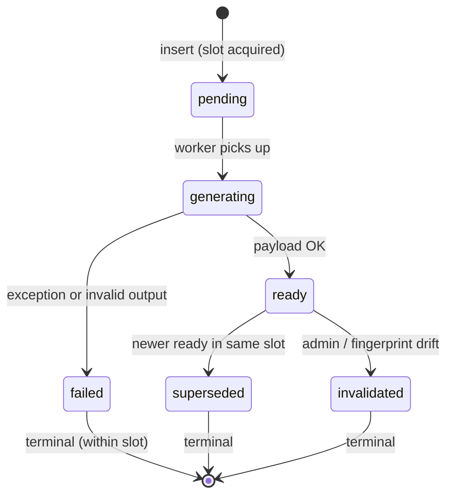
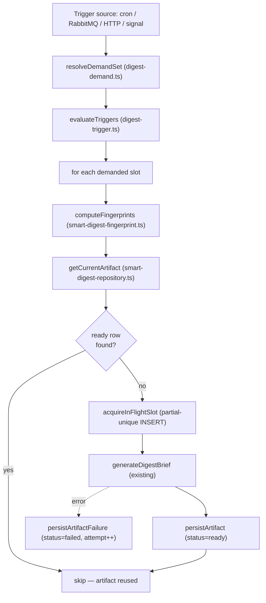

# Phase 2 / Step 14 / Slice 14.1 — Canonical Smart Digest artifact (`analysis_smart_digest`)

## A. Diagnosis: why per-user logging is the wrong source-of-truth shape

The current per-ticker pipeline ([digest-pipeline.ts L160-214](services/ai/gateway-2.0/src/core/analysis/digest-pipeline.ts)) generates a single `DigestBrief` once per `(symbol, signal-batch)` in `fanOutToWatchers`, then loops over every watcher and writes **one row per user per send** into `user_recommendation_log.message_body` as `JSON.stringify(brief)` ([digest-delivery.ts L129-142](services/ai/gateway-2.0/src/core/analysis/digest-delivery.ts)). Today this is "okay" because the brief is held in memory for one fanout call — but the table itself is shaped wrong for what the product needs next:

1. **Content is duplicated across users.** N identical `message_body` blobs per `(symbol, signal-of-day)` — no shared source row.
2. **Dedup is Redis-only, in-process, per-`(symbol, type, UTC-day)`** ([digest-pipeline.ts L116-150](services/ai/gateway-2.0/src/core/analysis/digest-pipeline.ts)). If the gateway restarts mid-day, the Redis key still helps, but there is no durable "this is the current artifact for AAPL right now" row anywhere.
3. **No provenance on stored content.** `user_recommendation_log` has `sent_at`, but no `model_name`, `prompt_version`, `code_version`, `truth_hash`, `context_hash` — so we cannot diff "did the content actually change" vs "did we just send again".
4. **No reuse across triggers or sessions.** A pre-open card and a post-close card for the same ticker on the same day are two unrelated `user_recommendation_log` rows with no shared key.
5. **No failure visibility.** Generation errors are caught per-watcher and logged ([digest-pipeline.ts L205-210](services/ai/gateway-2.0/src/core/analysis/digest-pipeline.ts)); there is no row for "we tried to generate AAPL at 09:25 and the LLM/truth fetch failed".
6. **Forces "delivery == generation".** Today every send forces a fresh generation in memory. Future delivery channels (push, email, in-app) cannot reference a stable artifact and must re-derive everything per-channel.

Splitting the table cleanly is the right next step because:

- **Content lifecycle** (when to (re)generate, when to invalidate) is governed by **upstream signal/news/memory state**, not by **per-user delivery state**.
- **Delivery lifecycle** (who got which artifact when, did we cap them, did the channel ack) is per-user and per-channel.
- Conflating them creates duplicate writes for what is really one content event, and prevents reuse across channels / scheduled windows / retries.

The target architecture:

```mermaid
flowchart LR
  subgraph upstream [Upstream truth/context]
    PTar[analysis_ticker_price_targets]
    Mem[analysis_market_memory]
    News[analysis_filtered_news]
    Macro[macro context]
  end
  subgraph artifact [Canonical artifact (Step 14.1)]
    ASD["analysis_smart_digest (per-ticker)"]
  end
  subgraph delivery [Delivery / fanout (Step 15)]
    URL[user_recommendation_log]
    Tg[Telegram sendPhoto]
    Future[Future channels: email/push/in-app]
  end
  PTar --> ASD
  Mem --> ASD
  News --> ASD
  Macro --> ASD
  ASD --> URL
  ASD --> Tg
  ASD --> Future
```

## B. Proposed schema for `analysis_smart_digest`

**File:** new migration [services/ai/gateway-2.0/migrations/023_analysis_smart_digest.sql](services/ai/gateway-2.0/migrations/023_analysis_smart_digest.sql). Numeric prefix is the next free slot in [services/ai/gateway-2.0/migrations/](services/ai/gateway-2.0/migrations/) (last used is `022_daily_overview_preferences.sql`).

### B.1 Design choices (opinionated)

- **Append-only.** Every generation attempt is its own row. We never UPDATE payload columns in-place once `status='ready'`. Lifecycle transitions only flip `status`/timestamps. This trades a small storage cost for total debuggability and trivial revert semantics.
- **Hybrid payload.** Critical surfacing fields are typed columns (cheap to index, cheap to render in admin tools); the full `DigestBrief` JSON shape lives in a `payload` JSONB column so we can evolve `digest-brief-generator.ts` without a migration each time.
- **Truth/context as references, not snapshots.** Store `truth_refs` (JSONB pointing at the rows that fed the brief — `price_target_id`, `memory_theme_ids[]`, `news_batch_ids[]`, `analysis_date`, `macro_signature`) plus a **hash** over those rows' identity-and-revision tuples. This keeps the table compact, makes "what changed?" queries trivial, and avoids snapshot drift.
- **Generation-window first-class.** A single artifact row encodes both `digest_date` (calendar day, UTC) and `window_start`/`window_end` (precise generation slot). This lets multiple intraday artifacts on the same day coexist without sentinel timestamps.

### B.2 Columns

Identity:

- `id BIGSERIAL PRIMARY KEY` — surrogate (matches existing repo convention).
- `digest_id UUID NOT NULL DEFAULT gen_random_uuid()` — external-facing handle (matches `analysis_market_memory.theme_id`).

Canonical key fields:

- `symbol VARCHAR(20) NOT NULL` — uppercased, slash form preserved for crypto (e.g. `BTC/USD`).
- `asset_type VARCHAR(10) NOT NULL` — `CHECK (asset_type IN ('stock','crypto','etf'))`. Tightens vs `user_watchlist` (which also allows `commodity`/`index`) because [recommendation-engine.ts `detectSignals` L1189-1249](services/ai/gateway-2.0/src/core/analysis/recommendation-engine.ts) only runs for `stock`/`crypto` today. Expansion is a later migration.
- `digest_date DATE NOT NULL` — UTC calendar day of the generation window.
- `mode VARCHAR(20) NOT NULL` — `CHECK (mode IN ('pre_open','post_close','intraday','on_demand'))`. Slot class.
- `window_start TIMESTAMPTZ NOT NULL` — UTC start of the generation window (e.g. pre_open = 13:00Z weekday for US stocks, post_close = 21:00Z, intraday = signal arrival time bucketed to nearest minute).
- `window_end TIMESTAMPTZ NOT NULL` — UTC end of the generation window.
- `trigger_reason VARCHAR(40) NOT NULL` — observability free-text (`'cron:pre_open'`, `'signal:target_reached'`, `'http:force_send'`, `'http:debug'`, `'retry:material_move'`). Indexable but not constrained.
- `brief_mode VARCHAR(10) NOT NULL DEFAULT 'strict'` — `CHECK (brief_mode IN ('strict','blended'))`. Matches today's `BriefMode` ([digest-brief-truth.ts L56](services/ai/gateway-2.0/src/core/analysis/digest-brief-truth.ts)); `'strict'` and `'blended'` are distinct artifacts.

Payload (hybrid):

- `payload JSONB NOT NULL DEFAULT '{}'::jsonb` — full `DigestBrief` shape: `ticker`, `status{label,tone}`, `price`, `changePercent`, `confidence`, `updatedAt`, `whatHappening`, `whatToWatch{holdAbove,breakBelowTarget}`, `context`, `hasMaterialContext`.
- `title TEXT` — denormalized from primary signal headline (matches today's `headline` on `user_recommendation_log`).
- `summary TEXT` — denormalized from `payload.whatHappening`.
- `primary_signal_type VARCHAR(30)` — e.g. `target_reached`, `stop_loss_warning` (`TickerSignal["type"]` enum).
- `confidence VARCHAR(10)` — `High`/`Medium`/`Low`.
- `stance_label VARCHAR(20)`, `stance_tone VARCHAR(20)` — denormalized from `payload.status`.

Truth/context references:

- `truth_refs JSONB NOT NULL DEFAULT '{}'::jsonb` — `{ priceTargetId, analysisDate, memoryThemeIds: uuid[], newsBatchIds: uuid[], macroSignature }`. References, not snapshots.

Reuse-eligibility fields (used by the selection query — only fields that materially change artifact meaning belong here):

- `truth_hash TEXT NOT NULL` — stable hex digest over `truth_refs` rows' `(id, last_updated/updated_at/processed_at)` tuples.
- `context_hash TEXT NOT NULL` — stable hex digest over the memory/news context selected for this brief.
- `schema_version INT NOT NULL` — bumped when the `DigestBrief` **payload shape** changes (column-shape contract). Mechanical/compile-time-enforced via a const exported from `digest-brief-generator.ts`.
- `generator_version TEXT NOT NULL` — manually-bumped marker (any short string or integer, e.g. `'1'`, `'2'`, `'2a'`). Exported as `CURRENT_GENERATOR_VERSION` from `smart-digest-fingerprint.ts`. Engineers bump it in source when they've changed the generator's output contract enough that prior artifacts should not be reused. No semver scheme, no diff-based enforcement, no review ceremony — it's a deliberate human-operated signal, and that's the entire point. Replaces deploy-SHA-based invalidation entirely.
- `prompt_version TEXT` — nullable (today the per-ticker brief is deterministic with no LLM; reserved for future blended/LLM-augmented modes). Participates in reuse selection via `IS NOT DISTINCT FROM` so two NULLs match.

Provenance / audit fields (stored on every row; **not** used for reuse selection):

- `code_version TEXT NOT NULL` — short git SHA at generation time (or `'dev-${env}'` locally). Captured for audit, debugging, and "which build wrote this row?" forensics. A new deploy does **not** invalidate previously-`ready` artifacts; reuse is decided by `truth_hash` / `context_hash` / `schema_version` / `generator_version` / `prompt_version` / freshness instead. This matches the upstream provenance pattern used by [026_market_memory_provenance.sql](services/workers/data-fetcher-2.0/migrations/026_market_memory_provenance.sql).
- `model_name TEXT` — nullable. Captured when an LLM is involved; reserved.

Lifecycle:

- `status VARCHAR(20) NOT NULL DEFAULT 'pending'` — `CHECK (status IN ('pending','generating','ready','failed','invalidated','superseded'))`.
- `attempt_number INT NOT NULL DEFAULT 1` — retry counter within a slot (≤ 3 per slot).

Timestamps:

- `requested_at TIMESTAMPTZ NOT NULL DEFAULT NOW()` — row creation (slot acquisition).
- `generation_started_at TIMESTAMPTZ` — when status flipped to `generating`.
- `generated_at TIMESTAMPTZ` — when status flipped to `ready`. **Primary timestamp for selection ordering.**
- `invalidated_at TIMESTAMPTZ` — when status flipped to `invalidated`/`superseded`.
- `created_at TIMESTAMPTZ NOT NULL DEFAULT NOW()`.

Failure metadata (nullable):

- `error_code TEXT` — short machine label (`'truth_fetch_failed'`, `'render_failed'`, `'sanitizer_threw'`).
- `error_message TEXT` — last 1KB of error.message.
- `error_stack TEXT` — last 4KB of stack (development; trim in prod).

### B.3 Indexes

- `idx_smart_digest_current` on `(symbol, asset_type, brief_mode, status, generated_at DESC)` — primary read path: "give me the current ready artifact for AAPL".
- `idx_smart_digest_digest_date` on `(digest_date DESC, symbol)` — calendar/admin listing.
- `idx_smart_digest_slot_window` on `(symbol, asset_type, mode, window_start)` — exact slot lookup for the demand+trigger resolver.
- `idx_smart_digest_status_requested` on `(status, requested_at)` WHERE `status IN ('pending','generating')` — orphan/stuck-job detection.
- `idx_smart_digest_digest_id` UNIQUE on `(digest_id)` — external handle.
- `idx_smart_digest_payload_gin` (optional, defer to 14.1 followup) `USING GIN (payload jsonb_path_ops)`.

### B.4 Uniqueness

- `UNIQUE (digest_id)` — already declared as the UUID handle.
- **Partial unique index** `uq_smart_digest_inflight` on `(symbol, asset_type, mode, window_start, brief_mode)` WHERE `status IN ('pending','generating')` — guards against two concurrent generators racing for the same slot. Failed/superseded/invalidated rows do NOT block retries because they're excluded from the partial.
- **No** unique on `(symbol, asset_type, digest_date, mode)` — multiple intraday rows + retries + supersedes per slot are legal and desirable for the append-only model.

### B.5 Active/current artifact selection

The repository function `getCurrentArtifact(symbol, assetType, briefMode)` runs:

```sql
SELECT *
FROM analysis_smart_digest
WHERE symbol = $1
  AND asset_type = $2
  AND brief_mode = $3
  AND status = 'ready'
  AND truth_hash = $4
  AND context_hash = $5
  AND schema_version = $6
  AND generator_version = $7
  AND prompt_version IS NOT DISTINCT FROM $8
  AND generated_at > NOW() - $9::interval  -- e.g. INTERVAL '1 day' freshness ceiling
ORDER BY generated_at DESC
LIMIT 1;
```

Caller passes the **current** semantic constants (`CURRENT_DIGEST_BRIEF_SCHEMA_VERSION`, `CURRENT_GENERATOR_VERSION`, `CURRENT_PROMPT_VERSION`) plus freshly-computed `truth_hash`/`context_hash`. **`code_version` is deliberately absent from the WHERE clause** — a routine deploy with no contract change does not invalidate prior `ready` artifacts. If any meaning-bearing input changed, the query returns 0 rows and the caller generates a new one. This makes "current artifact" deterministic from the caller's perspective — no `is_current` flag to maintain, no race window between flip and read.

### B.6 Multiple refreshes per day/window

Allowed by design: each generation attempt is its own row. Within a single `(symbol, asset_type, mode, window_start, brief_mode)` slot, the partial unique index forces serialization of in-flight attempts; once a row reaches `ready`, the next slot's row supersedes it implicitly via `generated_at DESC` selection. We can run a nightly maintenance job (deferred to Step 16) that flips older same-slot `ready` rows to `superseded` for hygiene; the read path does not require it.

## C. Canonical key recommendation

**Recommended pattern: immutable artifact rows + selection query (no current-pointer column).**

Evaluated tradeoffs:

- `(symbol, asset_type, digest_date, mode)` as natural PK / unique:
  - Pro: simple semantic — one artifact per slot per day.
  - Con: forces UPSERT on every regenerate; loses history of failed attempts and retries; multiple intraday triggers in the same day collapse (we'd need a `seq` field anyway); cannot represent the `'pending' → 'generating' → 'failed' → 'pending' (retry)` cycle in a single row without timestamps drifting.

- `(symbol, asset_type, mode, trigger_type, window_start)` as natural unique:
  - Pro: window_start gives intraday resolution; trigger_type disambiguates reason.
  - Con: still UPSERT-shaped; retries still collide on `window_start`; we end up needing partial uniqueness anyway. The `trigger_type` part is observability, not identity — putting it in the key is overreach.

- Versioned / current-pointer (`is_current` boolean, flip on regen):
  - Pro: trivially fast "give me current" query.
  - Con: requires write-side discipline to ATOMICALLY flip the old row's `is_current=false` while inserting the new `is_current=true`. Easy to introduce bugs where two rows are "current" or zero are. Also requires the writer to know about the old row, which couples generation to selection.

- **Immutable rows + selection query (RECOMMENDED):**
  - Pro: append-only, single-writer-per-slot via partial unique index, "current" is a query, "history" is free, retries and reruns produce trivially-explainable per-row evidence. Matches how `analysis_market_memory` already works (themes accumulate; `status` says which are alive). Matches the Slice 10 design intuition that explicit per-row provenance > implicit "latest".
  - Con: requires the index `idx_smart_digest_current` to be present (it is); requires the caller to compute the truth/context fingerprints (one-line helper).
  - Risk mitigation: the freshness ceiling (`generated_at > NOW() - interval`) guarantees we don't accidentally reuse a hash-matching artifact from yesterday if the input rows happened to not change.

**Surrogate key for external use:** `digest_id UUID` mirrors `analysis_market_memory.theme_id` — gives delivery rows in `user_recommendation_log` (Step 15) a stable FK target without depending on bigserial `id`.

## D. Lifecycle / state model

States:

- `pending` — slot row acquired (partial-unique insert succeeded). No work done yet.
- `generating` — worker has started; `generation_started_at` set.
- `ready` — payload populated, `generated_at` set. Eligible for read-path selection.
- `failed` — generation threw or returned an unusable result; `error_code`/`error_message`/`error_stack` populated. Counts toward the per-slot retry cap (3).
- `invalidated` — manually retired (admin tool, future Slice). Rare. Excluded from read path.
- `superseded` — passively retired by a newer `ready` row in the same slot. Selection query already filters by `status='ready'` so explicit supersede is optional, mainly for hygiene.

Transitions:



Retry behavior:

- A `failed` row stays as-is. The next demand+trigger evaluation **inserts a new row** for the same slot if `attempt_number < 3` and the partial-unique-on-inflight allows it.
- After 3 failed rows for the same slot, the next-slot scheduler (e.g. the next pre_open) creates a fresh row with `attempt_number = 1`.
- "Stuck" rows in `generating` for > N minutes are reaped by a Step 16 maintenance job (out of scope here) flipping them to `failed`.

## E. Generation flow changes

The flow refactors into five named service boundaries. Concretely:



New / refactored modules (relative to `services/ai/gateway-2.0/src/core/analysis/`):

- `digest-demand.ts` (NEW) — `resolveDemandSet(db, assetType)` returns `Array<{symbol, asset_type}>` via `SELECT DISTINCT (asset_type, ticker_symbol) FROM user_watchlist WHERE asset_type IN ('stock','crypto')`. Channel/session/Telegram joins **deliberately not** here — those move to Step 15's delivery layer. This is the single change implementing the `watchlist_only` demand source.
- `digest-trigger.ts` (NEW) — `evaluateTriggers(now, modes, triggerSource)` returns `Array<{symbol, asset_type, mode, window_start, window_end, trigger_reason}>`. For Step 14.1 it covers:
  - `mode='pre_open'`: window once a day at UTC pre-open boundary; current code lacks this cron for per-ticker, so the cron-wiring half is deferred to 14.1.5.
  - `mode='post_close'`: same shape post-close.
  - `mode='intraday'`: invoked from the existing RabbitMQ/HTTP signal path with `window_start = bucketed-to-minute now`.
  - `mode='on_demand'`: invoked from `/internal/force-send-digest` and `/internal/debug-digest`.
- `smart-digest-fingerprint.ts` (NEW) — `computeTruthFingerprint(symbol)` and `computeContextFingerprint(symbol)` return hex digests. Inputs come from the same fetchers the existing brief generator uses (`fetchTickerMemoryText`, `analysis_ticker_price_targets` row for the day, `news_one_liner`, `MacroContext`). Hashes are stable across process restarts — use `crypto.createHash('sha256').update(JSON.stringify(deterministicProjection)).digest('hex')`. Also exports the **reuse-contract constants**: `CURRENT_DIGEST_BRIEF_SCHEMA_VERSION` (number; bumped when `DigestBrief` shape changes — co-located in `digest-brief-generator.ts` re-exported here for symmetry) and `CURRENT_GENERATOR_VERSION` (semver-like string, manually bumped, reviewed at PR time). `CURRENT_CODE_VERSION` is **also** exported but is captured for audit only — it does **not** participate in `getCurrentArtifact`'s WHERE clause.
- `smart-digest-repository.ts` (NEW) — pg-backed CRUD: `getCurrentArtifact`, `acquireInFlightSlot`, `markReady`, `markFailed`, `selectByDigestId`, `listRecent`. All queries parameterized; all status mutations bounded by `WHERE id = $1 AND status = $expectedFrom` to be safe under concurrent writers.
- `digest-brief-generator.ts` (LIGHT REFACTOR) — `generateDigestBrief` stays pure-functional and signature-compatible; **no** DB writes inside this module. Persistence is the orchestrator's job.
- `digest-pipeline.ts` (REFACTOR) — `processRecommendations`/`fanOutToWatchers` gain an artifact-aware branch behind a flag (see below). The current "generate once per fanout call, INSERT N user log rows" path is preserved verbatim when the flag is off.
- `digest-delivery.ts` (NO CHANGE in Step 14.1) — `deliverSmartDigest` and the `user_recommendation_log` INSERT are untouched. The delivery function does **not** learn about `digest_id` in this step. Linking delivery rows to canonical artifacts (any new column on `user_recommendation_log`, any FK to `analysis_smart_digest.digest_id`, any retirement of the JSON `message_body`) is exclusively Step 15.

Feature flag: `SMART_DIGEST_CANONICAL_ARTIFACT_ENABLED` (env, default `false`). When off, the artifact INSERT is a no-op and the existing path runs unchanged. When on, the orchestrator persists a canonical artifact row and the fanout loop reads the `DigestBrief` from `payload` instead of from in-memory generation. Either way, `deliverSmartDigest` and the per-user delivery write to `user_recommendation_log` are byte-identical to today.

## F. Refresh / fingerprint strategy

**Design principle:** reuse eligibility is driven by **things that materially affect artifact meaning**, never by accidents of deployment. A new image tag with identical generator logic must not invalidate yesterday's `ready` artifacts.

A canonical artifact is reusable iff **all of these** hold:

1. `status = 'ready'`.
2. `truth_hash = computeTruthFingerprint(symbol)` **now**.
3. `context_hash = computeContextFingerprint(symbol)` **now**.
4. `schema_version = CURRENT_DIGEST_BRIEF_SCHEMA_VERSION` (payload-shape contract).
5. `generator_version = CURRENT_GENERATOR_VERSION` (semantic generation contract — manually bumped, never auto-bumped from git).
6. `prompt_version IS NOT DISTINCT FROM CURRENT_PROMPT_VERSION` (today both NULL; future-proof for blended/LLM modes).
7. `generated_at > NOW() - INTERVAL '1 day'` (absolute freshness ceiling — defends against unchanged-input collisions across calendar days).

Note: `code_version` is **not** part of this list. It is stored on the row for audit but is not consulted at read time. Routine deploys (bug fixes, refactors, dependency bumps, log-message tweaks) preserve artifact validity. Only the engineer's explicit decision to bump `CURRENT_GENERATOR_VERSION` invalidates prior artifacts.

What forces a new artifact:

| Trigger                                                                                 | Mechanism                                                                                        |
| --------------------------------------------------------------------------------------- | ------------------------------------------------------------------------------------------------ |
| Pre-open / post-close scheduled window arrives                                          | `evaluateTriggers` proposes a new slot; selection misses because `window_start` advanced         |
| Material intraday move                                                                  | `detectSignals` / RabbitMQ event → `evaluateTriggers` with `mode='intraday'`, new `window_start` |
| Truth changed (new price target row, new analysis_date)                                 | `truth_hash` differs → selection misses                                                          |
| Context changed (memory theme updated, new news batch)                                  | `context_hash` differs → selection misses                                                        |
| **DigestBrief payload shape changed** (column-shape contract)                           | `schema_version` const bumped in source → selection misses globally                              |
| **Generator algorithm changed materially** (stance thresholds, gate logic, level rules) | engineer bumps `CURRENT_GENERATOR_VERSION` in PR → `generator_version` differs                   |
| Brief mode changed                                                                      | row column included in selection → `strict` and `blended` are distinct slots                     |
| Previous artifact failed/invalidated                                                    | `status != 'ready'` → selection misses                                                           |
| ~~Routine deploy / new git SHA~~                                                        | **deliberately NOT a trigger** — `code_version` is audit-only                                    |

What allows reuse:

- Same truth refs, same context refs, same `schema_version`, same `generator_version`, same `prompt_version`, within the freshness ceiling — even across multiple deploys. Most intraday signal-driven invocations on the same minute should reuse the existing `ready` row instead of regenerating.

`CURRENT_GENERATOR_VERSION` is a single TypeScript constant in [smart-digest-fingerprint.ts](services/ai/gateway-2.0/src/core/analysis/smart-digest-fingerprint.ts) — e.g. `export const CURRENT_GENERATOR_VERSION = "1"`. Bump it in the same PR that changes the generator's output meaningfully; leave it alone for refactors and bug fixes that produce identical output. That's the whole policy.

Fingerprint inputs (concrete projection):

- **Truth:** `{ priceTargetId: row.id, priceTargetUpdatedAt: row.updated_at, analysisDate: row.analysis_date, newsOneLiner: stripWhitespace(news_one_liner) || null, macroSignature: deriveMacroSignature(macroContext) }`.
- **Context:** `{ memoryThemes: [{ theme_id, last_updated, prompt_version }], newsHeadlines: [{ batch_id, processed_at }] }`. The Slice 10 path that re-sanitizes legacy memory rows naturally bumps `last_updated`, which naturally bumps `context_hash`, which naturally invalidates downstream artifacts — the chains compose correctly.

## G. Step 14.1 implementation slices

**Step 14.1 scope is `analysis_smart_digest` per-ticker artifacts only.** Daily Overview, sibling tables, and any cross-product canonical work are explicitly out of scope and live in later steps (see section I).

Eight slices, each independently shippable, each behind the global `SMART_DIGEST_CANONICAL_ARTIFACT_ENABLED=false` until 14.1.8:

- **14.1.1 — Schema migration.** [services/ai/gateway-2.0/migrations/023_analysis_smart_digest.sql](services/ai/gateway-2.0/migrations/023_analysis_smart_digest.sql) only. No code reads/writes the table yet. Ship + verify migration applies on a fresh DB and on the existing prod schema (via SSH + `docker exec gateway psql -f`). One-file commit.
- **14.1.2 — Repository layer.** `smart-digest-repository.ts` with all CRUD + a `__tests__/smart-digest-repository.test.ts` using the mock-pool pattern from [memory-curator.test.ts L1303-1330](services/ai/gateway-2.0/src/core/analysis/__tests__/memory-curator.test.ts). The `getCurrentArtifact` query MUST use `generator_version` (not `code_version`) — a dedicated test asserts that two artifacts written under different `code_version` but identical `generator_version` + hashes are mutually reusable. No callers yet.
- **14.1.3 — Fingerprint helpers + version constants.** `smart-digest-fingerprint.ts` exports `computeTruthFingerprint`, `computeContextFingerprint`, `CURRENT_DIGEST_BRIEF_SCHEMA_VERSION`, `CURRENT_GENERATOR_VERSION`, and `CURRENT_CODE_VERSION` (audit-only). Pure functions; tests include hash stability across re-imports and a "version constant exists and is well-formed" test.
- **14.1.4 — Demand + trigger resolvers.** `digest-demand.ts` (watchlist-only `SELECT DISTINCT`) + `digest-trigger.ts` (window math for `pre_open`/`post_close`/`intraday`/`on_demand`). Tests with fixed `now` and small fixture watchlist sets.
- **14.1.5 — Generation write path (flag off by default).** Refactor `processRecommendations`/`fanOutToWatchers` in [digest-pipeline.ts](services/ai/gateway-2.0/src/core/analysis/digest-pipeline.ts) so that **when the flag is on**, the sequence is: resolve demand → evaluate triggers → for each slot, `getCurrentArtifact` → on miss, `acquireInFlightSlot` → `generateDigestBrief` (existing) → `markReady` / `markFailed`. Existing dedup, fanout loop, and `user_recommendation_log` INSERT continue unchanged. Add `SMART_DIGEST_CANONICAL_ARTIFACT_ENABLED` to [config.ts](services/ai/gateway-2.0/src/core/analysis/config.ts).
- **14.1.6 — Read-path adapter (flag-gated).** When the flag is on, `fanOutToWatchers` loads the `DigestBrief` from `smart-digest-repository.getCurrentArtifact(...).payload` instead of from the in-process generator. The `deliverSmartDigest` call inside the watcher loop is **not** modified — same arguments, same Telegram sendPhoto, same `user_recommendation_log` INSERT shape. This slice only swaps where the brief comes from; the delivery write is untouched.
- **14.1.7 — Debug / preview support.** Extend [preview-digest.ts](services/ai/gateway-2.0/scripts/preview-digest.ts) with `--from-artifact <digest_id|latest>` to load and render an existing artifact instead of regenerating. Extend `/internal/debug-digest` ([recommendations.ts L329-372](services/ai/gateway-2.0/src/http/recommendations.ts)) with optional `digestId` to return an existing artifact. Both deliberately keep the existing "regenerate now" path as default.
- **14.1.8 — Staging rollout.** Flip the flag for a single ticker via env override or per-symbol allowlist in `config.ts`. Capture pre/post `user_recommendation_log` shape (it must stay byte-identical to today). Capture artifact rows. Validate that a redeploy (new `code_version`, same `generator_version`) reuses prior `ready` artifacts. Iterate, then flip the flag globally.

## H. Files / functions likely to change

| File                                                                                                                                           | Change                                                                                                                      |
| ---------------------------------------------------------------------------------------------------------------------------------------------- | --------------------------------------------------------------------------------------------------------------------------- |
| [services/ai/gateway-2.0/migrations/023_analysis_smart_digest.sql](services/ai/gateway-2.0/migrations/023_analysis_smart_digest.sql)           | NEW — schema                                                                                                                |
| [services/ai/gateway-2.0/src/core/analysis/smart-digest-repository.ts](services/ai/gateway-2.0/src/core/analysis/smart-digest-repository.ts)   | NEW — `getCurrentArtifact`, `acquireInFlightSlot`, `markReady`, `markFailed`, `selectByDigestId`, `listRecent`              |
| [services/ai/gateway-2.0/src/core/analysis/smart-digest-fingerprint.ts](services/ai/gateway-2.0/src/core/analysis/smart-digest-fingerprint.ts) | NEW — `computeTruthFingerprint`, `computeContextFingerprint`, `CURRENT_DIGEST_BRIEF_SCHEMA_VERSION`, `CURRENT_GENERATOR_VERSION` (reuse-eligibility), `CURRENT_CODE_VERSION` (audit-only) |
| [services/ai/gateway-2.0/src/core/analysis/digest-demand.ts](services/ai/gateway-2.0/src/core/analysis/digest-demand.ts)                       | NEW — `resolveDemandSet(db, assetType)` — `SELECT DISTINCT (asset_type, ticker_symbol) FROM user_watchlist`                 |
| [services/ai/gateway-2.0/src/core/analysis/digest-trigger.ts](services/ai/gateway-2.0/src/core/analysis/digest-trigger.ts)                     | NEW — `evaluateTriggers(now, modes, triggerSource, demandSet)`                                                              |
| [services/ai/gateway-2.0/src/core/analysis/digest-pipeline.ts](services/ai/gateway-2.0/src/core/analysis/digest-pipeline.ts)                   | REFACTOR — `processRecommendations` + `fanOutToWatchers` gain artifact branch (flag-gated); flag off keeps current path     |
| [services/ai/gateway-2.0/src/core/analysis/digest-brief-generator.ts](services/ai/gateway-2.0/src/core/analysis/digest-brief-generator.ts)     | NO-OP (stays a pure function); export `DIGEST_BRIEF_SCHEMA_VERSION` constant                                                |
| [services/ai/gateway-2.0/src/core/analysis/digest-delivery.ts](services/ai/gateway-2.0/src/core/analysis/digest-delivery.ts)                   | NO change in Step 14.1 — `user_recommendation_log` INSERT unchanged                                                         |
| [services/ai/gateway-2.0/src/core/analysis/config.ts](services/ai/gateway-2.0/src/core/analysis/config.ts)                                     | ADD `smartDigestCanonicalArtifactEnabled` (default `false`)                                                                 |
| [services/ai/gateway-2.0/src/http/recommendations.ts](services/ai/gateway-2.0/src/http/recommendations.ts)                                     | LIGHT EDIT — `/internal/debug-digest` learns optional `digestId`                                                            |
| [services/ai/gateway-2.0/scripts/preview-digest.ts](services/ai/gateway-2.0/scripts/preview-digest.ts)                                         | LIGHT EDIT — add `--from-artifact <digest_id\|latest>`                                                                      |
| [services/ai/gateway-2.0/src/core/analysis/**tests**/](services/ai/gateway-2.0/src/core/analysis/__tests__/)                                   | NEW tests for repo, fingerprint, demand, trigger; extend `digest-pipeline.test.ts` for flag-on/flag-off branches            |
| [docs/upstream-trust-map.md](docs/upstream-trust-map.md)                                                                                       | APPEND Step 14.1 section mirroring Slice 8/9/10 sections                                                                    |

Functions touched in `digest-pipeline.ts`:

- `processRecommendations` ([L55-112](services/ai/gateway-2.0/src/core/analysis/digest-pipeline.ts)) — wraps the per-asset loop with a demand+trigger pre-pass when flag is on.
- `fanOutToWatchers` ([L160-214](services/ai/gateway-2.0/src/core/analysis/digest-pipeline.ts)) — when flag is on, the `brief` reference reads from `getCurrentArtifact().payload` (the row just written by the prior orchestrator step) instead of in-memory `generateDigestBrief(...)`.
- `filterDedupSignals` ([L129-150](services/ai/gateway-2.0/src/core/analysis/digest-pipeline.ts)) — **left in place**. Redis dedup is a delivery-layer concern (Step 15) and stays untouched in 14.1.

## I. Out-of-scope / deferred

- **All delivery-layer changes (Step 15):** explicitly deferred. 14.1 does **not** modify `deliverSmartDigest`, the `user_recommendation_log` INSERT shape, or any delivery-side behavior. Specifically out of 14.1 and reserved for Step 15: adding a `digest_id UUID` column on `user_recommendation_log`, any FK to `analysis_smart_digest(digest_id)`, retiring the JSON-blob `message_body`, moving Redis dedup behind a delivery-log read, and channel-aware delivery (email/push/in-app). The artifact table is written in 14.1; consumers in delivery start referencing it in 15.
- **Step 16 (cost / performance):** maintenance jobs that mark older same-slot `ready` rows as `superseded`, reap stuck-`generating` rows, prune `failed`+`invalidated` after N days, materialized "current artifact" view, GIN index on payload — all Step 16.
- **Daily Overview canonicalization (`analysis_daily_overview` or equivalent):** entirely out of Step 14.1. No design sketch, no doc, no schema, no code wiring in this slice. The pattern established by `analysis_smart_digest` (append-only, fingerprint-gated reuse, manually-bumped semantic generator version, partial-unique-on-inflight) is a likely template for a future sibling table, but that will be planned and reviewed as its own step when prioritized. Today's daily overview path in [daily-overview-broadcaster.ts](services/ai/gateway-2.0/src/core/analysis/daily-overview-broadcaster.ts) keeps writing `user_recommendation_log` rows unchanged.
- **News / memory quality improvements (Step 12 / Step 13):** explicitly untouched. Truth/context inputs are consumed as-is. The fingerprint architecture makes future quality improvements drop-in: when memory rows get cleaner (Slice 10/11), `context_hash` updates naturally invalidate stale artifacts.
- **LLM-augmented per-ticker brief:** schema reserves `model_name` and `prompt_version` columns but the generator stays deterministic in 14.1. No LLM cost added by this slice.
- **Frontend rendering of past digests:** no consumer code in 14.1; the marketing `smart-digest` page stays static.
- **Backfill of pre-14.1 `user_recommendation_log` content into `analysis_smart_digest`:** explicitly NO. Per-ticker briefs are deterministic and regeneratable; history stays where it is.
- **Asset-type expansion to `commodity`/`index`:** the table accepts only `stock`/`crypto`/`etf` matching today's pipeline universe. Expansion is a one-line `CHECK` constraint migration when those asset classes get digest support.
- **Deploy-driven invalidation:** explicitly NOT a feature. A new image tag with the same `CURRENT_GENERATOR_VERSION` reuses prior `ready` artifacts. Engineers wanting to force re-generation must bump `CURRENT_GENERATOR_VERSION` (or `CURRENT_DIGEST_BRIEF_SCHEMA_VERSION` if the payload shape also changed) in source.

## Risks & edge cases

- **Fingerprint instability across processes** — if `JSON.stringify` key order is non-deterministic for any input, hashes will flap. Mitigation: explicit projection helpers in `smart-digest-fingerprint.ts` that build sorted-key plain objects before hashing; tests assert hash stability across re-imports.
- **Partial unique index race** — two workers can both try to INSERT a `pending` row for the same slot. Postgres rejects the second; the second worker re-runs `getCurrentArtifact` and either reuses the now-`ready` row or gets a `pending`/`generating` row owned by the first worker and back-offs. Repository function returns `null` on conflict and caller retries with bounded backoff (≤ 5 attempts, 100ms base).
- **Slot windows for non-US/24h crypto** — `mode='pre_open'`/`'post_close'` doesn't map to crypto. For `asset_type='crypto'`, only `mode IN ('intraday','on_demand')` produces slots in `evaluateTriggers`. Tests assert this.
- **`generated_at` clock skew between gateway instances** — same DB clock used for both write and read freshness; `NOW()` in the SELECT mitigates instance-clock drift. No issue.
- **Flag-on rollout regresses delivery** — 14.1.6 keeps `user_recommendation_log` INSERT byte-identical to today; the artifact path is additive. If artifact persist fails after `markReady` but before delivery, the next pipeline pass selects the now-ready artifact and delivery proceeds idempotently per the Redis dedup key (unchanged).
- **`code_version` unavailable locally** — `CURRENT_CODE_VERSION` falls back to `'dev-${env}'` when the build env var is unset. Because `code_version` is **audit-only** and never appears in the reuse-selection WHERE clause, this fallback has zero effect on reuse correctness. The provenance column just records `'dev-local'` for locally-generated rows.
- **Forgotten `CURRENT_GENERATOR_VERSION` bump** — an engineer changes the generator's output meaningfully but forgets to bump the constant, so stale artifacts continue to be reused. Cheap recovery: bump the constant in a follow-up PR; the very next demand+trigger pass regenerates everything. No data loss, no rollback. Treat the constant as a normal code-review attention item, not a process.

---

## Appendix 1 — Recommended schema sketch (SQL-ish)

```sql
-- 023_analysis_smart_digest.sql
BEGIN;

CREATE TABLE IF NOT EXISTS analysis_smart_digest (
  id                     BIGSERIAL PRIMARY KEY,
  digest_id              UUID NOT NULL DEFAULT gen_random_uuid(),

  symbol                 VARCHAR(20) NOT NULL,
  asset_type             VARCHAR(10) NOT NULL,
  digest_date            DATE NOT NULL,
  mode                   VARCHAR(20) NOT NULL,
  window_start           TIMESTAMPTZ NOT NULL,
  window_end             TIMESTAMPTZ NOT NULL,
  trigger_reason         VARCHAR(40) NOT NULL,
  brief_mode             VARCHAR(10) NOT NULL DEFAULT 'strict',

  payload                JSONB NOT NULL DEFAULT '{}'::jsonb,
  title                  TEXT,
  summary                TEXT,
  primary_signal_type    VARCHAR(30),
  confidence             VARCHAR(10),
  stance_label           VARCHAR(20),
  stance_tone            VARCHAR(20),

  truth_refs             JSONB NOT NULL DEFAULT '{}'::jsonb,
  truth_hash             TEXT NOT NULL,
  context_hash           TEXT NOT NULL,
  schema_version         INT  NOT NULL,
  generator_version      TEXT NOT NULL,           -- reuse-eligibility (semantic, manually bumped)
  prompt_version         TEXT,                    -- reuse-eligibility (IS NOT DISTINCT FROM)
  code_version           TEXT NOT NULL,           -- audit-only; NOT used in reuse selection
  model_name             TEXT,

  status                 VARCHAR(20) NOT NULL DEFAULT 'pending',
  attempt_number         INT NOT NULL DEFAULT 1,

  requested_at           TIMESTAMPTZ NOT NULL DEFAULT NOW(),
  generation_started_at  TIMESTAMPTZ,
  generated_at           TIMESTAMPTZ,
  invalidated_at         TIMESTAMPTZ,
  created_at             TIMESTAMPTZ NOT NULL DEFAULT NOW(),

  error_code             TEXT,
  error_message          TEXT,
  error_stack            TEXT,

  CONSTRAINT chk_smart_digest_status     CHECK (status IN ('pending','generating','ready','failed','invalidated','superseded')),
  CONSTRAINT chk_smart_digest_mode       CHECK (mode IN ('pre_open','post_close','intraday','on_demand')),
  CONSTRAINT chk_smart_digest_asset_type CHECK (asset_type IN ('stock','crypto','etf')),
  CONSTRAINT chk_smart_digest_brief_mode CHECK (brief_mode IN ('strict','blended')),
  CONSTRAINT chk_smart_digest_attempt    CHECK (attempt_number BETWEEN 1 AND 3),
  CONSTRAINT uq_smart_digest_digest_id   UNIQUE (digest_id)
);

CREATE INDEX idx_smart_digest_current
  ON analysis_smart_digest (symbol, asset_type, brief_mode, status, generated_at DESC);

CREATE INDEX idx_smart_digest_digest_date
  ON analysis_smart_digest (digest_date DESC, symbol);

CREATE INDEX idx_smart_digest_slot_window
  ON analysis_smart_digest (symbol, asset_type, mode, window_start);

CREATE INDEX idx_smart_digest_status_requested
  ON analysis_smart_digest (status, requested_at)
  WHERE status IN ('pending','generating');

CREATE UNIQUE INDEX uq_smart_digest_inflight
  ON analysis_smart_digest (symbol, asset_type, mode, window_start, brief_mode)
  WHERE status IN ('pending','generating');

COMMIT;
```

## Appendix 2 — Generation decision pseudocode

```ts
// orchestrator: services/ai/gateway-2.0/src/core/analysis/digest-pipeline.ts

async function generateCanonicalArtifacts(deps, assetType) {
  if (!deps.config.smartDigestCanonicalArtifactEnabled) return;

  // 1. Demand
  const demand = await resolveDemandSet(deps.db, assetType);
  // → [{ symbol: 'AAPL', asset_type: 'stock' }, ...]

  // 2. Triggers (windows for this invocation)
  const slots = evaluateTriggers({
    now: new Date(),
    modes: deps.triggerModes, // ['intraday'] for RabbitMQ; ['pre_open'] for cron
    triggerReason: deps.triggerReason, // 'signal:target_reached', 'cron:pre_open', ...
    demand,
  });
  // → [{ symbol, asset_type, mode, window_start, window_end, trigger_reason, brief_mode }, ...]

  for (const slot of slots) {
    // 3. Compute current fingerprints
    const truthHash = await computeTruthFingerprint(deps.db, slot.symbol);
    const contextHash = await computeContextFingerprint(deps.db, slot.symbol);

    // 4. Try to reuse an existing valid artifact.
    //    NOTE: code_version is deliberately NOT in this call — routine
    //    deploys do not invalidate prior ready artifacts.
    const existing = await repo.getCurrentArtifact({
      db: deps.db,
      symbol: slot.symbol,
      assetType: slot.asset_type,
      briefMode: slot.brief_mode,
      truthHash,
      contextHash,
      schemaVersion:    CURRENT_DIGEST_BRIEF_SCHEMA_VERSION,
      generatorVersion: CURRENT_GENERATOR_VERSION,
      promptVersion:    CURRENT_PROMPT_VERSION,
      maxAgeMs:         24 * 60 * 60 * 1000,
    });
    if (existing) continue; // reuse — no generation

    // 5. Acquire in-flight slot (partial-unique INSERT, may conflict).
    //    code_version is recorded here for AUDIT only.
    const slotRow = await repo.acquireInFlightSlot({
      db: deps.db,
      ...slot,
      truthHash,
      contextHash,
      schemaVersion:    CURRENT_DIGEST_BRIEF_SCHEMA_VERSION,
      generatorVersion: CURRENT_GENERATOR_VERSION,
      promptVersion:    CURRENT_PROMPT_VERSION,
      codeVersion:      CURRENT_CODE_VERSION, // audit-only
    });
    if (!slotRow) continue; // another worker owns this slot — let it finish

    // 6. Generate (deterministic, no LLM call)
    try {
      const brief = generateDigestBrief({
        signals: deps.signalsBySymbol.get(slot.symbol) ?? [],
        symbol: slot.symbol,
        macroContext: deps.macroContext,
        memoryTextMap: deps.memoryTextMap,
        analysisDateMap: deps.analysisDateMap,
        mode: slot.brief_mode,
      });

      await repo.markReady({
        db: deps.db,
        id: slotRow.id,
        payload: brief,
        title: deriveTitle(brief, deps.signalsBySymbol.get(slot.symbol)?.[0]),
        summary: brief.whatHappening,
        primarySignalType:
          deps.signalsBySymbol.get(slot.symbol)?.[0]?.type ?? null,
        confidence: brief.confidence,
        stanceLabel: brief.status.label,
        stanceTone: brief.status.tone,
        truthRefs: await collectTruthRefs(deps.db, slot.symbol),
      });
    } catch (err) {
      await repo.markFailed({
        db: deps.db,
        id: slotRow.id,
        errorCode: classifyError(err),
        errorMessage: String(err?.message ?? err).slice(0, 1024),
        errorStack: String(err?.stack ?? "").slice(0, 4096),
      });
      // Retry handled by next-trigger pass (attempt_number checked on acquire).
    }
  }
}
```

Read path (flag-on):

```ts
// fanOutToWatchers, flag-on branch
const artifact = await repo.getCurrentArtifact({ ... });
if (!artifact) {
  // gracefully fall through to legacy in-memory generation
  return legacyFanOut(...);
}
const brief = artifact.payload as DigestBrief;
const rendered = await renderSmartDigestCard(brief, log);
// existing watcher loop + deliverSmartDigest unchanged
```

## Appendix 3 — Step 14.1 slice sequence (execution order)

1. **14.1.1** Schema migration only ([023_analysis_smart_digest.sql](services/ai/gateway-2.0/migrations/023_analysis_smart_digest.sql)) — includes both `generator_version` and `code_version` columns.
2. **14.1.2** Repository (`smart-digest-repository.ts`) + repo tests — reuse query uses `generator_version`, never `code_version`.
3. **14.1.3** Fingerprint helpers + reuse-contract constants (`smart-digest-fingerprint.ts`) — `CURRENT_DIGEST_BRIEF_SCHEMA_VERSION`, `CURRENT_GENERATOR_VERSION`, `CURRENT_CODE_VERSION` (audit-only).
4. **14.1.4** Demand + trigger resolvers (`digest-demand.ts`, `digest-trigger.ts`) + tests.
5. **14.1.5** Generation write path (flag-gated) — refactor [digest-pipeline.ts](services/ai/gateway-2.0/src/core/analysis/digest-pipeline.ts), add flag to [config.ts](services/ai/gateway-2.0/src/core/analysis/config.ts), pipeline tests for flag-off (parity) + flag-on (writes artifacts).
6. **14.1.6** Read-path adapter (flag-gated) — `fanOutToWatchers` reads `payload` from artifact when flag is on; assert delivery byte-parity vs flag-off.
7. **14.1.7** Debug / preview support — `--from-artifact` in [preview-digest.ts](services/ai/gateway-2.0/scripts/preview-digest.ts); optional `digestId` on `/internal/debug-digest` ([recommendations.ts](services/ai/gateway-2.0/src/http/recommendations.ts)).
8. **14.1.8** Staging rollout — single-ticker flag-on capture, then global flip; explicit redeploy-reuse validation.

---

## Workflow (always appended) — Step 14.1 slices share this loop

Run this loop **once per slice** (14.1.1, 14.1.2, ..., 14.1.8). Each slice ships in its own commit + push + CI cycle.

1. **Baseline check (SSH into VM).**
   - `ssh -i "$HOME\.ssh\nx-linux-server-azure_key (1).pem" azureuser@20.17.176.1`
   - `docker ps` → note current `stocktracker-gateway-2.0` image version (record in the slice's DECISION/log).

2. **Stage and push changes.**
   - `git status` → `git add <file1> <file2> ...` with only the listed files for that slice (never `git add .` — other agents may have uncommitted changes).
   - `git commit -m "step14.1.<n>(<area>): <imperative summary>"`
   - `git push origin main`

3. **Verify build.**
   - GitHub Actions: `gh run watch`
   - Frontend not modified in any 14.1 slice — no `vercel ls --scope=stocktracker` needed unless that changes.
   - **Only proceed when all builds pass.**
   - Build fails → `gh run view <run-id> --log` → fix → step 2.

4. **Verify VM deployment.**
   - SSH → `docker ps` → compare image version to step 1.
   - Version incremented → proceed.
   - Version unchanged / container down → fix → step 2.
   - For 14.1.1 specifically: after the version increments, `docker exec stocktracker-gateway-2.0 psql $DATABASE_URL -c "\d analysis_smart_digest"` to confirm the migration applied.

5. **Done** for the slice. Move to the next slice in the order above.
