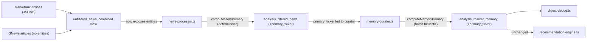

## Problem this slice solves

Smart Digest already depends on a fragile implicit primary-subject signal:

```35:40:services/ai/gateway-2.0/src/core/analysis/digest-symbol-affinity.ts
/**
 * +2 when `affected_tickers[0]` is one of the symbol's aliases. The curator
 * tends to put the primary subject first in the array, so position-1
 * combined with even one supporting signal clears the default threshold.
 */
const WEIGHT_POSITION_PRIMARY = 2;
```

The contamination defense around it (`computeSymbolAffinity` token matching on `theme` + `news_one_liner`) exists because this `[0]`-position convention is brittle. Yet a deterministic primary-subject signal already exists upstream and is **discarded before the LLM ever sees an article**: MarketAux's per-article `entities` JSONB (symbol + `match_score`) is persisted in `unfiltered_news_marketaux` but stripped from `unfiltered_news_combined`. See:

```15:26:services/workers/data-fetcher-2.0/migrations/014_rename_unfiltered_news.sql
CREATE OR REPLACE VIEW unfiltered_news_combined AS
SELECT 'marketaux' AS source_api, marketaux_uuid AS external_id,
       title, description, snippet AS content_excerpt, url,
       source AS source_name, published_at, search_category,
       key_points, avg_sentiment_score, sentiment_label, created_at
FROM unfiltered_news_marketaux
UNION ALL
...
```

```234:239:services/ai/gateway-2.0/src/core/analysis/news-processor.ts
    `SELECT source_api, external_id, title, description,
            published_at::text, search_category, sentiment_label, url
     FROM unfiltered_news_combined
     WHERE created_at >= NOW() - INTERVAL '${LOOKBACK_HOURS} hours'
     ORDER BY published_at DESC`,
```

This slice lifts that signal up: a deterministic `primary_ticker` on filtered news (purely from source-API entity data), then a reproducible heuristic primary on memory rows (deterministic function of batch filtered-news primaries).

## Why this slice next vs the other deferred items

- **Per-row article lineage (other Slice 2 candidate)** is forensic. Smart Digest does not consume per-theme article IDs in any current ranking, gating, or rendering path. Adding it does not improve card quality; it improves traceability for humans.
- **Trust-aware structure (broad option)** is too vague — it bundles primary-subject, lineage, and macro classification together, exactly the "canonical-digest mixing" the user has asked us to avoid.
- **Primary-subject distinction** is consumed implicitly _today_ via `affected_tickers[0]` on every card via `computeSymbolAffinity`. Replacing that heuristic with a real upstream signal directly improves Smart Digest's biggest current trust risk — symbol-overlap contamination, the same failure mode the existing `recommendation-engine.test.ts` "rejects an ETH-primary row that lists BTC at position 2" test exists to defend against.
- We have a deterministic source (MarketAux `entities.match_score`) already persisted in the DB. The user explicitly prefers a slice that does not depend on the LLM emitting fragile bookkeeping, and this avoids the LLM entirely on the write path for `analysis_filtered_news.primary_ticker`.

## What the new fields mean

Add two columns to each table — same column **names** on both sides, but the **trust tier they represent differs** and that distinction must be preserved end-to-end in docs, debug naming, and tests:

- `primary_ticker TEXT` — single ticker the row is **about** (subject), uppercase, may or may not be in `affected_tickers` (we record honestly, do not silently merge).
- `primary_ticker_source TEXT` — provenance tag whose value carries the trust tier:
  - `'marketaux_entities'` — **strong / deterministic / source-grounded.** Computed at news-processor write time by sorting MarketAux's per-article `entities` by `(match_score DESC, symbol ASC)`. No LLM involved. Only ever appears on `analysis_filtered_news`.
  - `'batch_heuristic'` — **weak / heuristic / reproducible but derived.** Computed at memory-curator write time as a majority vote over the `primary_ticker` of filtered-news rows in the same batch whose `affected_tickers` overlap the new theme. Reproducible from the same input batch, but it is **not** grounded in any source-API signal at the memory layer. Only ever appears on `analysis_market_memory`.
  - `NULL` — no signal available (story is GNews-only, or no overlapping primaried filtered rows in the curator's batch).

Trust ordering for any future consumer is: `marketaux_entities` > `batch_heuristic` > `NULL`. Slice 3 adoption code must respect that ordering and is permitted to weight or gate on `primary_ticker_source` value, not just on non-NULL-ness.

Smart Digest behavior is unchanged in this slice. Future Slice 3 may replace `WEIGHT_POSITION_PRIMARY` with `primary_ticker` lookups gated on `primary_ticker_source`.

## Design constraints honored

- Strictly additive: no rename/drop. All migrations are `ADD COLUMN IF NOT EXISTS` and idempotent.
- Deterministic where source data permits. NULL is a first-class "we don't know" — we never fabricate.
- Smart Digest output unchanged. Only `digest-debug.ts` surfaces the new field.
- No prompt edits this slice. The LLM is not asked to emit a primary ticker; that would re-introduce the fragile-bookkeeping risk the user warned about.
- TDD throughout — each behavior change ships with a failing-first unit test.

## Architecture (data flow this slice changes)



## Task 1 — Migrations

Files to create:

- `services/workers/data-fetcher-2.0/migrations/027_filtered_news_primary_ticker.sql`
- `services/workers/data-fetcher-2.0/migrations/028_market_memory_primary_ticker.sql`
- `services/workers/data-fetcher-2.0/migrations/029_unfiltered_news_combined_with_entities.sql`

`027`:

```sql
BEGIN;
ALTER TABLE analysis_filtered_news
    ADD COLUMN IF NOT EXISTS primary_ticker TEXT,
    ADD COLUMN IF NOT EXISTS primary_ticker_source TEXT;
CREATE INDEX IF NOT EXISTS idx_filtered_news_primary_ticker
    ON analysis_filtered_news (primary_ticker);
COMMIT;
```

`028`:

```sql
BEGIN;
ALTER TABLE analysis_market_memory
    ADD COLUMN IF NOT EXISTS primary_ticker TEXT,
    ADD COLUMN IF NOT EXISTS primary_ticker_source TEXT;
CREATE INDEX IF NOT EXISTS idx_market_memory_primary_ticker
    ON analysis_market_memory (primary_ticker);
COMMIT;
```

`029` — **deliberately avoids `DROP VIEW`** to honor caution #2. There is one dependent `SELECT *` consumer (`analysis_news_combined` in [migration 014](services/workers/data-fetcher-2.0/migrations/014_rename_unfiltered_news.sql) line 35-36), so we use `CREATE OR REPLACE VIEW` and **append** the new `entities` column at the end. Postgres permits this exact pattern: appending columns to a view via `CREATE OR REPLACE VIEW` is supported, and dependent `SELECT *` views freeze their column list at creation time so `analysis_news_combined` continues to project the original 13 columns and is undisturbed.

Pre-rollout consumer audit (already done in plan-mode research, must be re-verified once more right before applying):

- `services/ai/gateway-2.0/src/core/analysis/news-processor.ts` — explicit column list. Safe.
- `services/mcp/tools/news.py` — explicit column list (`source_api, title, description, published_at, search_category, sentiment_label`). Safe.
- `services/workers/data-fetcher-2.0/migrations/014_rename_unfiltered_news.sql` — `analysis_news_combined AS SELECT * FROM unfiltered_news_combined`. Survives via the append-only semantics above.
- No other repository consumer of `unfiltered_news_combined` exists at audit time (verified by `Grep` across the workspace).

```sql
BEGIN;
CREATE OR REPLACE VIEW unfiltered_news_combined AS
SELECT 'marketaux' AS source_api, marketaux_uuid AS external_id,
       title, description, snippet AS content_excerpt, url,
       source AS source_name, published_at, search_category,
       key_points, avg_sentiment_score, sentiment_label, created_at,
       entities
FROM unfiltered_news_marketaux
UNION ALL
SELECT 'gnews', gnews_id,
       title, description, content_excerpt, url,
       source_name, published_at, search_category,
       key_points, NULL::numeric, NULL::varchar, created_at,
       NULL::jsonb AS entities
FROM unfiltered_news_gnews;
COMMIT;
```

If Postgres rejects the `CREATE OR REPLACE VIEW` (e.g. due to an undocumented dependent we missed), the fallback is `DROP VIEW analysis_news_combined; DROP VIEW unfiltered_news_combined; CREATE VIEW unfiltered_news_combined ...; CREATE VIEW analysis_news_combined AS SELECT * FROM unfiltered_news_combined;` all in one transaction. **Do not use `DROP ... CASCADE`** — explicit drops only.

## Task 2 — Pure deterministic primary-ticker utilities

Files to create:

- `services/ai/gateway-2.0/src/core/analysis/primary-ticker.ts`
- `services/ai/gateway-2.0/src/core/analysis/__tests__/primary-ticker.test.ts`

Exports:

```ts
export interface MarketauxEntity {
  symbol?: unknown;
  match_score?: unknown;
}

export interface ArticleForPrimary {
  source_api: string;
  entities: unknown;
}

export type PrimaryTickerSource =
  | "marketaux_entities"
  | "batch_heuristic"
  | null;

export interface PrimaryTickerResult {
  primary_ticker: string | null;
  primary_ticker_source: PrimaryTickerSource;
}

export function computeArticlePrimary(
  article: ArticleForPrimary,
): PrimaryTickerResult;
export function computeStoryPrimary(
  articlePrimaries: PrimaryTickerResult[],
): PrimaryTickerResult;
export function computeMemoryPrimary(
  themeAffectedTickers: string[],
  contributingStories: ReadonlyArray<{
    affected_tickers: string[];
    primary_ticker: string | null;
  }>,
): PrimaryTickerResult;
```

Deterministic rules (all uppercase comparison, all alphabetical fallback):

- `computeArticlePrimary`:
  - If `source_api !== 'marketaux'` → `{ null, null }`.
  - If `entities` is not an array or empty → `{ null, null }`.
  - Coerce each entry: skip if `symbol` is not a string or `match_score` is not a finite number.
  - Sort by `(match_score DESC, symbol ASC)`. Take first. Uppercase symbol.
  - Return `{ primary_ticker, 'marketaux_entities' }`.
- `computeStoryPrimary`:
  - Filter to non-NULL primaries.
  - If none → `{ null, null }`.
  - Tally counts per ticker.
  - Sort by `(count DESC, ticker ASC)`. Take first.
  - Source is `'marketaux_entities'` (every contributing primary already came from that path).
- `computeMemoryPrimary`:
  - Filter `contributingStories` to those whose `affected_tickers` (uppercased) overlap `themeAffectedTickers` (uppercased) **and** whose `primary_ticker` is non-NULL.
  - If none → `{ null, null }`.
  - Tally counts of `primary_ticker` across the filtered set.
  - Sort by `(count DESC, ticker ASC)`. Take first.
  - Source is `'batch_heuristic'`.

Wrap each function body in try/catch per the user's exception-handling rule; on any internal failure return `{ null, null }` so we never block writes.

Tests (failing-first):

- `computeArticlePrimary`:
  - GNews article → `{ null, null }`.
  - MarketAux, empty entities → `{ null, null }`.
  - MarketAux, entities = `[{symbol:"AAPL",match_score:0.5},{symbol:"NVDA",match_score:0.9}]` → `{ "NVDA", "marketaux_entities" }`.
  - MarketAux, ties on match_score → alphabetical (`AAPL` beats `NVDA` when equal).
  - MarketAux, malformed entry (missing match_score) is skipped.
- `computeStoryPrimary`:
  - All NULL inputs → `{ null, null }`.
  - `[AAPL, AAPL, NVDA]` → `AAPL`.
  - Ties on count → alphabetical.
- `computeMemoryPrimary`:
  - Theme tickers `["AAPL"]`, stories with primaries `[AAPL, AAPL, NVDA]`, where the NVDA story has no overlap with theme → primary `AAPL`.
  - No overlapping stories → `{ null, null }`.
  - All overlapping stories have NULL primary → `{ null, null }`.

## Task 3 — Wire into `news-processor.ts`

File to modify: `services/ai/gateway-2.0/src/core/analysis/news-processor.ts`
Test to modify: `services/ai/gateway-2.0/src/core/analysis/__tests__/news-processor.test.ts`

Changes:

1. Extend `RawArticle`:
   ```ts
   interface RawArticle {
     source_api: string;
     external_id: string;
     title: string;
     description: string | null;
     published_at: string;
     search_category: string | null;
     sentiment_label: string | null;
     url: string | null;
     entities: unknown; // JSONB; MarketAux only; null for GNews
   }
   ```
2. Add `entities` to the `SELECT` from `unfiltered_news_combined`.
3. After the LLM returns validated stories, for each story:
   - For each index in `source_article_indices`, look up the article and call `computeArticlePrimary`.
   - Call `computeStoryPrimary` over the per-article results.
   - Attach the result to the story object before INSERT.
4. Extend the `INSERT INTO analysis_filtered_news` column list with `primary_ticker, primary_ticker_source` and add corresponding `$N` placeholders.
5. Do **not** mutate `affected_tickers`. The new column lives alongside; we honestly record both even when they disagree.
6. Do **not** modify the LLM prompt or pass entities into it this slice. Re-evaluating prompt-time entity hints belongs in Slice 3 once we have observability data on agreement between `primary_ticker` and `affected_tickers[0]`.

Tests to add (failing-first):

- Story sourced from one MarketAux article with `entities=[{AAPL, 0.9}]` and one GNews article (no entities) → INSERT params include `primary_ticker="AAPL", primary_ticker_source="marketaux_entities"`.
- Story sourced only from GNews → INSERT params include `primary_ticker=null, primary_ticker_source=null`.
- Three MarketAux articles, primaries `[AAPL, AAPL, NVDA]` → `primary_ticker="AAPL"`.
- MarketAux with empty `entities` array → falls back to `null/null` (does not crash).

## Task 4 — Wire into `memory-curator.ts`

File to modify: `services/ai/gateway-2.0/src/core/analysis/memory-curator.ts`
Test to modify: `services/ai/gateway-2.0/src/core/analysis/__tests__/memory-curator.test.ts`

Changes:

1. Extend `FilteredStory` to include `primary_ticker: string | null` (the `primary_ticker_source` is not needed downstream; the curator only consumes the resolved ticker).
2. Update `fetchRecentFilteredNews` `SELECT` list to include `primary_ticker`.
3. After Zod validation of `new_themes` from the curator, for each new theme call `computeMemoryPrimary(theme.affected_tickers, batchStories)`.
4. Extend the `INSERT INTO analysis_market_memory` column list with `primary_ticker, primary_ticker_source` and add placeholders. Use a single per-call timestamp for `generated_at` (already in place from Slice 1).
5. For the UPDATE path (existing theme reinforcement), **do not mutate** `primary_ticker` / `primary_ticker_source`. Rationale: the primary is the theme's anchor identity. Re-derivation on update would let later batches drift it. Leave invariant once set.

Tests to add (failing-first):

- New theme with `affected_tickers=["AAPL"]`, batch contains 3 stories: two have `primary_ticker="AAPL"`, one has `primary_ticker="NVDA"` and no AAPL overlap → INSERT params include `primary_ticker="AAPL", primary_ticker_source="batch_heuristic"`.
- New theme with `affected_tickers=["AAPL"]`, no batch story has a non-null primary → INSERT params include `primary_ticker=null, primary_ticker_source=null`.
- Existing theme UPDATE path does not include `primary_ticker` / `primary_ticker_source` in its SET clause.

## Task 5 — Surface in debug report (read-only, trust-tier-explicit)

File to modify: `services/ai/gateway-2.0/src/core/analysis/digest-debug.ts`
Test to modify or add: `services/ai/gateway-2.0/src/core/analysis/__tests__/digest-debug.test.ts`

Changes:

1. Add `primary_ticker, primary_ticker_source` to the memory-candidate SELECT in `fetchMemoryCandidatesForDebug`.
2. Add a `primaryTicker` block per candidate with an **explicit trust tag**, not just the raw source string. Shape:
   ```ts
   primaryTicker: {
     ticker: string | null;
     source: 'marketaux_entities' | 'batch_heuristic' | null;
     trustTier: 'strong' | 'heuristic' | 'none';  // derived from source
   }
   ```
   Mapping (single helper in `digest-debug.ts`): `marketaux_entities` -> `strong`, `batch_heuristic` -> `heuristic`, `null` -> `none`. The `trustTier` field is what downstream debug-readers (human and machine) should key off; the raw `source` is kept for forensic completeness.
3. If the debug report also surfaces filtered-news rows for any view, add the same `primaryTicker` block there. Filtered-news rows will only ever show `strong` or `none` — never `heuristic`. This invariant is asserted in tests below.
4. **Do not** plumb the new fields into `BriefTruth`, ranking, gating, or card rendering. Smart Digest behavior stays byte-for-byte identical.

Tests:

- Memory-row fixture with `primary_ticker='AAPL', primary_ticker_source='batch_heuristic'` -> debug block has `primaryTicker = { ticker: "AAPL", source: "batch_heuristic", trustTier: "heuristic" }`.
- Memory-row fixture with `primary_ticker=null, primary_ticker_source=null` -> `primaryTicker = { ticker: null, source: null, trustTier: "none" }`.
- Filtered-news fixture (if surfaced) with `primary_ticker_source='marketaux_entities'` -> `trustTier: "strong"`.
- Filtered-news invariant test: a `'batch_heuristic'` source value on a *filtered-news* fixture should never occur in practice; assert via a type guard or runtime check that the debug surface logs a warning if it does.

## Task 6 — Documentation snapshot (trust-tier-explicit)

File to modify: `docs/upstream-trust-map.md` (created in Slice 1).

Append a section "Slice 2: primary subject ticker" with three subsections:

1. **Trust tiers (must be the first thing the next agent reads).** A small table mapping each `primary_ticker_source` value to a trust tier, where it can appear, and how to treat it:
   - `marketaux_entities` — tier: **strong**. Appears only on `analysis_filtered_news`. Deterministic from source-API entity match_score. Safe to use as ground truth in downstream gating.
   - `batch_heuristic` — tier: **heuristic**. Appears only on `analysis_market_memory`. Reproducible from the same input batch but **not source-grounded** at the memory layer. Safe as a tie-breaker or weighted signal; **not** safe as ground truth.
   - `NULL` — tier: **none**. No deterministic signal available. Downstream code must fall back to the existing `affected_tickers[0]` heuristic for these rows.
2. **Derivation rules.** Article-level, story-level, and memory-level rules from `primary-ticker.ts`, copied verbatim or near-verbatim from the JSDoc on the exported functions to keep the doc in sync.
3. **Consumer guidance.** Explicit reminder that Smart Digest does not yet consume these fields — Slice 3 will — plus a one-paragraph note that consumer code should always weight `strong > heuristic > none`, not collapse them.

Markdown only.

## What this slice explicitly does NOT do

- No change to `computeSymbolAffinity` / `WEIGHT_POSITION_PRIMARY`. The `affected_tickers[0]` heuristic remains active.
- No prompt edits to news-processor or memory-curator (deferred to Slice 3 after observing real `primary_ticker` distributions).
- No backfill — existing rows keep NULL primary; new rows after the migration land carry the deterministic signal.
- No mutation of `affected_tickers` to reconcile with `primary_ticker` (we record honestly, even when they disagree — that disagreement is itself observability).
- No deterministic entity extraction for GNews (would require an NER library; revisit in Slice 3 if MarketAux coverage proves insufficient).
- No `primary_ticker` update on existing memory theme reinforcement (anchor invariance, see Task 4).
- No change to `affected_tickers` typing (`TEXT[]` stays).
- No new ranking / gating in Smart Digest.

## Validation

1. Apply migrations 027/028/029 on the VM (`sudo docker exec postgres psql -U postgres -d stocktracker -f <path>`).
2. Trigger one news-processor run and one memory-curator run.
3. Sanity queries:
   ```sql
   SELECT primary_ticker_source, COUNT(*)
   FROM analysis_filtered_news
   WHERE generated_at >= NOW() - INTERVAL '24 hours'
   GROUP BY primary_ticker_source;
   ```
   Expect a mix of `marketaux_entities` and `NULL`. If `NULL` is 100%, the view-passthrough is broken.
4. Cross-check agreement with the existing `[0]` heuristic:
   ```sql
   SELECT
     primary_ticker = affected_tickers[1] AS matches_position_zero,
     COUNT(*)
   FROM analysis_filtered_news
   WHERE primary_ticker IS NOT NULL
   GROUP BY 1;
   ```
   Both values are diagnostic: high agreement validates the prior heuristic and the new signal; low agreement is exactly the upstream truth gap this slice was built to expose.
5. Run `scripts/preview-digest.ts` for two or three users before and after — diff the output. Expect byte-for-byte identical cards (this slice does not touch the consumer side).
6. Run the full gateway-2.0 test suite — `news-processor.test.ts`, `memory-curator.test.ts`, `recommendation-engine.test.ts`, `digest-debug.test.ts`, plus new `primary-ticker.test.ts`. All green.

## What should come after this slice (Slice 3 preview, not in scope here)

Wait 3–7 days of production data, then pick **one** of these — do not bundle:

- (a) **Adopt the signal**: in `computeSymbolAffinity`, replace `WEIGHT_POSITION_PRIMARY` with a stronger bonus when `row.primary_ticker` equals (or aliases to) the digest symbol, gated on `primary_ticker_source IS NOT NULL`. Fall back to the current `[0]` heuristic when NULL. This is where the real Smart Digest quality win comes from — Slice 2 just makes it possible.
- (b) **Expand coverage**: deterministic NER on GNews titles in a small TypeScript module (no LLM) to populate `primary_ticker` for GNews-sourced stories.
- (c) **Tighten the prompt**: add an explicit `primary_ticker` output field to the news-processor LLM contract, schema-validate it, but only after Slice 2 data shows whether the LLM agrees with the MarketAux-deterministic primary on the rows we can ground-truth.

The user has explicitly asked us not to mix the canonical-digest architecture work into this slice. (a) is the natural next step; (b) and (c) are alternatives.

---

## Standard deployment workflow

1. **Baseline check (SSH into VM)**
   - `ssh -i "$HOME\.ssh\nx-linux-server-azure_key (1).pem" azureuser@20.17.176.1`
   - `docker ps` -> note current image version

2. **Stage and push changes**
   - `git status` -> `git add <file1> <file2> ...` -> `git commit -m "msg" && git push origin main`
   - Never `git add .` — other agents may have uncommitted changes

3. **Verify build**
   - GitHub Actions: `gh run watch`
   - If frontend modified: `vercel ls --scope=stocktracker`
   - **Only proceed when all builds pass**
   - Build fails -> `gh run view <run-id> --log` or `vercel logs <url>` -> Fix -> Step 2

4. **Verify VM deployment**
   - SSH -> `docker ps` -> compare image version vs baseline
   - Version incremented -> Done
   - Version unchanged / container down -> Fix -> Step 2

5. **Done**

---

## Migration execution notes

- `027` and `028` are pure `ADD COLUMN IF NOT EXISTS` with no defaults — safe to apply ahead of code rollout. No backfill required; existing rows show `NULL` for both new columns, which is the correct semantic for "no deterministic signal".
- `029` uses `CREATE OR REPLACE VIEW` with the new `entities` column **appended at the end**. This deliberately avoids `DROP VIEW` to honor caution #2 (positional / `SELECT *` consumers must not break). Pre-rollout, re-run `Grep` for `unfiltered_news_combined` across the whole workspace and confirm only the three known consumers exist (news-processor.ts explicit-columns, services/mcp/tools/news.py explicit-columns, analysis_news_combined `SELECT *` alias — the last is unaffected because its column list froze at creation). If `CREATE OR REPLACE VIEW` rejects for any reason, fall back to the explicit DROP+CREATE pair documented in Task 1 — **never** use `CASCADE`.
- Application order: 029 → 027 → 028, or any order — they are independent. Apply in numeric order for simplicity.
- Rollback: each migration's only side effects are columns/indexes/the view. `029` can be rolled back by re-running `CREATE OR REPLACE VIEW` with the original 13-column projection from migration `014`. `027`/`028` rollback is `DROP INDEX ...; ALTER TABLE ... DROP COLUMN IF EXISTS ...;`.
- Apply on the VM using the standard project pattern (e.g. `sudo docker exec postgres psql -U postgres -d stocktracker -f <path>`).
