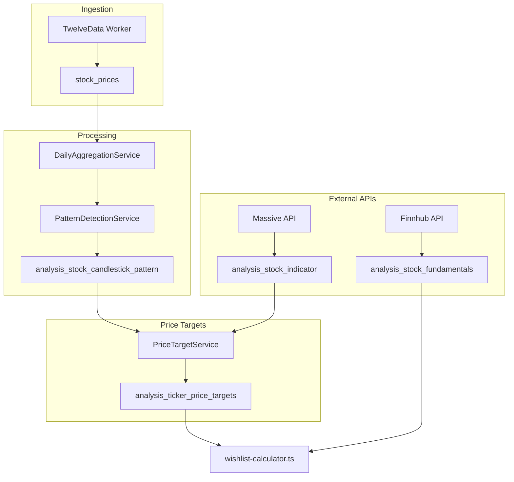
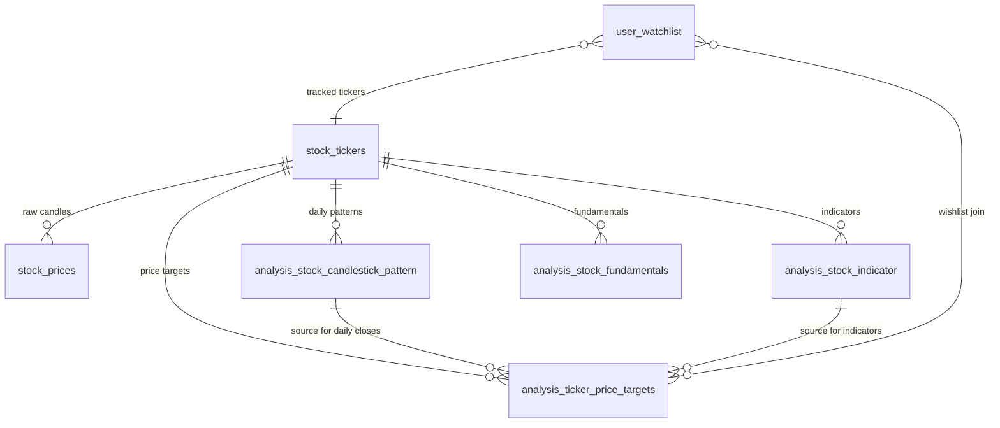
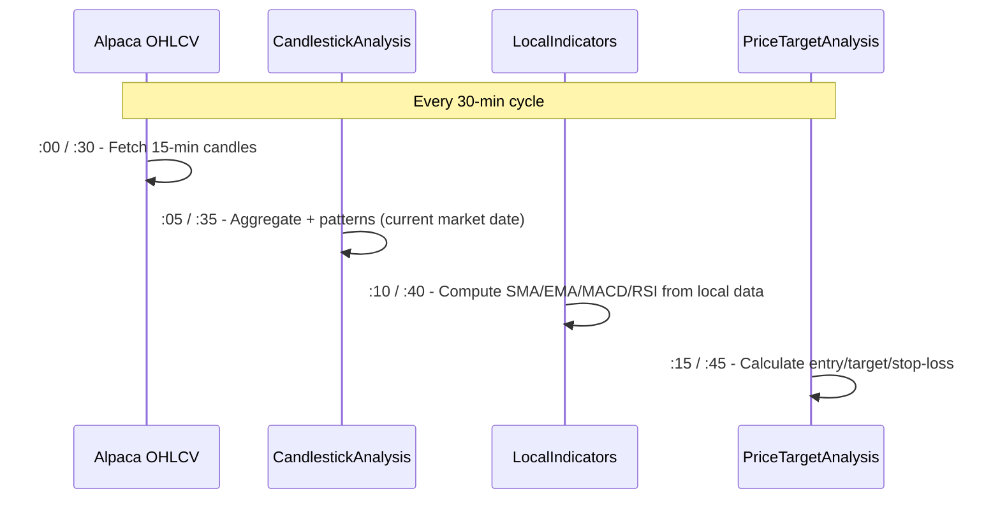

# Stock Analysis Pipeline

Blueprint for the stock analysis pipeline. Use this document when implementing the crypto analysis pipeline.

---

## 1. Overview

The analysis pipeline ingests raw price data, aggregates it to daily OHLCV, detects candlestick patterns, fetches technical indicators and fundamentals, and computes daily price targets (entry/target/stop-loss). Results power the wishlist feature and MCP tools.



---

## 2. Data Ingestion

| Aspect | Detail |
|--------|--------|
| **Worker** | Alpaca workers (AlpacaStockFetchWorker, AlpacaCryptoFetchWorker) |
| **Table** | `stock_prices`, `crypto_prices` |
| **Schedule** | Every 30 min (via `Task.Delay(FetchIntervalMinutes)`) |
| **Config** | `Providers__Alpaca__FetchIntervalMinutes=30` |
| **Interval** | 15-minute candles (with ~15 min market delay) |
| **Fields** | open_price, high_price, low_price, close_price, volume per interval |
| **Retention** | 90 days |

---

## 3. Daily Aggregation

**Service:** `DailyAggregationService` (data-fetcher-2.0, `Application/Providers/CandlestickAnalysis/`)

Converts 10-minute candles into daily OHLCV:

| Field | Calculation |
|-------|-------------|
| Open | First candle's open |
| High | Max of all candles' highs |
| Low | Min of all candles' lows |
| Close | Last candle's close |
| Volume | Sum of all candles' volume |

**Additional metrics:**

- `body_size` — |close - open|
- `range_size` — high - low
- `upper_wick` — high - max(open, close)
- `lower_wick` — min(open, close) - low
- `is_bullish` — close > open

---

## 4. Candlestick Pattern Detection

**Service:** `PatternDetectionService` (data-fetcher-2.0)

**Output table:** `analysis_stock_candlestick_pattern`

**Schedule:** Every 30 min at :05/:35 (5 min after Alpaca OHLCV fetch). Analyzes current market date.

### 8 Single-Candle Patterns

| Pattern | Signal | Trigger |
|---------|--------|---------|
| Doji | indecision | Body < 10% of range |
| Long-Legged Doji | indecision | Doji with long shadows both sides |
| Hammer | bullish_reversal | Small body at top, long lower wick |
| Inverted Hammer | bullish_reversal | Small body at bottom, long upper wick |
| Shooting Star | bearish_reversal | Same shape as inverted hammer |
| Bullish Marubozu | strong_bullish | No/minimal wicks, bullish |
| Bearish Marubozu | strong_bearish | No/minimal wicks, bearish |
| Spinning Top | indecision | Small body, shadows both sides |

**Stored structure (JSONB):**

```json
[
  { "pattern": "doji", "confidence": 0.92, "signal": "indecision", "description": "..." },
  { "pattern": "hammer", "confidence": 0.85, "signal": "bullish_reversal", "description": "..." }
]
```

---

## 5. Technical Indicators

| Aspect | Detail |
|--------|--------|
| **Source** | Local computation from `analysis_stock_candlestick_pattern` daily closes (Massive API available for backfill) |
| **Flow** | LocalIndicatorWorker → LocalIndicatorCalculatorService → analysis_stock_indicator |
| **Schedule** | Every 30 min at :10/:40 |
| **Table** | `analysis_stock_indicator` |

**Indicators:**

| Field | Description |
|-------|-------------|
| sma | SMA 20-day |
| ema | EMA 20-day |
| macd_value, macd_signal, macd_histogram | MACD |
| rsi | RSI 14-day |

---

## 6. Fundamentals

| Aspect | Detail |
|--------|--------|
| **Source** | Finnhub API |
| **Table** | `analysis_stock_fundamentals` |
| **Frequency** | Quarterly |

**Metrics:** market_cap, pe_ratio, forward_pe, peg_ratio, fcf_yield, roe, roic, operating_margin, revenue_ttm, revenue_growth_yoy, eps_ttm, eps_growth_yoy, debt_to_equity, interest_coverage, free_cash_flow, fcf_growth_yoy, dividend_yield

---

## 7. Price Target Calculation

**Service:** `PriceTargetService` (data-fetcher-2.0, `Application/Providers/PriceTargetAnalysis/`)

**Schedule:** Every 30 min at :15/:45 (15 min after Alpaca OHLCV fetch)

**Table:** `analysis_ticker_price_targets` (new row per day, 90-day retention)

### Technical Composite Methodology

| Component | Formula |
|-----------|---------|
| **Entry** | 60% EMA-20 + 40% 20-day low. RSI > 70 → 2% discount |
| **Target** | 40% EMA-50 + 60% 20-day high. RSI < 30 → 5% bounce projection |
| **Stop Loss** | min(entry × 0.97, 20-day low × 0.99) |
| **Signal** | Majority vote from recent candlestick signals + RSI zones |
| **Confidence** | Weighted (0–1): data completeness + indicator availability |

**Data sources:**

- Daily closes: `analysis_stock_candlestick_pattern` (daily_close)
- Indicators: `analysis_stock_indicator` (EMA-20, SMA as proxy for EMA-50, RSI)
- Signals: recent `detected_patterns` from candlestick table

### Gateway Wishlist

**File:** `gateway-2.0/src/core/analysis/wishlist-calculator.ts`

- Reads last 20 days from `analysis_ticker_price_targets`
- Joins with `user_watchlist` for user’s tickers
- Computes entry/target/stop-loss ranges from min/max of recent values
- Aggregates candlestick signals (bullish/bearish/neutral) across lookback

---

## 8. Table Relationships



| Table | Key Fields | Purpose |
|-------|------------|---------|
| `stock_tickers` | id, symbol | Master ticker list; referenced by all analysis tables via stock_ticker_id |
| `stock_prices` | stock_ticker_id, price_time, OHLCV | Raw 10-min candles; source for aggregation |
| `analysis_stock_candlestick_pattern` | stock_ticker_id, analysis_date, daily_*, detected_patterns | Daily OHLCV + patterns; source for price target calc |
| `analysis_stock_indicator` | stock_ticker_id, indicator_time, sma, ema, macd_*, rsi | Technical indicators |
| `analysis_stock_fundamentals` | stock_ticker_id, fiscal_year/quarter, metrics | Quarterly fundamentals |
| `analysis_ticker_price_targets` | ticker_symbol, asset_type, analysis_date, entry/target/stop_loss | Daily computed targets |
| `user_watchlist` | ticker_symbol, asset_type, clerk_user_id | User tracked tickers; joined with targets for /wishlist |

---

## 9. What Needs to Change for Crypto

| Component | Status | Action |
|-----------|--------|--------|
| `crypto_tickers` | Exists | — |
| `crypto_prices` | Exists (DECIMAL 24,12) | — |
| `analysis_crypto_candlestick_pattern` | Missing | Create table |
| Crypto indicators | Missing | Extend Massive API or alternative |
| Fundamentals | N/A | Skip or replace with on-chain metrics |
| `PriceTargetService` | Stocks only | Add crypto_tickers + crypto_prices support |
| `analysis_ticker_price_targets` | Supports asset_type='crypto' | — |
| `wishlist-calculator.ts` | Currently filters stock/etf only | Extend to include crypto when targets exist |

### Recommended Implementation Order

1. Add `DailyAggregationService` for crypto (`crypto_prices` → daily OHLCV)
2. Create `analysis_crypto_candlestick_pattern` table
3. Extend pattern detection to crypto daily candles
4. Either extend Massive API for crypto indicators or compute locally
5. Extend `PriceTargetService` to process `crypto_tickers`
6. Extend `wishlist-calculator.ts` to include crypto (currently stock/etf only)

---

## 10. Scheduling Dependency Chain

### 30-Minute Pipeline (Active)

Every 30 minutes, the pipeline runs in sequence with 5-minute stagger offsets:

| Order | Job | Schedule | Offset | Output |
|-------|-----|----------|--------|--------|
| 1 | Alpaca OHLCV | Every 30 min | :00 / :30 | stock_prices, crypto_prices |
| 2 | CandlestickAnalysis | Every 30 min | :05 / :35 | analysis_stock_candlestick_pattern |
| 3 | LocalIndicatorComputation | Every 30 min | :10 / :40 | analysis_stock_indicator |
| 4 | PriceTargetAnalysis | Every 30 min | :15 / :45 | analysis_ticker_price_targets |



### Key Design Notes

- **Clock-aligned intervals**: Workers run at fixed minutes past the hour via `interval_minutes` and `offset_minutes` in `worker_fetch_schedules`. This ensures predictable staggering even after container restarts.
- **Local indicator computation**: SMA-20, EMA-20, MACD (12,26,9), RSI-14 are computed locally from daily closes in `analysis_stock_candlestick_pattern`. Eliminates Massive API dependency for scheduled runs.
- **Incremental daily candle**: Today's candlestick pattern record is upserted every 30 min with the latest aggregated partial-day data. After market close, it becomes the final daily record.
- **Massive API**: Disabled for scheduled runs. Kept available for manual backfill via API endpoints.

### Legacy Daily Pipeline (Disabled)

| Order | Job | Time (UTC) | Output |
|-------|-----|------------|--------|
| 1 | TwelveData | 22:00 | stock_prices |
| 2 | Massive | Variable | analysis_stock_indicator |
| 3 | CandlestickAnalysis | 01:00 | analysis_stock_candlestick_pattern |
| 4 | PriceTargetAnalysis | 01:30 | analysis_ticker_price_targets |
